# 第1章 问题重述与任务分析

## 1.1 比赛背景

本项目面向爱恩斯坦棋 AI 对抗挑战赛，目标是设计并实现一个能够自主完成对弈决策的智能程序。参赛程序需要具备完整的规则处理能力、稳定的对战能力和一定的智能决策能力，能够在规定时间内根据当前棋局状态输出合法走法，并支持完整比赛流程。

爱恩斯坦棋虽然采用 (5 \times 5) 的小规模棋盘，但其决策过程并不简单。由于每回合需要掷骰子，当前可移动棋子受到骰子点数和棋子存活状态的共同约束，因此该问题具有明显的随机性和动态动作约束。同时，棋局中还存在冲向目标角点、吃掉对方棋子、防守阻挡以及主动吃掉己方棋子等多种策略选择，使得该问题具有较强的博弈复杂性。

因此，本项目不仅需要实现完整可靠的规则引擎，还需要进一步设计适合该问题的状态表示、动作表示和智能决策方法。

------

## 1.2 规则简述

爱恩斯坦棋使用 (5 \times 5) 方格棋盘。红方出发区位于棋盘左上角，蓝方出发区位于棋盘右下角。红蓝双方各有 6 枚棋子，分别编号为 1 至 6。开局时，双方棋子可以在各自出发区的棋位中任意摆放。

每回合当前行动方先掷骰子，得到点数：
$$
d \in {1,2,3,4,5,6}
$$
若编号为 (d) 的己方棋子仍在棋盘上，则本回合只能移动该棋子；若该棋子已经被移出棋盘，则可以移动编号小于 (d) 且最接近 (d) 的存活棋子，或编号大于 (d) 且最接近 (d) 的存活棋子。

红方棋子的移动方向为：
$$
\text{向右、向下、向右下}
$$
蓝方棋子的移动方向为：
$$
\text{向左、向上、向左上}
$$
每次移动一格。若目标棋位上已有棋子，则该棋子被移出棋盘。被吃掉的棋子可以是对方棋子，也可以是己方棋子。

一方若率先将任意一枚己方棋子移动到对方出发区角点，或将对方所有棋子全部吃掉，则该方获胜。对弈结果只有胜负，没有和棋。

------

## 1.3 比赛流程与运行要求

在比赛流程上，每盘对局中双方均具有固定用时限制。若某一方在规定时间内未能完成决策，则判定该方超时失败。每轮比赛最多进行 7 盘，双方轮流先手，先取得 4 盘胜利的一方获得本轮胜利。

因此，参赛程序需要满足以下运行要求：

1. 能够完整执行爱恩斯坦棋规则；
2. 能够在每一步生成合法动作；
3. 能够支持完整对局流程与胜负判定；
4. 能够在时间限制内完成决策；
5. 能够支持多局对战和结果统计；
6. 能够输出训练过程、评估结果和运行结果。

这些要求决定了本项目不仅是一个棋类规则实现任务，也是一个包含智能决策、模型训练、搜索优化和系统工程实现的综合性计算机博弈任务。

------

## 1.4 任务难点分析

本项目的主要难点可以概括为以下四点。

### 1.4.1 骰子随机性带来的不确定性

爱恩斯坦棋每回合需要掷骰子，骰子点数直接限制当前可移动棋子。因此，智能体无法完全按照固定计划行动，而必须在随机事件约束下进行决策。这使得该问题区别于完全确定性的棋类博弈。

从状态转移角度看，当前状态 (s_t) 和动作 (a_t) 并不能完全决定下一状态，因为下一回合的骰子点数具有随机性。因此，状态转移可以表示为：
$$
s_{t+1} \sim P(s_{t+1}\mid s_t,a_t)
$$
其中，(P) 表示包含骰子随机性的状态转移分布。

### 1.4.2 合法动作集合动态变化

虽然从模型输出角度可以将动作空间统一定义为固定的 18 维离散空间，但在具体局面中，真正合法的动作集合会随骰子点数、棋子存活状态和棋盘边界而变化。

因此，系统必须实现严格的合法动作生成机制，并在模型决策时使用合法动作掩码，保证智能体不会选择非法动作。

### 1.4.3 局面策略存在多目标权衡

爱恩斯坦棋的胜利方式包括到达对方目标角点和吃光对方棋子。因此，智能体需要在推进、吃子、防守和调整己方棋子结构之间进行权衡。

尤其是规则允许吃掉己方棋子，这使得某些局面中主动自吃可能成为一种策略选择。该机制增加了局面评估的复杂性，也要求智能体具备一定的前瞻判断能力。

### 1.4.4 决策质量与时间限制需要平衡

搜索算法通常能够提升决策质量，但搜索越深、模拟次数越多，计算开销越大。在比赛计时约束下，智能体必须在有限时间内完成决策。因此，本项目需要在模型推理速度、搜索规模和对弈性能之间取得平衡。

------

## 1.5 项目技术路线概述

针对上述问题，本项目采用由基础规则系统到智能决策模型的渐进式技术路线。

首先，实现完整的爱恩斯坦棋规则引擎，包括棋盘表示、骰子选子、合法动作生成、棋子移动、吃子处理和胜负判定。其次，构建状态编码与动作编码方法，将真实棋局转换为神经网络和 MCTS 能够处理的数字形式。然后，设计自博弈模型作为基线方法，使智能体能够通过自我对弈生成训练数据并训练策略价值网络。最后，引入深度强化学习增强的 MCTS 方法，将策略价值网络提供的动作先验和局面价值估计融入搜索过程，以提升最终智能体的综合对弈能力。

整体技术路线可以概括为：
$$
\text{规则引擎}
\rightarrow
\text{状态动作编码}
\rightarrow
\text{自博弈模型}
\rightarrow
\text{MCTS搜索}
\rightarrow
\text{深度强化学习增强的MCTS}
\rightarrow
\text{最终智能体}
$$

------

## 1.6 本章小结

本章对爱恩斯坦棋 AI 对抗任务进行了简要重述，并分析了该问题在骰子随机性、合法动作约束、策略权衡和时间限制方面的主要难点。总体来看，爱恩斯坦棋虽然棋盘规模较小，但由于骰子机制、编号棋子约束和特殊吃子规则的存在，其决策过程具有较强的不确定性和博弈复杂性。

因此，本项目需要在完整规则引擎的基础上，进一步构建适合神经网络学习和 MCTS 搜索的状态动作表示，并通过自博弈模型和深度强化学习增强的 MCTS 方法提升智能体的对弈能力。

------

## 图1-1 项目整体任务关系示意图

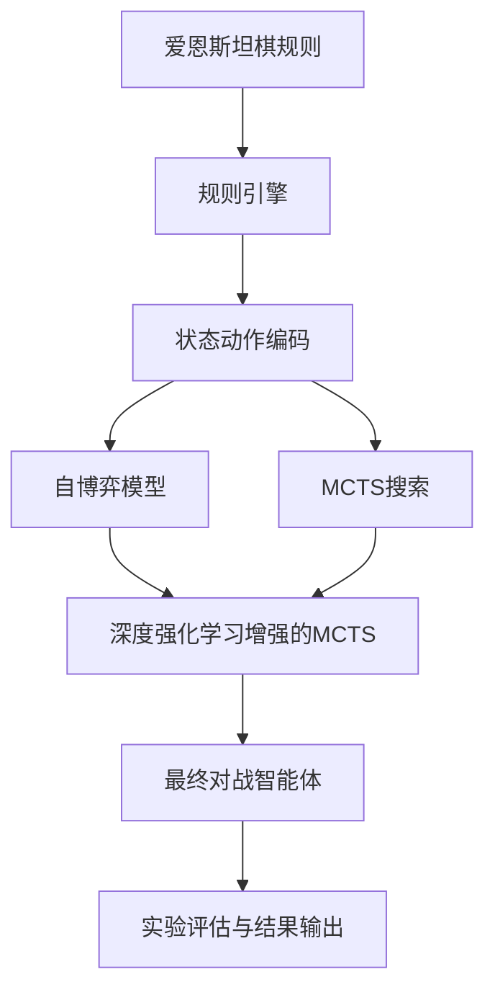
```mermaid
flowchart TB
    A["爱恩斯坦棋规则"] --> B["规则引擎"]
    B --> C["状态动作编码"]
    C --> D["自博弈模型"]
    C --> E["MCTS搜索"]
    D --> F["深度强化学习增强的MCTS"]
    E --> F
    F --> G["最终对战智能体"]
    G --> H["实验评估与结果输出"]
```

## 图1-2 智能体决策流程示意图


```mermaid
flowchart LR
    A["当前棋局"] --> B["掷骰子"]
    B --> C["生成候选棋子"]
    C --> D["生成合法动作"]
    D --> E["智能体决策"]
    E --> F["执行动作"]
    F --> G["更新棋局"]
    G --> H["判断胜负"]
```

------

# 第2章 参数定义与状态动作建模

## 2.1 问题建模概述

爱恩斯坦棋虽然采用 (5 \times 5) 的小规模棋盘，但其决策过程并非简单的确定性棋类博弈。一方面，双方棋子具有明确编号，当前可移动棋子受到骰子点数约束；另一方面，棋子移动过程中可能产生吃子、自吃、到达目标角点等多种状态变化。因此，在构建智能体之前，需要首先将真实棋局转化为神经网络与搜索算法能够处理的数字化表示。

本项目将爱恩斯坦棋建模为一个带随机因素的双人零和博弈过程。设第 (t) 个回合的棋局状态为 (s_t)，当前行动方根据状态选择动作 (a_t)，环境根据游戏规则完成棋子移动、吃子、胜负判断和下一轮掷骰，并转移到新状态 (s_{t+1})。该过程可以形式化表示为：

$$
s_{t+1} \sim P(s_{t+1}\mid s_t,a_t)
$$

其中，(P) 表示状态转移函数。由于下一回合骰子点数具有随机性，因此状态转移不是完全确定的，而是包含随机事件。

本章主要讨论两个核心问题：第一，如何表示一个完整棋局状态；第二，如何定义智能体可以选择的动作空间。前者对应状态空间建模，后者对应动作定义与合法动作筛选。

------

## 2.2 棋盘、棋子与基本变量定义

爱恩斯坦棋棋盘为 (5 \times 5) 方格棋盘。采用从 0 开始的二维坐标表示，则棋盘位置集合定义为：

$$
\mathcal{B}={(i,j)\mid 0\leq i<5,\ 0\leq j<5}
$$

其中，((0,0)) 表示棋盘左上角，((4,4)) 表示棋盘右下角。红方目标角为右下角 ((4,4))，蓝方目标角为左上角 ((0,0))。

红方棋子集合定义为：

$$
\mathcal{R}={R_1,R_2,R_3,R_4,R_5,R_6}
$$

蓝方棋子集合定义为：

$$
\mathcal{U}={U_1,U_2,U_3,U_4,U_5,U_6}
$$

其中，下标表示棋子编号。每枚棋子在任一时刻具有两种状态：一种是仍位于棋盘上的某一坐标位置，另一种是已经被移出棋盘。设棋子 (x) 在时刻 (t) 的位置为：

$$
pos_t(x)\in \mathcal{B}\cup{\varnothing}
$$

其中，(\varnothing) 表示该棋子已经被吃掉或移出棋盘。

当前行动方记为：

$$
p_t\in{\text{Red},\text{Blue}}
$$

当前骰子点数记为：

$$
d_t\in{1,2,3,4,5,6}
$$

因此，一个真实棋局状态不仅包括棋盘布局，还必须包括当前行动方、骰子点数、合法走法集合、胜负状态和回合编号等信息。

在程序实现中，一个局面可以抽象为：

```text
board: 5×5 棋盘
current_player: 当前行动方
dice_roll: 当前骰子点数
winner: 当前胜者
legal_moves: 当前合法走法集合
turn_index: 当前回合编号
```

这些信息共同决定了当前棋局的完整状态。

------

## 2.3 状态空间定义

在深度强化学习和 MCTS 语境下，状态空间需要包含智能体做出决策所需的全部信息。本项目将第 (t) 步的状态定义为：

$$
s_t=(B_t,p_t,d_t,W_t,L_t,k_t)
$$

其中：

$$
B_t
$$

表示当前棋盘状态；

$$
p_t
$$

表示当前行动方；

$$
d_t
$$

表示当前骰子点数；

$$
W_t
$$

表示当前胜负状态；

$$
L_t
$$

表示当前合法动作集合；

$$
k_t
$$

表示当前回合编号。

在该定义中，骰子点数 (d_t) 是不可忽略的重要变量。爱恩斯坦棋不同于围棋、五子棋等确定性棋类，当前行动方并不能任意选择所有己方棋子移动，而是必须受到骰子点数和棋子存活状态的约束。因此，如果状态中不包含骰子点数，智能体将无法判断哪些动作在当前状态下是合法动作。

状态空间可以进一步写为：

$$
\mathcal{S}=\mathcal{B}_{state}\times \mathcal{P}\times \mathcal{D}\times \mathcal{W}\times \mathcal{L}\times \mathcal{K}
$$

其中：

$$
\mathcal{B}_{state}
$$

表示所有可能的棋盘布局集合；

$$
\mathcal{P}={\text{Red},\text{Blue}}
$$

表示行动方集合；

$$
\mathcal{D}={1,2,3,4,5,6}
$$

表示骰子点数集合；

$$
\mathcal{W}={\text{None},\text{RedWin},\text{BlueWin}}
$$

表示胜负状态集合；

$$
\mathcal{L}\subseteq\mathcal{A}
$$

表示当前状态下的合法动作集合；

$$
\mathcal{K}
$$

表示回合编号集合。

------

## 2.4 状态编码：(15\times5\times5) 多通道张量

为了使神经网络能够处理棋局信息，本项目将棋局状态编码为一个三维张量：

$$
X_t\in\mathbb{R}^{15\times5\times5}
$$

其中，(5\times5) 对应原始棋盘的空间结构，15 表示通道数。该编码方式保留了棋子的空间分布特征，适合卷积神经网络提取局面模式；同时又显式加入当前行动方、骰子点数和合法候选棋子等关键信息，使模型能够理解当前规则约束。

具体通道设计如下表所示。

| 通道编号 | 含义                                |
| -------- | ----------------------------------- |
| 0-5      | 红方 1-6 号棋子的位置               |
| 6-11     | 蓝方 1-6 号棋子的位置               |
| 12       | 当前行动方，红方为 (1)，蓝方为 (-1) |
| 13       | 当前骰子点数，使用 (d_t/6) 归一化   |
| 14       | 当前合法候选棋子的位置辅助通道      |

对于棋子位置通道，若某枚棋子位于棋盘坐标 ((i,j))，则其对应通道在该位置取值为 1，其余位置取值为 0。若该棋子已经被移出棋盘，则对应通道全为 0。

形式化地，若红方第 (n) 枚棋子位于 ((i,j))，则：

$$
X_t[n-1,i,j]=1,\quad n\in{1,2,3,4,5,6}
$$

若蓝方第 (n) 枚棋子位于 ((i,j))，则：

$$
X_t[5+n,i,j]=1,\quad n\in{1,2,3,4,5,6}
$$

当前行动方通道使用常数平面表示：

$$
X_t[12,:,:]=
\begin{cases}
1, & p_t=\text{Red}\
-1, & p_t=\text{Blue}
\end{cases}
$$
骰子通道使用归一化数值填充整个平面：

$$
X_t[13,:,:]=\frac{d_t}{6}
$$

其中，(d_t) 为当前骰子点数。通过归一化处理，骰子信息被限制在 ([1/6,1]) 范围内，有利于神经网络稳定训练。

第 14 个通道用于表示当前骰子条件下的合法候选棋子位置。若某枚候选棋子位于 ((i,j))，则：

$$
X_t[14,i,j]=1
$$

否则该位置取 0。

------

## 2.5 合法候选棋子通道设计

第 14 个通道是本项目状态编码中的重要设计。爱恩斯坦棋的走子规则并不是“所有己方棋子均可选择”，而是由骰子点数决定候选棋子。若骰子点数对应的棋子仍在棋盘上，则只能移动该棋子；若该棋子已经被移出，则需要寻找编号上小于骰子点数且最接近的存活棋子，以及编号上大于骰子点数且最接近的存活棋子。

设当前行动方存活棋子编号集合为：

$$
A_t={i\mid pos_t(P_i)\neq \varnothing,\ i\in{1,2,3,4,5,6}}
$$

其中，(P_i) 表示当前行动方编号为 (i) 的棋子。当前骰子点数为 (d_t)。候选棋子集合 (C_t) 定义为：

$$
C_t=
\begin{cases}
{d_t}, & d_t\in A_t\
C_t^- \cup C_t^+, & d_t\notin A_t
\end{cases}
$$
其中：
$$
C_t^-=
\begin{cases}
{\max{i\in A_t\mid i<d_t}}, & \exists i\in A_t,\ i<d_t\
\varnothing, & \text{otherwise}
\end{cases}
$$

$$
C_t^+=
\begin{cases}
{\min{i\in A_t\mid i>d_t}}, & \exists i\in A_t,\ i>d_t\
\varnothing, & \text{otherwise}
\end{cases}
$$
候选棋子位置通道可表示为：
$$
X_t[14,i,j]=
\begin{cases}
1, & \exists c\in C_t,\ pos_t(P_c)=(i,j)\
0, & \text{otherwise}
\end{cases}
$$
加入该通道的意义在于，它将部分规则约束显式提供给神经网络。仅输入骰子点数并不能直接告诉模型哪些棋子当前真正可动，模型需要自行从棋子存活情况和骰子规则中推断候选棋子。候选棋子辅助通道相当于向模型直接标注当前可选棋子的空间位置，能够降低规则学习难度，并帮助策略网络将注意力集中到当前真正可能产生动作的区域。

------

## 2.6 动作空间定义

本项目没有将动作定义为“从某一棋盘格移动到另一棋盘格”，而是将动作抽象为棋子编号和移动方向的组合。对于当前行动方，一个动作定义为：
$$
a_t=(q_t,m_t)
$$
其中，(q_t) 表示被移动的棋子编号，(m_t) 表示移动方向。

棋子编号满足：
$$
q_t\in{1,2,3,4,5,6}
$$
每枚棋子在一个回合中最多有三个移动方向，因此方向编号定义为：
$$
m_t\in{0,1,2}
$$
于是，完整动作空间大小为：
$$
|\mathcal{A}|=6\times3=18
$$
动作编号定义为：
$$
a=(q-1)\times3+m
$$
其中，(q) 为棋子编号，(m) 为方向编号。由此，神经网络可以输出一个固定长度为 18 的动作概率分布：
$$
\pi_\theta(a\mid s),\quad a\in{0,1,\dots,17}
$$
动作编号与棋子、方向的对应关系如下。

| 动作编号 | 棋子编号 | 方向编号 |
| -------- | -------- | -------- |
| 0        | 1        | 0        |
| 1        | 1        | 1        |
| 2        | 1        | 2        |
| 3        | 2        | 0        |
| 4        | 2        | 1        |
| 5        | 2        | 2        |
| (\cdots) | (\cdots) | (\cdots) |
| 15       | 6        | 0        |
| 16       | 6        | 1        |
| 17       | 6        | 2        |

这种动作定义方式具有两个优点。第一，动作空间固定，便于神经网络输出统一维度的策略分布。第二，动作数量较小，只有 18 个，有利于 MCTS 搜索和策略网络训练。

------

## 2.7 红蓝双方方向解释

虽然动作空间统一为 18 维，但红方和蓝方在真实棋盘上的移动方向不同。因此，同一个动作编号在不同当前行动方下，需要解释为不同的坐标变化。

对红方而言，三个方向定义为：
$$
m=0:\ (0,+1)
$$

$$
m=1:\ (+1,0)
$$

$$
m=2:\ (+1,+1)
$$
分别表示向右、向下和向右下。

对蓝方而言，三个方向定义为：
$$
m=0:\ (0,-1)
$$

$$
m=1:\ (-1,0)
$$

$$
m=2:\ (-1,-1)
$$
分别表示向左、向上和向左上。

因此，若当前棋子位置为 ((i,j))，动作方向对应的目标位置可以表示为：
$$
(i',j')=(i,j)+\Delta(p_t,m)
$$
其中，(\Delta(p_t,m)) 表示由当前行动方和方向编号共同决定的位移向量。

该设计使得神经网络输出层可以保持统一结构，而规则引擎在执行动作时根据当前行动方将动作解释为实际棋盘移动。

------

## 2.8 合法动作集合与动作掩码

在任一状态下，虽然动作空间大小固定为 18，但并非所有动作都可以执行。当前合法动作集合记为：
$$
\mathcal{A}_{legal}(s_t)\subseteq \mathcal{A}
$$
一个动作 (a=(q,m)) 合法需要同时满足以下条件：

第一，棋子 (q) 必须属于当前骰子点数对应的候选棋子集合：
$$
q\in C_t
$$
第二，棋子 (q) 必须仍在棋盘上：
$$
pos_t(P_q)\neq \varnothing
$$
第三，按照当前行动方和方向 (m) 移动后，目标坐标不能越出棋盘边界：
$$
(i',j')\in\mathcal{B}
$$
由于规则允许吃掉己方棋子，因此目标位置上是否已有棋子并不影响动作合法性。目标格中若存在棋子，则在状态转移过程中将其移出棋盘。

为了便于神经网络决策，本项目定义合法动作掩码：
$$
M_t\in{0,1}^{18}
$$
其中：
$$
M_t(a)=
\begin{cases}
1, & a\in \mathcal{A}*{legal}(s_t)\
0, & a\notin \mathcal{A}*{legal}(s_t)
\end{cases}
$$
策略网络首先输出 18 维 logits：
$$
z_\theta(s_t)\in\mathbb{R}^{18}
$$
然后使用合法动作掩码屏蔽非法动作。被屏蔽后的策略分布为：
$$
\pi_\theta(a\mid s_t)=
\frac{\exp(z_a)\cdot M_t(a)}
{\sum_{b=0}^{17}\exp(z_b)\cdot M_t(b)}
$$
该公式保证了非法动作的概率为 0，即：
$$
M_t(a)=0\Rightarrow \pi_\theta(a\mid s_t)=0
$$
因此，动作空间虽然是固定的 18 维，但每个具体局面下实际可执行的动作集合是动态变化的。

------

## 2.9 面向神经网络与 MCTS 的统一接口

上述状态编码和动作定义同时服务于策略价值网络和 MCTS 搜索过程。对于神经网络而言，状态张量 (X_t) 是模型输入，18 维动作空间是策略头输出；对于 MCTS 而言，合法动作集合 (\mathcal{A}_{legal}(s_t)) 用于节点扩展，状态转移函数用于模拟后续局面，动作编号则用于统一记录搜索统计量。

在策略价值网络中，模型可以表示为：
$$
(p_\theta,v_\theta)=f_\theta(X_t)
$$
其中：
$$
p_\theta\in\mathbb{R}^{18}
$$
表示动作概率分布，
$$
v_\theta\in[-1,1]
$$
表示当前局面对当前行动方的价值估计。

在 MCTS 中，每个节点维护动作访问次数和动作价值：
$$
N(s,a),\quad Q(s,a)
$$
若使用深度强化学习增强的 MCTS，则策略网络输出 (p_\theta) 可作为搜索先验：
$$
P(s,a)=p_\theta(a\mid s)
$$
价值网络输出 (v_\theta) 可作为叶子节点评估：
$$
V(s)=v_\theta(s)
$$

因此，本章所定义的状态空间和动作空间构成了规则引擎、神经网络模型和 MCTS 搜索之间的统一接口。

------

## 2.10 本章小结

本章对爱恩斯坦棋智能体所需的状态空间和动作空间进行了形式化建模。首先，将真实棋局定义为由棋盘状态、当前行动方、骰子点数、胜负状态、合法动作集合和回合编号共同组成的状态。其次，为适配神经网络训练，设计了 (15\times5\times5) 的多通道状态编码，其中包含红蓝双方棋子位置、当前行动方、归一化骰子点数以及合法候选棋子位置。再次，将动作空间定义为 6 个棋子编号与 3 个移动方向的组合，形成固定的 18 维离散动作空间。最后，通过合法动作掩码机制对策略网络输出进行约束，保证智能体只会选择当前规则允许的动作。

该建模方式既保留了棋盘空间结构，又显式表达了骰子随机性和合法动作约束，为后续自博弈模型、策略价值网络以及深度强化学习增强的 MCTS 方法提供了统一的数据基础。

------

# 图2-1 状态编码与动作决策流程示意

你可以把下面这个图放到 Word 里作为第2章示意图。如果 Word 里不能直接渲染 Mermaid，可以用 Mermaid 在线编辑器导出 PNG 后插入。

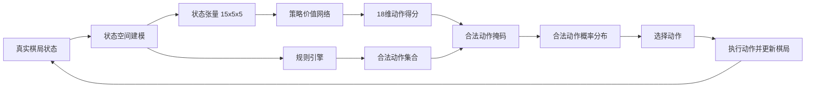
```mermaid
flowchart LR
    A["真实棋局状态"] --> B["状态空间建模"]
    B --> C["状态张量 15x5x5"]
    C --> D["策略价值网络"]

    D --> E["18维动作得分"]
    E --> F["合法动作掩码"]
    F --> G["合法动作概率分布"]

    B --> H["规则引擎"]
    H --> I["合法动作集合"]
    I --> F

    G --> J["选择动作"]
    J --> K["执行动作并更新棋局"]
    K --> A
```

------

# 图2-2 状态张量通道结构示意

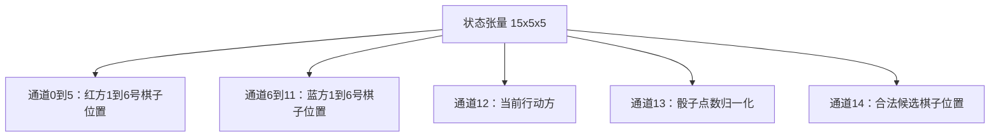
```mermaid
flowchart TB
    A["状态张量 15x5x5"]

    A --> B["通道0到5：红方1到6号棋子位置"]
    A --> C["通道6到11：蓝方1到6号棋子位置"]
    A --> D["通道12：当前行动方"]
    A --> E["通道13：骰子点数归一化"]
    A --> F["通道14：合法候选棋子位置"]
```

------

# 图2-3 18维动作空间示意

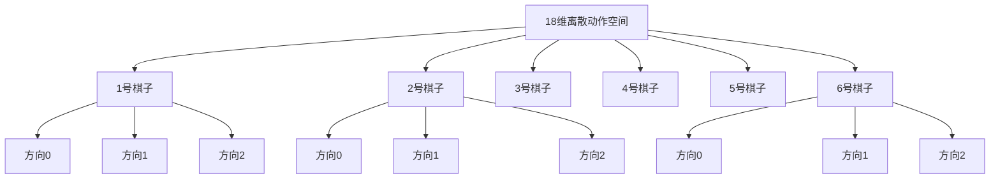
```mermaid
flowchart TB
    A[18维离散动作空间]

    A --> P1[1号棋子]
    A --> P2[2号棋子]
    A --> P3[3号棋子]
    A --> P4[4号棋子]
    A --> P5[5号棋子]
    A --> P6[6号棋子]

    P1 --> P1A[方向0]
    P1 --> P1B[方向1]
    P1 --> P1C[方向2]

    P2 --> P2A[方向0]
    P2 --> P2B[方向1]
    P2 --> P2C[方向2]

    P6 --> P6A[方向0]
    P6 --> P6B[方向1]
    P6 --> P6C[方向2]
```
# 第3章 整体技术路线

## 3.1 技术路线概述

本项目围绕爱恩斯坦棋 AI 对抗任务，采用“规则建模—状态编码—自博弈学习—搜索增强—实验评估”的整体技术路线。首先，系统需要建立完整的爱恩斯坦棋规则引擎，使程序能够准确处理棋盘状态、骰子选子、合法动作、棋子移动、吃子和胜负判定。其次，需要将真实棋局转换为神经网络和 MCTS 搜索算法能够处理的数字化表示，包括状态张量、动作编号和合法动作掩码。随后，项目以自博弈模型作为基线方法，通过智能体与自身对战产生训练数据，并训练策略价值网络。最后，在基线模型基础上进一步引入 MCTS 搜索，并利用策略价值网络为搜索提供动作先验和局面价值评估，形成深度强化学习增强的 MCTS 方法。

整体技术路线可以表示为：

$$
\text{规则引擎}
\rightarrow
\text{状态动作编码}
\rightarrow
\text{自博弈模型}
\rightarrow
\text{策略价值网络}
\rightarrow
\text{深度强化学习增强的 MCTS}
\rightarrow
\text{实验评估}
$$

其中，自博弈模型作为基线方法，主要用于验证状态编码、动作编码和策略价值网络的有效性；深度强化学习增强的 MCTS 作为进阶模型，主要用于提升智能体在复杂局面下的前瞻搜索能力和决策质量。

---

## 3.2 系统总体架构

本项目整体系统可以划分为五个层次：规则引擎层、状态动作编码层、智能体决策层、训练评估层和可视化输出层。各层之间保持相对独立，使规则实现、模型训练、搜索决策和结果展示能够解耦。

| 层次      | 主要功能                            | 作用               |
| ------- | ------------------------------- | ---------------- |
| 规则引擎层   | 棋盘维护、掷骰、候选棋子生成、合法动作判断、吃子、胜负判定   | 保证对弈过程符合爱恩斯坦棋规则  |
| 状态动作编码层 | 15×5×5 状态张量、18 维动作编码、合法动作掩码     | 建立规则系统与学习算法之间的接口 |
| 智能体决策层  | 随机智能体、自博弈模型、MCTS、深度强化学习增强的 MCTS | 根据当前局面选择动作       |
| 训练评估层   | 自博弈数据生成、模型训练、模型保存、性能评估          | 支撑模型迭代和实验对比      |
| 可视化输出层  | 对战界面、棋局回放、训练曲线、实验结果输出           | 展示系统运行效果和训练过程    |

系统架构示意如下。

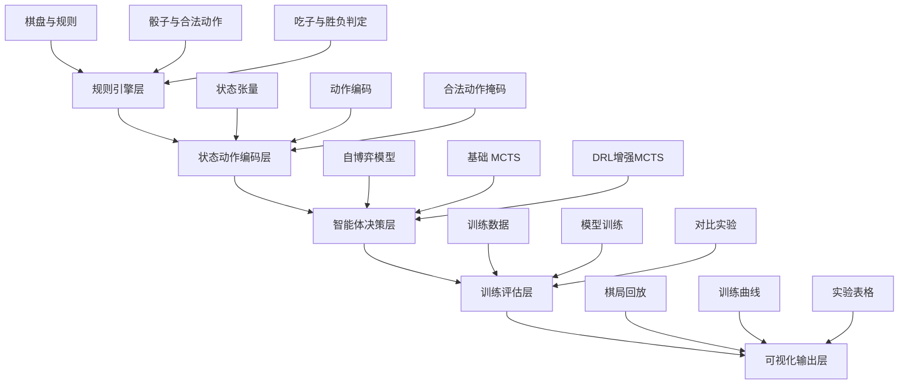
```mermaid
flowchart TB
    A["规则引擎层"] --> B["状态动作编码层"]
    B --> C["智能体决策层"]
    C --> D["训练评估层"]
    D --> E["可视化输出层"]

    A1["棋盘与规则"] --> A
    A2["骰子与合法动作"] --> A
    A3["吃子与胜负判定"] --> A

    B1["状态张量"] --> B
    B2["动作编码"] --> B
    B3["合法动作掩码"] --> B

    C1["自博弈模型"] --> C
    C2["基础 MCTS"] --> C
    C3["DRL增强MCTS"] --> C

    D1["训练数据"] --> D
    D2["模型训练"] --> D
    D3["对比实验"] --> D

    E1["棋局回放"] --> E
    E2["训练曲线"] --> E
    E3["实验表格"] --> E
```

这种分层架构的优点在于：规则引擎可以独立测试，状态编码可以独立验证，智能体算法可以灵活替换，训练系统和可视化系统也可以分别运行。

---

## 3.3 方法演化路线

本项目采用由基础到进阶的渐进式方法演化路线。整体上，算法发展过程可以分为两个主要阶段：第一阶段是基线方法，即自博弈模型；第二阶段是进阶方法，即深度强化学习增强的 MCTS。

自博弈模型通过智能体与自身对弈生成数据，使策略价值网络能够从对局结果中学习基本决策能力。该方法不依赖人工棋谱，具有较强的自动数据生成能力，但由于缺少前瞻搜索，在复杂局面下容易出现短视决策。

深度强化学习增强的 MCTS 在自博弈模型基础上进一步加入搜索机制。策略价值网络为搜索提供动作先验和局面价值估计，MCTS 则通过模拟未来局面提升当前动作选择的可靠性。二者结合后，智能体既具有神经网络的泛化能力，又具有搜索算法的前瞻能力。

方法演化过程如下表所示。

| 阶段  | 方法名称             | 核心思想            | 阶段作用      |
| --- | ---------------- | --------------- | --------- |
| 阶段一 | 规则引擎             | 完整实现棋局规则和状态转移   | 提供可靠对弈环境  |
| 阶段二 | 状态动作编码           | 将棋局转换为张量和动作编号   | 连接规则系统与模型 |
| 阶段三 | 自博弈模型            | 通过自我对弈训练策略价值网络  | 形成基线智能体   |
| 阶段四 | 基础 MCTS          | 使用搜索和随机模拟选择动作   | 获得搜索型智能体  |
| 阶段五 | 策略价值网络           | 学习动作分布和局面价值     | 提供神经网络先验  |
| 阶段六 | Root Neural MCTS | 在根节点引入网络先验和价值   | 初步结合搜索与学习 |
| 阶段七 | Full Neural MCTS | 在多层搜索树中使用策略价值网络 | 形成最终进阶智能体 |

方法演化流程可以表示为：


```mermaid
flowchart LR
    A["规则引擎"] --> B["状态动作编码"]
    B --> C["自博弈模型"]
    C --> D["基础 MCTS"]
    D --> E["策略价值网络"]
    E --> F["Root Neural MCTS"]
    F --> G["随机开局迭代"]
    G --> H["Full Neural MCTS"]
    H --> I["最终智能体"]
```

---

## 3.4 基线方法：自博弈模型

本文将自博弈模型作为基线方法。自博弈模型是指智能体不依赖人工棋谱，而是通过与自身或历史版本模型对弈产生训练数据，并利用这些数据训练策略价值网络。

设策略价值网络为：

$$
(p_\theta, v_\theta)=f_\theta(s)
$$

其中，$$s$$ 表示当前棋局状态，$$p_\theta$$ 表示策略输出，$$v_\theta$$ 表示价值输出。由于本项目动作空间为 18 维离散空间，因此策略输出满足：

$$
p_\theta \in \mathbb{R}^{18}
$$

价值输出用于估计当前局面对当前行动方的有利程度，其取值范围通常设为：

$$
v_\theta \in [-1,1]
$$

当 $$v_\theta$$ 越接近 1 时，表示当前行动方越可能获胜；当 $$v_\theta$$ 越接近 -1 时，表示当前行动方越可能失败。

自博弈模型的基本训练闭环如下。


```mermaid
flowchart LR
    A["当前策略价值网络"] --> B["自我对弈"]
    B --> C["生成对局数据"]
    C --> D["训练策略价值网络"]
    D --> E["更新模型参数"]
    E --> A
```

在每一局自博弈过程中，可以保存如下训练样本：

$$
(s_t,\pi_t,z_t)
$$

其中，$$s_t$$ 表示第 $$t$$ 步棋局状态，$$\pi_t$$ 表示该状态下的动作分布标签，$$z_t$$ 表示最终胜负结果。若当前行动方最终获胜，则 $$z_t=1$$；若当前行动方最终失败，则 $$z_t=-1$$。

策略价值网络的联合损失可以写为：

$$
L(\theta)=(z-v_\theta)^2-\pi^T\log p_\theta+\lambda|\theta|_2^2
$$

其中，第一项为价值损失，用于训练价值头预测局面胜负；第二项为策略损失，用于训练策略头拟合目标动作分布；第三项为正则化项，用于约束模型复杂度、降低过拟合风险。

自博弈模型具有以下特点。

| 方面      | 说明                 |
| ------- | ------------------ |
| 数据来源    | 由智能体自我对弈自动生成       |
| 决策方式    | 策略价值网络直接输出动作概率     |
| 优点      | 结构清晰、推理速度快、不依赖人工棋谱 |
| 不足      | 缺少搜索前瞻，复杂局面下可能短视   |
| 在本文中的作用 | 作为实验基线和后续进阶方法基础    |

---

## 3.5 进阶方法：深度强化学习增强的 MCTS

在基线方法基础上，本项目进一步设计深度强化学习增强的 MCTS。该方法的核心思想是将策略价值网络与 MCTS 搜索结合起来，使神经网络为搜索提供先验知识，使搜索为当前决策提供前瞻推演。

传统 MCTS 通常依靠大量随机模拟估计动作价值。然而，在爱恩斯坦棋中，由于存在骰子随机性和复杂的候选棋子规则，完全随机模拟容易产生较大噪声。策略价值网络可以为 MCTS 提供两个关键信息：

| 网络输出                       | 在 MCTS 中的作用                |
| -------------------------- | -------------------------- |
| 策略输出 $$p_\theta(a\mid s)$$ | 作为动作先验，引导搜索优先探索高概率动作       |
| 价值输出 $$v_\theta(s)$$       | 作为叶子节点价值估计，减少随机 rollout 噪声 |

因此，深度强化学习增强的 MCTS 可以概括为：

$$
\text{DRL增强MCTS}
================

\text{策略价值网络}
+
\text{MCTS搜索}
$$

在搜索过程中，策略价值网络给出先验概率：

$$
P(s,a)=p_\theta(a\mid s)
$$

并对叶子节点进行价值评估：

$$
V(s)=v_\theta(s)
$$

MCTS 则根据访问次数、动作价值和策略先验选择扩展动作。典型的 PUCT 选择公式为：

$$
a^*=\arg\max_a
\left[
Q(s,a)+c_{puct}P(s,a)\frac{\sqrt{N(s)}}{1+N(s,a)}
\right]
$$

其中，$$Q(s,a)$$ 表示动作价值，$$P(s,a)$$ 表示策略先验，$$N(s)$$ 表示状态访问次数，$$N(s,a)$$ 表示动作访问次数，$$c_{puct}$$ 为探索系数。

深度强化学习增强的 MCTS 决策流程如下。

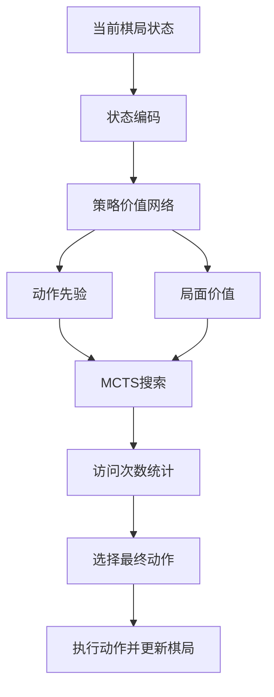
```mermaid
flowchart TB
    A["当前棋局状态"] --> B["状态编码"]
    B --> C["策略价值网络"]
    C --> D["动作先验"]
    C --> E["局面价值"]
    D --> F["MCTS搜索"]
    E --> F
    F --> G["访问次数统计"]
    G --> H["选择最终动作"]
    H --> I["执行动作并更新棋局"]
```

该方法的优势在于：策略价值网络减少了 MCTS 的无效探索，MCTS 又弥补了纯神经网络缺少前瞻的问题。二者结合后，智能体能够在较小搜索预算下获得更高质量的动作选择。

---

## 3.6 多阶段辅助进化流程

深度强化学习增强的 MCTS 并不是一次性完成的，而是通过多阶段迭代逐步构建。每一阶段都在前一阶段基础上生成更高质量的数据或更强的决策模型。

### 3.6.1 基础 MCTS 阶段

基础 MCTS 阶段不依赖神经网络，而是通过搜索和随机模拟选择动作。该阶段的主要作用是获得第一个具备一定棋力的搜索型智能体，并利用它生成初始自我对弈数据。

基础 MCTS 包括四个核心步骤：

| 步骤              | 含义                   |
| --------------- | -------------------- |
| Selection       | 从根节点开始，根据选择策略向下访问子节点 |
| Expansion       | 在叶子节点扩展新的合法动作        |
| Simulation      | 通过模拟对局估计局面结果         |
| Backpropagation | 将模拟结果沿搜索路径回传         |

### 3.6.2 策略价值网络阶段

策略价值网络阶段使用 MCTS 生成的数据训练神经网络，使模型能够学习搜索过程中体现出的动作偏好和局面评估能力。

训练样本形式为：

$$
(s,\pi,z)
$$

其中，$$s$$ 为棋局状态，$$\pi$$ 为由搜索访问次数形成的动作分布，$$z$$ 为最终胜负结果。

该阶段的目标是获得一个不依赖搜索也能直接决策的纯神经网络智能体。

### 3.6.3 Root Neural MCTS 阶段

Root Neural MCTS 阶段将策略价值网络接入 MCTS，但主要在根节点使用网络输出的动作先验和价值评估。与基础 MCTS 相比，该阶段能够在当前局面下更快关注高价值动作，从而提高搜索效率。

Root Neural MCTS 可以看作神经网络与搜索结合的初始版本，其主要作用是验证策略价值网络对搜索过程的辅助效果。

### 3.6.4 随机开局与迭代数据阶段

由于爱恩斯坦棋允许开局棋子在出发区内任意摆放，若模型只在固定开局上训练，容易出现对特定布局的过拟合。因此，本项目引入随机开局机制，使智能体在更多初始布局下进行自我对弈。

随机开局阶段的数据来源更加多样，包括基础 MCTS 数据、策略价值网络自博弈数据和 Neural MCTS 数据。通过合并多阶段数据重新训练模型，可以提高策略价值网络对不同开局的泛化能力。

### 3.6.5 Full Neural MCTS 阶段

Full Neural MCTS 阶段在搜索树的多层节点中使用策略价值网络，而不仅限于根节点。每当搜索扩展到新的叶子节点时，系统都会调用策略价值网络获得该状态下的动作先验和局面价值。

该阶段需要同时处理玩家动作节点和骰子随机节点。玩家动作节点负责选择走法，骰子随机节点负责刻画下一回合骰子点数带来的不确定性。叶子节点的价值由网络评估后沿搜索路径回传，从而形成更加完整的神经网络增强搜索过程。

多阶段辅助进化关系如下。

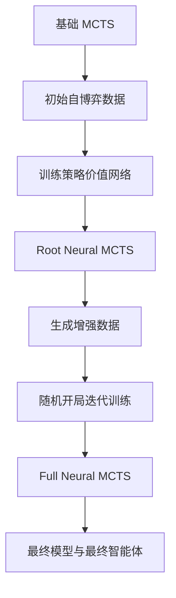
```mermaid
flowchart TB
    A["基础 MCTS"] --> B["初始自博弈数据"]
    B --> C["训练策略价值网络"]
    C --> D["Root Neural MCTS"]
    D --> E["生成增强数据"]
    E --> F["随机开局迭代训练"]
    F --> G["Full Neural MCTS"]
    G --> H["最终模型与最终智能体"]
```

---

## 3.7 训练、评估与可视化闭环

本项目不仅关注最终智能体棋力，也关注训练过程是否可复现、实验结果是否可比较、对局过程是否可解释。因此，在整体技术路线中，训练、评估和可视化构成一个闭环。

训练阶段通过自博弈或 MCTS 生成对局数据，并保存状态、动作、动作分布、价值目标和胜负结果。模型训练后，系统定期保存网络权重、训练指标和对局记录。

评估阶段通过不同智能体之间的大量对战比较模型性能，包括自博弈模型、基础 MCTS、单策略价值网络、Root Neural MCTS 和 Full Neural MCTS 等。评估指标包括胜率、平均步数、平均决策时间、到角点获胜比例和吃光获胜比例等。

可视化阶段则负责展示棋局回放、动作概率、价值估计和训练曲线，使模型行为更加直观可解释。

| 模块    | 输出内容                |
| ----- | ------------------- |
| 训练模块  | 模型参数、训练损失、reward 曲线 |
| 评估模块  | 胜率、平均步数、平均决策时间      |
| 回放模块  | 完整棋局记录、每步动作、胜负原因    |
| 可视化模块 | 棋盘界面、策略概率、价值估计、曲线图  |

训练评估闭环如下。


```mermaid
flowchart LR
    A["自博弈与搜索对局"] --> B["生成训练数据"]
    B --> C["训练策略价值网络"]
    C --> D["保存模型"]
    D --> E["对战评估"]
    E --> F["生成实验结果"]
    F --> G["可视化分析"]
    G --> A
```

---

## 3.8 本章小结

本章从整体层面对项目技术路线进行了说明。项目首先通过规则引擎和状态动作编码建立可靠的计算机博弈基础，然后以自博弈模型作为基线方法，训练策略价值网络实现直接决策。在此基础上，项目进一步引入 MCTS 搜索，并利用策略价值网络提供动作先验和局面价值评估，形成深度强化学习增强的 MCTS 方法。

整体而言，本文方法的核心思想是将自博弈学习和前瞻搜索结合起来：自博弈模型提供可学习的策略和价值估计，MCTS 提供局部搜索和未来推演能力，二者相互增强，最终形成具有较强对弈能力和较好泛化能力的爱恩斯坦棋智能体。


# 第4章 基线方法：自博弈 Actor-Critic 模型

本章介绍本文采用的基线方法：**无搜索增强的自博弈 Actor-Critic 模型**。该模型不使用 MCTS 前瞻搜索，也不依赖人工棋谱，而是通过智能体与自身对弈生成训练经验，并使用 Actor-Critic 方法更新策略价值网络。该方法作为本文的基线模型，用于后续与“深度强化学习增强的 MCTS”方法进行对比。

需要说明的是，第2章中曾给出一种 `15×5×5` 状态编码设计，而当前代码中的 Actor-Critic 基线模型实际采用 `18×5×5` 状态输入。差异主要在于：第2章中骰子信息采用单通道归一化表示，而本章实际实现将骰子点数表示为 6 个 one-hot 平面。因此，本章以实际实现为准，使用 `18×5×5` 状态张量。该调整并不改变第2章状态空间建模的基本思想，而是对骰子信息表达方式进行了更显式的工程化实现。

------

## 4.1 自博弈模型的基本思想

自博弈模型的核心思想是：不依赖人工棋谱，而是让智能体通过与自身对弈产生训练经验，并利用这些经验不断更新策略价值网络。在该过程中，模型既是对弈数据的生成者，也是训练数据的学习者。

在本文中，自博弈模型作为基线方法，具有两个作用。第一，它验证第2章中状态编码、动作编码和合法动作掩码设计是否能够支持神经网络学习；第二，它为第5章“深度强化学习增强的 MCTS”提供对照基准，用于分析搜索增强机制带来的性能提升。

自博弈模型的整体闭环可以表示为：

$$
\text{当前策略价值网络}
\rightarrow
\text{自我对弈}
\rightarrow
\text{生成训练经验}
\rightarrow
\text{更新网络参数}
\rightarrow
\text{新策略价值网络}
$$

该模型在决策时不展开搜索树，而是直接根据当前局面输出动作概率分布和价值估计。因此，它的决策速度较快，结构相对简单，但也缺少对未来多步局面的显式推演能力。


```mermaid
flowchart LR
    A["当前 Actor-Critic 模型"] --> B["自我对弈"]
    B --> C["生成 transition 经验"]
    C --> D["写入经验回放池"]
    D --> E["采样 batch"]
    E --> F["计算损失并更新模型"]
    F --> A
```

**图4-1 自博弈 Actor-Critic 基线模型训练闭环**

从强化学习角度看，自博弈模型可以视为一种自动数据生成机制。智能体在没有人工标注棋谱的情况下，通过不断对局探索状态空间，并根据胜负反馈和局面价值估计修正策略。对于爱恩斯坦棋这类小棋盘、强规则约束且带骰子随机性的博弈任务，自博弈能够在较低人工成本下生成大量训练样本，是构建后续进阶智能体的重要基础。

------

## 4.2 自博弈数据生成流程

在自博弈过程中，当前 Actor-Critic 智能体与自身进行完整对局。每一步中，环境首先给出当前状态、当前骰子点数和合法动作集合；策略网络根据状态输出动作 logits；系统利用合法动作掩码过滤非法动作，并从合法动作概率分布中选择动作；随后规则引擎执行动作，完成棋子移动、吃子处理、胜负判定和下一状态生成。

每一步生成的训练样本以 transition 形式保存。一个 transition 可表示为：

$$
\tau_t=
(s_t,M_t,a_t,r_t,s_{t+1},M_{t+1},done_t,\log p_{old}(a_t|s_t),v_{old}(s_t))
$$

其中，(s_t) 表示当前状态，(M_t) 表示当前合法动作掩码，(a_t) 表示当前执行动作，(r_t) 表示即时奖励，(s_{t+1}) 表示下一状态，(M_{t+1}) 表示下一状态合法动作掩码，(done_t) 表示对局是否结束，(\log p_{old}(a_t|s_t)) 表示采样动作时旧策略下的对数概率，(v_{old}(s_t)) 表示采样时旧价值网络的估计值。

**表4-1 Transition 字段说明**

| 字段              | 含义                 | 作用                 |
| ----------------- | -------------------- | -------------------- |
| (s_t)             | 当前状态             | 作为网络输入         |
| (M_t)             | 当前合法动作掩码     | 过滤非法动作         |
| (a_t)             | 当前执行动作         | 作为策略更新对象     |
| (r_t)             | 当前奖励             | 构造 TD 目标         |
| (s_{t+1})         | 下一状态             | 用于价值估计         |
| (M_{t+1})         | 下一状态合法动作掩码 | 用于下一状态策略计算 |
| (done_t)          | 是否终局             | 判断是否截断价值回传 |
| (\log p_{old}(a_t | s_t))                | 旧策略动作概率       |
| (v_{old}(s_t))    | 旧价值估计           | 用于训练记录和诊断   |

除 transition 外，系统还会保存完整棋局记录，用于后续棋局回放和可视化分析。不过，本章训练目标主要基于 transition，而不是基于 MCTS 访问次数或专家棋谱。


```mermaid
flowchart LR
    A["当前状态 s_t"] --> B["Actor-Critic 输出策略与价值"]
    B --> C["合法动作 mask"]
    C --> D["选择动作 a_t"]
    D --> E["规则引擎执行动作"]
    E --> F["得到 r_t 与 s_t+1"]
    F --> G["保存 transition"]
    G --> H["Replay Buffer"]
```

**图4-2 自博弈 transition 生成流程**

完整棋局记录与 transition 经验的作用不同。transition 是训练过程中的基本更新单位，主要服务于网络参数学习；完整棋局记录则更适合用于调试、复盘和可视化展示。例如，在报告中可以通过棋局回放观察模型是否学会了向目标角点推进、是否能够合理吃子、是否会在特定情况下主动自吃等行为。这种训练数据与可视化数据分离的设计，有助于同时保证训练效率和结果可解释性。

------

## 4.3 策略价值网络结构

自博弈模型采用 Actor-Critic 网络结构。网络输入为当前行动方视角下的状态张量，输出包括两部分：一是策略输出，用于表示每个动作的选择倾向；二是价值输出，用于估计当前局面对当前行动方的有利程度。

本章实际使用的状态输入为：

$$
X_t \in \mathbb{R}^{18\times5\times5}
$$

其通道设计如下。

**表4-2 Actor-Critic 模型状态输入通道**

| 通道范围 | 含义                      |
| -------- | ------------------------- |
| 0-5      | 当前行动方 1-6 号棋子位置 |
| 6-11     | 对手 1-6 号棋子位置       |
| 12-17    | 当前骰子点数 one-hot 平面 |

其中，前 12 个通道用于表示双方棋子在棋盘上的空间分布，后 6 个通道用于表示当前骰子点数。若当前行动方为蓝方，则系统会对棋盘进行镜像变换，使网络始终从“当前行动方由左上向右下前进”的统一视角学习。该设计减少了红蓝双方方向差异带来的学习负担，使同一套网络参数能够同时适用于双方决策。

网络整体可以表示为：

$$
(l_\theta(s_t),v_\theta(s_t))=f_\theta(X_t)
$$

其中，(l_\theta(s_t)\in\mathbb{R}^{18}) 表示 Actor 输出的动作 logits，(v_\theta(s_t)\in[-1,1]) 表示 Critic 输出的状态价值。

网络结构如下表所示。

**表4-3 Actor-Critic 网络结构**

| 模块         | 结构                          | 输出         |
| ------------ | ----------------------------- | ------------ |
| 输入层       | (18\times5\times5) 状态张量   | 棋局状态表示 |
| 初始卷积层   | Conv (3\times3)，18→64，ReLU  | 基础空间特征 |
| 残差模块     | ResidualBlock × 2             | 强化局面特征 |
| 升维卷积层   | Conv (3\times3)，64→128，ReLU | 高维空间特征 |
| 展平层       | Flatten                       | 特征向量     |
| 共享全连接层 | FC 3200→256，ReLU             | 共享局面表示 |
| Actor Head   | FC 256→18                     | 动作 logits  |
| Critic Head  | FC 256→1，Tanh                | 状态价值     |

其中，残差块的内部结构可以表示为：

$$
F(x)=Conv_2(ReLU(Conv_1(x)))
$$

$$
y=ReLU(F(x)+x)
$$

残差连接通过将输入特征 (x) 与主分支变换结果 (F(x)) 相加，使网络在增加深度的同时保留原始特征信息，从而提高训练稳定性。对于 (5\times5) 的小棋盘而言，网络不需要使用大型 ResNet，但适当加入轻量残差块可以增强特征表达能力，避免简单浅层卷积难以捕获局部棋子关系的问题。

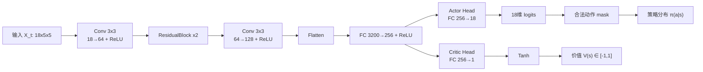
```mermaid
flowchart LR
    A["输入 X_t: 18x5x5"] --> B["Conv 3x3\n18→64 + ReLU"]
    B --> C["ResidualBlock x2"]
    C --> D["Conv 3x3\n64→128 + ReLU"]
    D --> E["Flatten"]
    E --> F["FC 3200→256 + ReLU"]

    F --> G["Actor Head\nFC 256→18"]
    G --> H["18维 logits"]
    H --> I["合法动作 mask"]
    I --> J["策略分布 π(a|s)"]

    F --> K["Critic Head\nFC 256→1"]
    K --> L["Tanh"]
    L --> M["价值 V(s) ∈ [-1,1]"]
```

**图4-3 Actor-Critic 策略价值网络结构**

残差块的内部逻辑可以进一步展开如下。

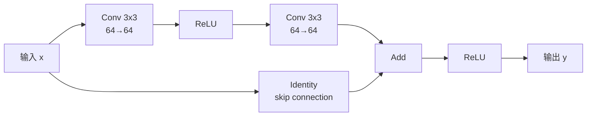
```mermaid
flowchart LR
    A["输入 x"] --> B["Conv 3x3\n64→64"]
    B --> C["ReLU"]
    C --> D["Conv 3x3\n64→64"]
    A --> E["Identity\nskip connection"]
    D --> F["Add"]
    E --> F
    F --> G["ReLU"]
    G --> H["输出 y"]
```

**图4-4 残差块内部结构示意图**

通过共享卷积主干和双头输出结构，模型能够同时学习两类信息：Actor 学习“当前应该如何走”，Critic 学习“当前局面对当前行动方是否有利”。这种策略与价值联合建模的方式，是后续自博弈训练能够进行稳定更新的重要基础。

------

## 4.4 策略学习函数

策略学习的目标是使模型在当前状态下更倾向于选择能够带来较高收益的动作。Actor Head 首先输出 18 维动作 logits：

$$
l_\theta(s_t)\in\mathbb{R}^{18}
$$

由于不同状态下合法动作集合不同，不能直接对所有 18 个动作进行 softmax，而必须结合规则引擎生成的合法动作掩码 (M_t)。带掩码的策略分布定义为：

$$
\pi_\theta(a|s_t)
\frac{\exp(l_a)M_t(a)}
{\sum_{b=0}^{17}\exp(l_b)M_t(b)}
$$
其中，(M_t(a)=1) 表示动作 (a) 合法，(M_t(a)=0) 表示动作 (a) 非法。由此可知：
$$
M_t(a)=0 \Rightarrow \pi_\theta(a|s_t)=0
$$
因此，合法动作掩码保证模型不会选择违反规则的动作。

策略学习的核心并不是简单地让模型模仿某个固定标签，而是根据自博弈过程中动作带来的收益调整动作概率。若某一动作的优势值 (A_t) 为正，说明该动作结果优于价值网络预期，应提高其概率；若优势值为负，则应降低其概率。

为限制策略更新幅度，本文采用 PPO-style clipped objective。设当前策略与旧策略之间的概率比率为：

$$
\rho_t= \exp\left( \log \pi_\theta(a_t|s_t)
\log \pi_{old}(a_t|s_t)
\right)
$$

则策略损失定义为：

$$
L_{policy}
-\mathbb{E}
\left[
\min
\left(
\rho_t A_t,
clip(\rho_t,1-\epsilon,1+\epsilon)A_t
\right)
\right]
$$
其中，(\epsilon) 为裁剪系数。该损失能够避免策略在一次更新中偏移过大，提高训练稳定性。

从直观上看，当动作 (a_t) 的优势为正时，目标函数倾向于提高该动作的概率；当优势为负时，目标函数倾向于降低该动作的概率。PPO-style 裁剪项则用于防止概率比率 (\rho_t) 偏离 1 过远，从而避免旧经验对当前策略造成过强冲击。

------

## 4.5 价值学习函数

Critic 的任务是估计当前状态对当前行动方的价值。价值函数定义为：
$$
v_\theta(s_t)\in[-1,1]
$$
其中，价值越接近 1，表示当前行动方越有利；价值越接近 -1，表示当前行动方越不利。

由于本项目采用当前行动方视角编码，下一状态 (s_{t+1}) 已经切换到对手视角。因此，从当前行动方角度看，下一状态价值应取相反符号。基于这一点，TD 目标定义为：
$$
y_t=r_t-\gamma v_\theta(s_{t+1})(1-done_t)
$$
其中，(\gamma) 为折扣因子，(done_t) 表示当前转移是否到达终局。若 (done_t=1)，则下一状态不再产生后续价值，此时：
$$
y_t=r_t
$$
优势函数定义为：
$$
A_t=y_t-v_\theta(s_t)
$$
该优势函数刻画了实际 TD 目标与当前价值估计之间的差异。当 (A_t>0) 时，说明当前动作表现好于预期；当 (A_t<0) 时，说明当前动作表现差于预期。

为了减小不同 batch 中优势值尺度差异，可以对优势函数进行标准化：
$$
\hat{A}_t=
\frac{A_t-\mu_A}{\sigma_A+\epsilon}
$$
其中，(\mu_A) 和 (\sigma_A) 分别表示 batch 内优势值的均值和标准差，(\epsilon) 为防止除零的小常数。

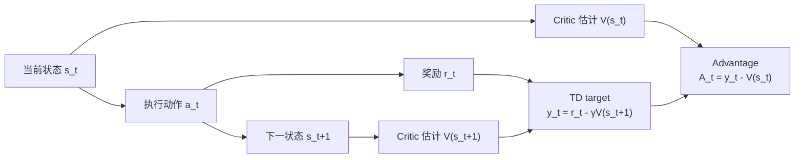
```mermaid
flowchart LR
    A["当前状态 s_t"] --> B["Critic 估计 V(s_t)"]
    A --> C["执行动作 a_t"]
    C --> D["奖励 r_t"]
    C --> E["下一状态 s_t+1"]
    E --> F["Critic 估计 V(s_t+1)"]
    D --> G["TD target\ny_t = r_t - γV(s_t+1)"]
    F --> G
    B --> H["Advantage\nA_t = y_t - V(s_t)"]
    G --> H
```

**图4-5 当前行动方视角下的价值目标与优势函数**

这里需要特别强调负号的来源。由于 (s_{t+1}) 已经是对手行动方视角，如果 (v_\theta(s_{t+1})) 较高，表示对手处于有利局面；从当前行动方角度看，这应当是不利信息。因此，在 TD 目标中使用减号而不是加号。这一点是双人零和博弈中当前行动方视角建模的重要细节。

------

## 4.6 损失函数设计

自博弈 Actor-Critic 模型的总损失由策略损失、价值损失和熵正则项组成。

策略损失用于更新 Actor，使模型提高优势动作的选择概率：

$$
L_{policy}

-\mathbb{E}
\left[
\min
\left(
\rho_t A_t,
clip(\rho_t,1-\epsilon,1+\epsilon)A_t
\right)
\right]
$$
价值损失用于更新 Critic，使价值估计接近 TD 目标：

$$
L_{value}

\mathbb{E}
\left[
\left(v_\theta(s_t)-y_t\right)^2
\right]
$$
策略熵定义为：

$$
H(\pi_\theta)
-\sum_{a\in\mathcal{A}}
\pi_\theta(a|s_t)\log \pi_\theta(a|s_t)
$$
熵正则用于鼓励模型在训练初期保持探索，避免策略过早收敛到少数动作。

最终联合损失为：

$$
L= L_{policy} + c_vL_{value}
c_eH(\pi_\theta)
$$

其中，(c_v) 为价值损失权重，(c_e) 为熵正则权重。

**表4-4 损失函数组成**

| 损失项          | 作用                             | 对应模块 |
| --------------- | -------------------------------- | -------- |
| $(L\_{policy}) $  | 根据优势函数更新动作概率         | Actor    |
| $(L\_{value})$     | 拟合 TD 目标，提高价值估计准确性 | Critic   |
| $(H(\pi_\theta))$ | 鼓励探索，防止策略过早确定化     | Actor    |
| $weight decay$   | 对参数进行正则化约束             | 整体网络 |

在优化过程中，项目采用 AdamW 优化器，并使用 weight decay 实现权重衰减正则化。同时，为避免梯度异常增大，还可以使用梯度裁剪控制梯度范数。

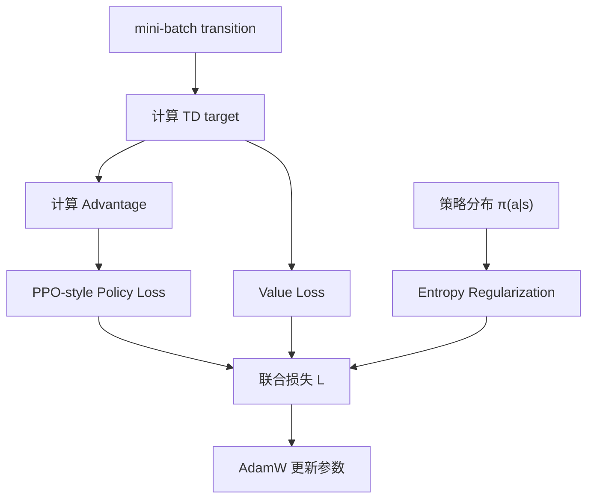
```mermaid
flowchart TB
    A["mini-batch transition"] --> B["计算 TD target"]
    B --> C["计算 Advantage"]
    C --> D["PPO-style Policy Loss"]
    B --> E["Value Loss"]
    F["策略分布 π(a|s)"] --> G["Entropy Regularization"]
    D --> H["联合损失 L"]
    E --> H
    G --> H
    H --> I["AdamW 更新参数"]
```

**图4-6 Actor-Critic 联合损失计算流程**

通过 PPO-style 裁剪、熵正则、权重衰减和梯度裁剪等机制，模型训练过程能够在保持探索的同时避免策略更新过于剧烈，从而提升基线方法的稳定性。

------

## 4.7 训练流程

自博弈基线模型的训练过程包括模型初始化、自博弈采样、经验存储、批量更新、模型保存和评估测试等步骤。完整流程如表4-5所示。

**表4-5 自博弈 Actor-Critic 训练流程**

| 步骤 | 操作                     | 说明                             |
| ---- | ------------------------ | -------------------------------- |
| 1    | 初始化 Actor-Critic 网络 | 随机初始化模型参数               |
| 2    | 进行自博弈               | 当前模型与自身完成对局           |
| 3    | 记录 transition          | 保存状态、动作、奖励和旧策略概率 |
| 4    | 写入经验回放池           | 为后续 batch 训练提供样本        |
| 5    | 采样 mini-batch          | 从经验池中随机采样               |
| 6    | 计算 TD 目标             | 使用 (y_t=r_t-\gamma V(s_{t+1})) |
| 7    | 计算优势函数             | 使用 (A_t=y_t-V(s_t))            |
| 8    | 计算联合损失             | 包括策略损失、价值损失和熵正则   |
| 9    | 反向传播更新             | 使用 AdamW 更新参数              |
| 10   | 保存模型                 | 定期保存 checkpoint              |
| 11   | 评估模型                 | 与随机智能体和规则智能体对战     |

训练流程可以表示为：


```mermaid
flowchart LR
    A["初始化网络"] --> B["自博弈生成数据"]
    B --> C["保存 transition"]
    C --> D["Replay Buffer"]
    D --> E["采样 mini-batch"]
    E --> F["计算 TD target 与 Advantage"]
    F --> G["计算联合损失"]
    G --> H["反向传播更新"]
    H --> I["保存 checkpoint"]
    I --> J["对战评估"]
    J --> B
```

**图4-7 自博弈 Actor-Critic 训练流程**

主要训练超参数如下表所示。

**表4-6 自博弈基线模型主要训练超参数**

| 参数               | 取值   | 含义               |
| ------------------ | ------ | ------------------ |
| (\gamma)           | 0.95   | 折扣因子           |
| learning rate      | 0.0003 | 初始学习率         |
| batch size         | 128    | 每次更新的样本数量 |
| replay buffer size | 100000 | 经验回放池容量     |
| entropy coef       | 0.01   | 熵正则系数         |
| value coef         | 0.5    | 价值损失权重       |
| PPO clip eps       | 0.2    | PPO 裁剪系数       |
| weight decay       | 0.0001 | 权重衰减系数       |
| grad clip norm     | 1.0    | 梯度裁剪阈值       |
| max steps          | 60     | 单局最大步数       |

在评估阶段，模型通常切换为贪心决策模式，并与 RandomAgent、RuleBasedAgent 等基线智能体进行对战。评估指标包括胜率、平均步数、平均奖励、平均决策时间、策略损失、价值损失和熵等。

**表4-7 评估指标说明**

| 指标         | 含义                     |
| ------------ | ------------------------ |
| 胜率         | 衡量模型整体对战能力     |
| 平均步数     | 衡量结束对局的效率       |
| 平均奖励     | 反映训练过程中的收益水平 |
| 策略熵       | 反映策略探索程度         |
| Policy Loss  | 反映 Actor 更新状态      |
| Value Loss   | 反映 Critic 价值估计误差 |
| 平均决策时间 | 反映模型推理效率         |

在实际训练曲线中，策略熵通常会随训练推进而逐步下降，说明模型从早期较随机的探索状态逐渐转向更稳定的动作偏好；策略损失在一定范围内波动，反映 PPO-style 裁剪目标对策略更新幅度的约束；价值损失可能出现一定波动，这是由骰子随机性、自博弈数据分布变化以及双人零和视角切换共同导致的。对于本章基线模型而言，这些曲线主要用于判断训练是否稳定，而不是用于证明其已经达到最终最优棋力。

------

## 4.8 自博弈模型的局限性

自博弈 Actor-Critic 模型具有结构清晰、训练流程完整、推理速度较快等优点，但作为无搜索增强的基线模型，它仍存在明显局限。

首先，该模型不展开搜索树，只依赖当前网络对局面的直接判断，因此缺少对未来多步局面的显式推演能力。在爱恩斯坦棋中，当前一步看似有利的吃子或推进动作，可能会导致后续被对方快速到达目标角点；纯网络模型较难在所有复杂局面中稳定识别这类长期风险。

其次，模型训练依赖自博弈生成的数据。在训练早期，策略网络尚未形成有效决策能力，自博弈样本质量较低，可能导致训练信号噪声较大。虽然 PPO-style 裁剪、熵正则、优势标准化和经验回放能够提升训练稳定性，但无法完全消除早期样本质量不足的问题。

再次，爱恩斯坦棋具有骰子随机性。骰子点数会改变当前可移动棋子集合，使相同棋盘布局在不同骰子条件下对应完全不同的合法动作集合。这种随机性会增加策略学习和价值估计的方差，使价值网络在部分局面上的预测存在波动。

最后，由于该模型没有 MCTS 的前瞻搜索能力，其决策质量主要取决于策略价值网络本身的泛化能力。当局面较复杂或需要多步规划时，模型可能出现短视决策。因此，第5章将进一步引入深度强化学习增强的 MCTS 方法，在策略价值网络基础上加入搜索机制，通过多步推演提升智能体的决策质量。

**表4-8 自博弈 Actor-Critic 模型优势与局限**

| 类型 | 内容                                       |
| ---- | ------------------------------------------ |
| 优势 | 不依赖人工棋谱，可通过自我对弈自动生成数据 |
| 优势 | 网络直接决策，推理速度较快                 |
| 优势 | 结构清晰，便于训练、调试和评估             |
| 优势 | 能作为后续 MCTS 增强方法的对照基线         |
| 局限 | 缺少多步前瞻搜索                           |
| 局限 | 训练早期样本质量较低                       |
| 局限 | 骰子随机性导致训练方差较大                 |
| 局限 | 复杂局面下可能出现短视决策                 |

------

## 4.9 本章小结

本章介绍了本文的基线方法：自博弈 Actor-Critic 模型。该模型采用当前行动方视角下的 `18×5×5` 状态张量作为输入，并通过 Actor Head 输出 18 维动作 logits，通过 Critic Head 输出当前局面对当前行动方的价值估计。模型使用规则引擎生成的合法动作掩码过滤非法动作，从而保证神经网络在固定动作空间中输出符合规则的走法。

在训练方面，本章方法通过自我对弈生成 transition 经验，并使用 TD 目标、优势函数、PPO-style clipped loss、价值损失和熵正则更新网络参数。该模型具有训练流程清晰、推理速度快、不依赖人工棋谱等优点，能够作为本文后续方法的学习型基线。

然而，由于本章方法不使用 MCTS 搜索，其决策过程缺少显式前瞻推演能力，在复杂局面下可能出现短视选择。因此，下一章将在该策略价值网络的基础上引入 MCTS 搜索机制，构建深度强化学习增强的 MCTS 方法，以进一步提升智能体的综合对弈能力。


# 5.1 方法总体框架

爱恩斯坦棋智能体的核心任务是在给定当前棋局状态的条件下，从有限的合法动作集合中选择一个尽可能优的动作。第2章已经将真实棋局形式化为状态

$$
s_t=(B_t,p_t,d_t,W_t,L_t,k_t),
$$

并进一步将其编码为神经网络可处理的多通道状态张量

$$
X_t\in \mathbb{R}^{15\times5\times5}.
$$

其中，(B_t) 表示当前棋盘状态，(p_t) 表示当前行动方，(d_t) 表示当前骰子点数，(W_t) 表示当前胜负状态，(L_t) 表示当前合法动作集合，(k_t) 表示当前回合编号。动作空间则被统一定义为 18 维离散空间，即 6 个棋子编号与 3 个移动方向的组合。通过该建模方式，规则引擎、策略价值网络与 MCTS 搜索算法能够共享同一套状态表示和动作编号体系。

在此基础上，本章进一步讨论如何构建进阶智能体，即利用策略价值网络增强蒙特卡洛树搜索。与单纯依赖随机模拟的基础 MCTS 不同，神经网络引导的 MCTS 不再完全通过大量随机 rollout 估计局面优劣，而是将策略价值网络输出的策略分布和局面价值引入搜索过程。策略网络为搜索提供动作先验，帮助算法优先探索更有潜力的走法；价值网络则用于评估叶子节点，减少随机模拟带来的不稳定性。由此，搜索过程能够在有限计算资源下更集中地分析关键分支，提高智能体的决策质量。

## 5.1.1 与状态动作建模的衔接

第2章已经定义了面向神经网络和 MCTS 的统一接口。对于任一状态 (s_t)，规则引擎首先根据当前棋盘、行动方和骰子点数计算合法动作集合：

$$
\mathcal{A}_{legal}(s_t)\subseteq \mathcal{A}.
$$

由于完整动作空间 (\mathcal{A}) 的大小固定为 18，而每一具体局面中实际可执行的动作数量会随骰子点数、棋子存活状态和棋盘边界变化，因此需要使用合法动作掩码 (M_t) 对非法动作进行屏蔽：

$$
M_t(a)=
\begin{cases}
1, & a\in \mathcal{A}*{legal}(s_t),\
0, & a\notin \mathcal{A}*{legal}(s_t).
\end{cases}
$$

在神经网络决策中，状态张量 (X_t) 作为模型输入，策略头输出 18 维动作得分，随后通过合法动作掩码得到只包含合法动作的概率分布。在 MCTS 搜索中，(\mathcal{A}_{legal}(s_t)) 用于节点扩展，(M_t) 用于约束策略先验，确保搜索树中不会展开违反规则的动作。

因此，本章所讨论的所有搜索方法均建立在以下接口之上：

$$
X_t \rightarrow f_\theta(X_t) \rightarrow (p_\theta,v_\theta),
$$

其中：

$$
p_\theta\in\mathbb{R}^{18}
$$

表示策略网络输出的动作分布，

$$
v_\theta\in[-1,1]
$$

表示价值网络对当前局面的胜负倾向估计。

对于 MCTS 而言，策略网络输出可以作为动作先验：

$$
P(s,a)=p_\theta(a\mid s),
$$

价值网络输出可以作为叶子节点评估：

$$
V(s)=v_\theta(s).
$$

由此，状态编码、动作编码、合法动作掩码、策略先验和价值评估共同构成了本章算法设计的基础。

## 5.1.2 从基础 MCTS 到神经网络引导 MCTS

基础 MCTS 的基本思想是通过搜索树模拟未来对局，并根据模拟结果不断修正不同动作的价值估计。对于搜索树中的状态节点 (s)，算法维护每个动作的访问次数和平均价值：

$$
N(s,a),\quad Q(s,a).
$$

其中，(N(s,a)) 表示动作 (a) 在状态 (s) 下被访问的次数，(Q(s,a)) 表示该动作经过多次模拟后得到的平均收益。基础 MCTS 通常依靠 UCT 公式在“利用已有高价值动作”和“探索访问次数较少动作”之间进行平衡。

然而，在爱恩斯坦棋中，基础 MCTS 存在两个主要问题。第一，棋局虽然规模不大，但每一步都受到骰子点数约束，状态转移中包含随机因素，单纯依赖随机 rollout 容易产生较大的估计波动。第二，基础 MCTS 在早期搜索阶段缺少先验知识，对于明显较差的动作也可能投入较多模拟次数，导致有限时间内的搜索效率不足。

为解决上述问题，本项目逐步引入策略价值网络对 MCTS 进行增强。整体演化路线可以概括为：

$$
\text{基础 MCTS}
\rightarrow
\text{策略价值网络}
\rightarrow
\text{Root Neural MCTS}
\rightarrow
\text{Full Neural MCTS}.
$$

其中，基础 MCTS 提供最初的搜索框架；策略价值网络学习局面与动作之间的映射关系；Root Neural MCTS 在根节点附近引入网络先验与价值评估；Full Neural MCTS 则在完整多层搜索树中结合 PUCT、chance node 和价值回传，形成最终采用的决策算法。

## 5.1.3 策略价值网络在搜索中的作用

策略价值网络在神经网络引导 MCTS 中承担两个核心作用：一是提供策略先验，二是提供局面价值评估。

首先，策略头输出的 (p_\theta(a\mid s)) 可以作为 MCTS 中的先验概率 (P(s,a))。在搜索树扩展时，算法不再将所有合法动作视为完全等价，而是根据网络预测结果为不同动作分配不同的初始倾向。若某一动作在当前局面下更符合已有训练经验，则其先验概率更高，在搜索过程中更容易被优先访问。这样可以使搜索资源集中于更有潜力的分支。

其次，价值头输出的 (v_\theta(s)) 可以作为局面价值估计 (V(s))。在传统 MCTS 中，叶子节点通常需要通过随机模拟到终局来获得收益；而在神经网络引导 MCTS 中，价值网络可以直接对非终局局面给出评估，从而减少随机 rollout 的依赖。对于爱恩斯坦棋这类包含骰子随机性的博弈，使用价值网络评估叶子节点有助于降低随机模拟的不稳定性，并提升搜索效率。

因此，策略价值网络并不是独立替代 MCTS，而是嵌入搜索流程之中：

$$
\text{策略头} \Rightarrow P(s,a),
$$

$$
\text{价值头} \Rightarrow V(s).
$$

前者影响搜索方向，后者影响叶子节点评估，二者共同提升 MCTS 在有限模拟次数下的决策质量。

## 5.1.4 本章算法框架

本章后续内容将按照方法演化顺序展开。首先介绍基础 MCTS 的节点定义、选择策略、扩展过程、模拟过程和价值回传机制；然后说明策略价值网络如何输出 18 维策略分布和局面价值；接着介绍 Root Neural MCTS 如何在根节点处引入策略先验和一步后价值评估；最后重点讨论 Full Neural MCTS 如何在多层搜索树中使用 PUCT 策略、处理骰子随机节点、评估叶子节点并完成价值回传。

整体来看，本章方法框架如下：

1. **基础 MCTS 阶段**：在规则引擎提供的合法动作集合上进行树搜索，通过 UCT 公式选择动作，并利用模拟结果更新 (N(s,a)) 与 (Q(s,a))。

2. **策略价值网络阶段**：将第2章定义的状态张量 (X_t) 输入网络，输出 18 维策略分布 (p_\theta) 和局面价值 (v_\theta)。

3. **Root Neural MCTS 阶段**：在根节点引入策略网络先验，并在走一步后的局面上调用价值网络进行评估，从而提升基础 MCTS 的决策效率。

4. **Full Neural MCTS 阶段**：在完整搜索树中使用 PUCT 选择策略，并加入骰子 chance node 处理随机转移，通过叶子节点价值评估和反向回传形成最终动作决策。

5. **最终智能体阶段**：综合选择最终策略价值网络和 Full Neural MCTS 搜索器，并根据运行环境设置搜索次数、搜索深度和骰子节点处理方式。

该框架体现了从“无先验搜索”到“神经网络引导搜索”的逐步增强过程。其核心思想不是简单地增加模型复杂度，而是在第2章所建立的统一状态动作接口上，将规则约束、策略先验、价值评估和树搜索机制有机结合，从而构建能够稳定运行并适应实际比赛要求的爱恩斯坦棋智能体。

图5-1 神经网络引导 MCTS 的总体框架


# 5.2 基础 MCTS 阶段

蒙特卡洛树搜索（Monte Carlo Tree Search，MCTS）是一类基于采样模拟的博弈搜索方法，其基本思想是在当前局面下不断构建搜索树，通过多次模拟未来对局来估计不同动作的长期收益。与穷举搜索不同，MCTS 不要求完整遍历所有可能局面，而是在有限计算资源内优先探索更有潜力的分支。因此，它适合用于爱恩斯坦棋这类状态空间有限、但存在骰子随机性和动态合法动作约束的棋类博弈。

在本项目中，基础 MCTS 是整个进阶智能体演化路线中的第一个搜索型智能体。它不依赖策略价值网络，而是直接基于规则引擎提供的当前局面和合法动作集合进行搜索。基础 MCTS 一方面可以作为随机 AI 之后的第一类较强基线方法，另一方面也为后续引入策略价值网络和 neural-MCTS 提供了算法框架。项目文档中明确指出，基础 MCTS 使用 UCT 思想，其基本流程包括选择动作、克隆局面、执行动作、随机或启发式 rollout，以及回传胜负收益。

## 5.2.1 搜索节点状态表示

在基础 MCTS 中，搜索树中的每一个节点对应一个棋局状态。根据第2章的状态空间定义，节点状态可以表示为：

$$
s_t=(B_t,p_t,d_t,W_t,L_t,k_t),
$$

其中，(B_t) 表示当前棋盘状态，(p_t) 表示当前行动方，(d_t) 表示当前骰子点数，(W_t) 表示胜负状态，(L_t) 表示当前合法动作集合，(k_t) 表示当前回合编号。

对于搜索算法而言，节点中最重要的信息包括当前状态 (s)、当前状态下的合法动作集合 (\mathcal{A}_{legal}(s))、每个动作的访问次数 (N(s,a))、动作价值估计 (Q(s,a))，以及由该动作到达的子节点。可以形式化表示为：

$$
Node(s)=\left(s,\mathcal{A}_{legal}(s),N(s,a),Q(s,a),Child(s,a)\right).
$$

其中：

$$
N(s,a)
$$

表示在状态 (s) 下动作 (a) 被搜索访问的次数；

$$
Q(s,a)
$$

表示该动作经过多次模拟后得到的平均价值；

$$
Child(s,a)
$$

表示在状态 (s) 下执行动作 (a) 后得到的后继节点。

基础 MCTS 并不直接使用神经网络输入 (X_t)，但它与后续 neural-MCTS 使用相同的状态和动作接口。也就是说，基础 MCTS 的节点扩展仍然依赖规则引擎生成的合法动作集合，动作仍然采用第2章定义的 18 维动作编号体系。这样设计的好处是，基础 MCTS、策略价值网络和后续 full neural-MCTS 可以共享统一的状态转移与动作记录方式，为后续算法升级提供一致接口。

## 5.2.2 合法动作集合与节点扩展

在爱恩斯坦棋中，虽然完整动作空间大小固定为：

$$
|\mathcal{A}|=18,
$$

但由于每回合受到骰子点数和棋子存活状态约束，当前真正可执行的动作只是其中一部分。因此，在 MCTS 搜索过程中，节点扩展不能直接枚举全部 18 个动作，而必须由规则引擎计算当前状态下的合法动作集合：

$$
\mathcal{A}_{legal}(s)\subseteq \mathcal{A}.
$$

一个动作 (a=(q,m)) 是否合法，取决于三个条件：第一，棋子编号 (q) 必须属于当前骰子点数对应的候选棋子集合；第二，该棋子必须仍然位于棋盘上；第三，按照方向 (m) 移动后的目标位置不能越出棋盘边界。由于爱恩斯坦棋允许吃掉目标格上的任意棋子，包括己方棋子，因此目标格是否已有棋子并不影响动作合法性。

节点扩展过程可以表示为：

$$
Expand(s)={Child(s,a)\mid a\in \mathcal{A}_{legal}(s)}.
$$

对于每一个合法动作 (a)，MCTS 会复制当前棋局状态，执行该动作，并得到后继状态 (s')。该状态转移可以写为：

$$
s' \sim P(s'\mid s,a).
$$

其中，(P) 表示由规则引擎决定的状态转移过程。需要注意的是，在爱恩斯坦棋中，棋子移动、吃子和胜负判断是确定的，但下一回合骰子点数具有随机性，因此整体状态转移包含随机因素。

在实现层面，基础 MCTS 通常不会直接修改原始对局对象，而是先克隆当前棋局，再在副本上执行候选动作。这样可以避免搜索过程影响真实比赛局面。项目说明中也将基础 MCTS 的流程概括为“克隆局面 → 执行动作 → rollout → 回传收益”。

## 5.2.3 UCT 选择策略

MCTS 的核心问题是如何在搜索过程中平衡“利用”和“探索”。所谓利用，是指优先选择当前平均收益较高的动作；所谓探索，是指适当尝试访问次数较少、但仍可能具有潜力的动作。基础 MCTS 使用 UCT（Upper Confidence Bound applied to Trees）公式完成这一平衡。

在状态 (s) 下，对于任一合法动作 (a)，其 UCT 分数定义为：

$$
UCT(s,a)=Q(s,a)+c\sqrt{\frac{\ln N(s)}{N(s,a)}}.
$$

其中：

$$
Q(s,a)
$$

表示动作 (a) 当前的平均价值估计；

$$
N(s)
$$

表示节点 (s) 的总访问次数；

$$
N(s,a)
$$

表示动作 (a) 的访问次数；

$$
c
$$

为探索系数，用于控制搜索的探索强度。

UCT 公式由两部分组成。第一项 (Q(s,a)) 体现利用倾向，数值越大说明该动作在历史模拟中表现越好；第二项

$$
c\sqrt{\frac{\ln N(s)}{N(s,a)}}
$$

体现探索倾向，当某个动作访问次数较少时，该项较大，从而促使算法继续探索尚未充分评估的动作。

因此，MCTS 在选择阶段会从根节点开始，反复选择 UCT 分数最高的动作：

$$
a^*=\arg\max_{a\in \mathcal{A}_{legal}(s)}UCT(s,a),
$$

并沿着该动作进入子节点，直到到达尚未完全扩展的节点或终局状态。

对于爱恩斯坦棋而言，UCT 选择策略具有较强适用性。由于不同骰子点数会导致合法动作集合变化，某些动作在局部局面中可能具有较大收益，但不一定能被简单规则直接识别。UCT 通过持续模拟和统计更新，使搜索过程能够逐渐提高优质动作的访问次数，同时避免过早放弃尚未充分探索的分支。

### 表5-1 基础 MCTS 中主要变量说明


| 符号                       | 含义                    |
| ------------------------ | --------------------- |
| (s)                      | 搜索树中的棋局状态节点           |
| (a)                      | 当前状态下的一个合法动作          |
| (\mathcal{A}_{legal}(s)) | 状态 (s) 下的合法动作集合       |
| (N(s))                   | 状态节点 (s) 的总访问次数       |
| (N(s,a))                 | 在状态 (s) 下动作 (a) 的访问次数 |
| (Q(s,a))                 | 动作 (a) 的平均价值估计        |
| (c)                      | UCT 探索系数              |
| (z)                      | 一次模拟得到的最终收益           |

## 5.2.4 模拟与价值回传

当 MCTS 到达一个尚未完全扩展的节点后，会选择一个未扩展的合法动作生成新子节点。随后，算法从该新状态出发进行模拟，直到到达终局或达到预设的最大模拟步数。基础 MCTS 阶段不使用价值网络，因此非终局状态的优劣主要依赖 rollout 结果进行估计。

设从状态 (s) 出发进行一次模拟后得到的最终收益为 (z)，则：

$$
z=
\begin{cases}
1, & \text{当前搜索方最终获胜},\
-1, & \text{当前搜索方最终失败},\
0, & \text{达到最大步数但未分胜负}.
\end{cases}
$$

模拟结束后，收益 (z) 会沿着本次搜索路径反向回传，用于更新路径上每个节点和动作的统计量。对于路径中的每一组 ((s,a))，访问次数更新为：

$$
N(s,a)\leftarrow N(s,a)+1.
$$

动作价值可以采用增量平均方式更新：

$$
Q(s,a)\leftarrow Q(s,a)+\frac{z-Q(s,a)}{N(s,a)}.
$$

该更新公式表示，动作价值 (Q(s,a)) 是多次模拟收益的平均估计。随着访问次数增加，估计结果会逐渐稳定。若某个动作在多次模拟中更容易导向胜利，则其 (Q(s,a)) 会逐渐升高，并在后续 UCT 选择中获得更大优势。

需要注意的是，爱恩斯坦棋是双人零和博弈。若搜索路径中行动方发生切换，则价值回传时需要注意收益视角的一致性。通常可以将收益统一定义为根节点当前行动方的收益，或者在回传过程中根据行动方变化取相反数。无论采用哪种方式，都必须保证 (Q(s,a)) 表示的是当前节点行动方选择动作后的期望收益。

## 5.2.5 基础 MCTS 决策输出

经过若干次模拟后，根节点下每个合法动作都具有对应的访问次数 (N(s_0,a)) 和平均价值 (Q(s_0,a))。在最终决策时，基础 MCTS 通常选择访问次数最多的动作作为输出：

$$
a_t=\arg\max_{a\in \mathcal{A}_{legal}(s_0)}N(s_0,a).
$$

选择访问次数最多的动作，而不是直接选择 (Q(s_0,a)) 最大的动作，原因在于访问次数综合反映了搜索过程中的价值判断和探索过程。一个动作如果既具有较高收益，又在多次搜索中被反复确认，通常会获得更高访问次数，因此更适合作为最终动作。

同时，根节点访问次数也可以归一化为一个策略分布：

$$
\pi(a\mid s_0)=
\frac{N(s_0,a)}
{\sum_{b\in \mathcal{A}_{legal}(s_0)}N(s_0,b)}.
$$

该分布可以用于描述 MCTS 对当前局面的动作偏好。在后续策略价值网络阶段，MCTS 访问次数分布也可以作为策略学习目标，使神经网络学习基础搜索器的决策倾向。项目文件中记录的自我对弈数据也包含 `policies` 字段，其含义正是 MCTS 搜索访问次数归一化后的策略标签。

从整体流程来看，基础 MCTS 首先以当前棋局状态 (s_0) 作为根节点，并由规则引擎生成当前状态下的合法动作集合 (\mathcal{A}_{legal}(s_0))。随后，算法在给定模拟次数内反复执行选择、扩展、模拟和回传四个步骤。在选择阶段，算法根据 UCT 公式从根节点开始向下选择动作；在扩展阶段，算法对尚未完全展开的合法动作生成新的子节点；在模拟阶段，算法从新节点出发，通过随机或启发式 rollout 推演至终局或达到最大步数；在回传阶段，算法根据模拟得到的胜负结果更新路径上相关动作的访问次数 (N(s,a)) 和平均价值 (Q(s,a))。当所有模拟结束后，根节点下访问次数最高的合法动作即被作为当前局面的最终决策输出。

总体来看，基础 MCTS 在不依赖神经网络的情况下，已经能够利用规则引擎进行多步前瞻搜索。它相比随机 AI 具有更强的局面判断能力，但也存在明显局限：其搜索质量依赖模拟次数，rollout 结果具有随机波动，在计算资源有限时难以充分评估复杂局面。因此，后续章节将在基础 MCTS 框架上引入策略价值网络，用策略先验 (P(s,a)) 替代无差别探索，并用价值估计 (V(s)) 替代部分随机 rollout，从而构建更高效的神经网络引导 MCTS。


### 图5-2 基础 MCTS 搜索流程图


# 5.3 策略价值网络阶段

基础 MCTS 能够在不依赖神经网络的情况下完成局面搜索，但其决策质量较大程度依赖模拟次数和 rollout 结果。当搜索次数有限时，基础 MCTS 可能无法充分评估所有关键分支，尤其是在爱恩斯坦棋这种包含骰子随机性和动态合法动作约束的博弈中，随机模拟结果容易出现波动。为提高搜索效率，本项目在基础 MCTS 框架之上引入策略价值网络，使智能体能够利用已学习到的局面经验指导搜索。

策略价值网络的作用不是直接替代 MCTS，而是为 MCTS 提供两个辅助信息：第一，策略头输出当前状态下各动作的优先程度，用作搜索过程中的策略先验；第二，价值头输出当前局面对当前行动方的胜负倾向，用作叶子节点的价值评估。由此，MCTS 不再完全依赖随机 rollout，而是可以在神经网络预测的基础上进行更有方向性的搜索。

本项目将策略价值网络表示为：

$$
(p_\theta,v_\theta)=f_\theta(X_t),
$$

其中，(X_t\in\mathbb{R}^{15\times5\times5}) 为第2章定义的状态张量，(p_\theta\in\mathbb{R}^{18}) 表示 18 维动作策略输出，(v_\theta\in[-1,1]) 表示当前局面对当前行动方的价值估计。

## 5.3.1 状态张量 (X_t) 作为网络输入

策略价值网络的输入来自第2章定义的多通道状态编码。对于任一局面 (s_t)，其对应状态张量为：

$$
X_t\in\mathbb{R}^{15\times5\times5}.
$$

其中，(5\times5) 对应爱恩斯坦棋棋盘的空间结构，15 个通道分别表示红方棋子位置、蓝方棋子位置、当前行动方、当前骰子点数以及合法候选棋子位置。该设计既保留了棋盘上的空间分布信息，又显式加入了影响当前决策的规则约束，使网络能够同时感知“棋子在哪里”“轮到谁行动”“当前骰子允许哪些棋子移动”等关键信息。

从特征提取角度看，棋盘局面具有明显的局部空间关系。例如，棋子是否接近目标角、某一方向是否存在吃子机会、己方棋子是否阻挡后续移动等，都与棋盘上局部区域的排列有关。因此，策略价值网络可以使用卷积结构提取棋盘特征。设卷积特征提取部分为 (g_\phi(\cdot))，则有：

$$
h_t=g_\phi(X_t),
$$

其中，(h_t) 表示由状态张量提取出的局面特征。随后，网络在共享特征 (h_t) 的基础上分出策略头和价值头，分别预测动作分布和局面价值。

这种共享特征、双头输出的结构具有较强的适用性。一方面，策略判断需要理解当前哪些动作更可能带来优势；另一方面，价值判断需要估计当前局面对最终胜负的影响。二者虽然输出目标不同，但都依赖对同一棋局状态的理解，因此使用共享特征能够减少重复计算，并提高模型对局面信息的综合利用能力。

### 表5-2 策略价值网络输入输出说明


| 项目   | 形式                                    | 含义              |
| ---- | ------------------------------------- | --------------- |
| 输入状态 | (X_t\in\mathbb{R}^{15\times5\times5}) | 当前棋局的多通道张量表示    |
| 共享特征 | (h_t=g_\phi(X_t))                     | 由卷积模块提取的局面特征    |
| 策略输出 | (p_\theta\in\mathbb{R}^{18})          | 18 维动作策略分布      |
| 价值输出 | (v_\theta\in[-1,1])                   | 当前局面对当前行动方的价值估计 |
| 策略先验 | (P(s,a)=p_\theta(a\mid s))            | MCTS 中的动作搜索先验   |
| 叶子价值 | (V(s)=v_\theta(s))                    | MCTS 中的叶子节点评估   |

## 5.3.2 18 维策略输出与合法动作掩码

策略头的目标是输出当前状态下各动作的选择倾向。根据第2章的动作定义，完整动作空间大小为：

$$
|\mathcal{A}|=6\times3=18.
$$

因此，策略头输出一个 18 维向量：

$$
z_\theta(s_t)\in\mathbb{R}^{18},
$$

其中每一个分量对应一个动作编号。动作编号由棋子编号 (q) 和方向编号 (m) 共同确定：

$$
a=(q-1)\times3+m.
$$

其中，(q\in{1,2,3,4,5,6})，(m\in{0,1,2})。

需要注意的是，策略头虽然输出固定长度的 18 维动作得分，但在任一具体状态下，并不是所有动作都合法。当前可执行动作受到骰子点数、棋子存活状态和棋盘边界共同约束。因此，网络输出必须结合合法动作掩码 (M_t) 进行筛选。设当前合法动作集合为：

$$
\mathcal{A}_{legal}(s_t)\subseteq \mathcal{A},
$$

合法动作掩码定义为：

$$
M_t(a)=
\begin{cases}
1, & a\in \mathcal{A}*{legal}(s_t),\
0, & a\notin \mathcal{A}*{legal}(s_t).
\end{cases}
$$

经过掩码处理后，策略分布可以写为：

$$
p_\theta(a\mid s_t)=
\frac{\exp(z_\theta(s_t)*a)\cdot M_t(a)}
{\sum*{b=0}^{17}\exp(z_\theta(s_t)_b)\cdot M_t(b)}.
$$

该公式保证了非法动作不会被选中：

$$
M_t(a)=0\Rightarrow p_\theta(a\mid s_t)=0.
$$

因此，策略网络输出层保持统一的 18 维结构，而规则引擎通过合法动作掩码保证最终动作满足爱恩斯坦棋规则。这种设计兼顾了神经网络训练的统一性和实际对弈规则的严格性。

在基础策略网络单独决策时，可以直接从合法动作概率分布中选择概率最大的动作：

$$
a_t=\arg\max_{a\in \mathcal{A}*{legal}(s_t)}p*\theta(a\mid s_t).
$$

而在 neural-MCTS 中，策略输出并不直接作为最终动作，而是作为搜索先验参与树搜索：

$$
P(s,a)=p_\theta(a\mid s).
$$

也就是说，策略头的作用是告诉 MCTS：在当前局面下，哪些合法动作更值得优先探索。

## 5.3.3 价值输出 (v_\theta(s)) 的含义

与策略头输出 18 维动作分布不同，价值头输出一个标量，用于估计当前局面对当前行动方的胜负倾向。其形式为：

$$
v_\theta(s_t)\in[-1,1].
$$

其中，(v_\theta(s_t)>0) 表示当前局面对当前行动方较为有利，(v_\theta(s_t)<0) 表示当前局面对当前行动方较为不利，(v_\theta(s_t)) 越接近 1，说明网络认为当前行动方最终获胜的可能性越高；越接近 -1，则说明当前行动方更可能失败。

价值头通常可以表示为：

$$
v_\theta(s_t)=\tanh(f_v(h_t)),
$$

其中，(h_t) 为共享特征，(f_v(\cdot)) 表示价值预测分支，(\tanh(\cdot)) 用于将输出限制在 ([-1,1]) 范围内。

在爱恩斯坦棋中，价值估计具有重要意义。基础 MCTS 需要通过 rollout 到终局来获得收益，但 rollout 过程具有随机性，且在有限步数内不一定能够准确反映当前局面的真实优劣。价值网络则可以直接对非终局局面进行评估，从而减少对随机模拟的依赖。

在 neural-MCTS 中，价值头输出可以作为叶子节点的局面评估：

$$
V(s)=v_\theta(s).
$$

当搜索过程到达某个尚未完全展开或达到最大搜索深度的节点时，算法无需继续大量随机模拟，而是可以调用价值网络评估当前状态，并将该估计值沿搜索路径回传。这样能够显著提高搜索效率，尤其适用于时间受限的实际比赛环境。

## 5.3.4 策略先验 (P(s,a)) 与叶子价值 (V(s))

策略价值网络与 MCTS 的结合主要体现在两个方面：策略头提供搜索先验，价值头提供叶子节点评估。

首先，策略头输出 (p_\theta(a\mid s)) 后，通过合法动作掩码得到只包含合法动作的概率分布。该分布在 MCTS 中被记为：

$$
P(s,a)=p_\theta(a\mid s).
$$

在搜索过程中，(P(s,a)) 用于指导算法优先探索网络认为更有潜力的动作。与基础 MCTS 将所有未访问动作近似等价看待不同，neural-MCTS 可以根据策略先验对不同动作赋予不同初始倾向，从而减少在明显较差动作上的搜索消耗。

其次，价值头输出 (v_\theta(s)) 后，被用作叶子节点价值：

$$
V(s)=v_\theta(s).
$$

当搜索到叶子节点时，算法可以直接调用价值网络得到该状态的估计收益，并将其回传给路径上的各个节点。这样可以减少对随机 rollout 的依赖，使搜索过程更加稳定。

因此，策略价值网络与 MCTS 的关系可以概括为：

$$
\text{策略头输出} \Rightarrow P(s,a),
$$

$$
\text{价值头输出} \Rightarrow V(s).
$$

其中，(P(s,a)) 影响搜索的方向，(V(s)) 影响搜索结果的价值回传。二者结合后，MCTS 不仅能够利用树搜索的前瞻能力，还能够利用神经网络从历史数据中学习到的局面判断能力。

## 5.3.5 联合训练目标

虽然本章重点讨论策略价值网络在 MCTS 中的使用方式，但为了说明网络输出的来源，有必要简要介绍其训练目标。策略价值网络需要同时学习两个任务：一是学习搜索器给出的动作偏好，二是学习局面的胜负价值。

设 MCTS 在状态 (s_t) 下得到的访问次数分布为 (\pi_t)，最终胜负收益为 (z_t)。策略头的目标是使网络输出 (p_\theta(\cdot\mid s_t)) 接近搜索得到的策略分布 (\pi_t)，其策略损失可表示为：

$$
L_{policy}
==========

-\sum_{a\in\mathcal{A}}\pi_t(a)\log p_\theta(a\mid s_t).
$$

价值头的目标是使网络输出 (v_\theta(s_t)) 接近最终胜负收益 (z_t)，其价值损失可表示为：

$$
L_{value}
=========

\left(v_\theta(s_t)-z_t\right)^2.
$$

因此，联合训练目标为：

$$
L
=

L_{policy}
+
\lambda L_{value},
$$

其中，(\lambda) 为价值损失权重，用于平衡策略学习和价值学习的重要性。

在本项目中，策略头学习 MCTS 搜索访问次数分布，价值头学习最终胜负结果。训练完成后，策略价值网络便可以为后续 Root Neural MCTS 和 Full Neural MCTS 提供动作先验与局面价值估计。


### 图5-3 策略价值网络结构示意图


# 5.4 Root Neural MCTS 阶段

在基础 MCTS 中，搜索过程主要依赖 UCT 公式和随机或启发式 rollout。虽然该方法能够在一定程度上实现前瞻搜索，但由于缺少局面先验知识，算法在有限模拟次数下仍可能将计算资源分配到价值较低的动作上。此外，rollout 过程本身具有随机性，尤其是在爱恩斯坦棋这种包含骰子约束的博弈中，随机模拟结果容易受到局部偶然因素影响。

为提升搜索效率，本项目在基础 MCTS 之后引入 Root Neural MCTS。该方法是从传统 MCTS 向神经网络引导搜索过渡的中间阶段。它并不构建完整多层神经网络搜索树，而是在根节点处引入策略价值网络，使根节点动作选择具有策略先验，并在执行一步候选动作后调用价值网络评估后继局面。项目文档中也明确指出，第一版 neural-MCTS 采用“根节点 PUCT + 走一步后 value 评估”的设计方式。

与基础 MCTS 相比，Root Neural MCTS 的核心改进在于两个方面：第一，用策略网络输出的动作概率作为根节点动作先验 (P(s,a))，使搜索不再对所有合法动作一视同仁；第二，用价值网络输出的局面价值替代部分随机 rollout，使后继状态评估更加稳定。由于它主要在根节点附近使用神经网络信息，因此计算速度较快，但搜索深度有限，为后续 Full Neural MCTS 的引入奠定了基础。

## 5.4.1 根节点策略先验

设当前真实棋局状态为 (s_0)，其对应的状态张量为：

$$
X_0\in\mathbb{R}^{15\times5\times5}.
$$

首先，将 (X_0) 输入策略价值网络：

$$
(p_\theta,v_\theta)=f_\theta(X_0).
$$

其中，(p_\theta) 为 18 维策略输出，表示网络对完整动作空间中各动作的选择倾向；(v_\theta) 为当前局面价值估计。由于并非所有动作在当前状态下都合法，因此需要使用第2章定义的合法动作掩码 (M_0) 对策略输出进行过滤：

$$
p_\theta(a\mid s_0)=
\frac{\exp(z_\theta(s_0)*a)\cdot M_0(a)}
{\sum*{b=0}^{17}\exp(z_\theta(s_0)_b)\cdot M_0(b)}.
$$

经过合法动作掩码处理后，非法动作概率被置为 0，合法动作概率重新归一化。Root Neural MCTS 将该合法动作概率分布作为根节点的搜索先验：

$$
P(s_0,a)=p_\theta(a\mid s_0),\quad a\in\mathcal{A}_{legal}(s_0).
$$

这里的 (P(s_0,a)) 与基础 MCTS 中的无先验选择不同。基础 MCTS 通常需要通过多次模拟逐步判断哪些动作更优，而 Root Neural MCTS 在搜索开始前就能够根据策略网络的输出，为不同动作赋予不同的初始倾向。如果某个动作在训练经验中更可能带来优势，则它在根节点具有更高的先验概率，并在后续搜索中更容易被访问。

这种设计使搜索过程更具方向性。对于爱恩斯坦棋而言，每个局面的合法动作数量虽然不大，但不同动作的价值差异可能较明显。例如，有些动作可以快速接近目标角，有些动作可以形成吃子机会，也有些动作虽然合法但会削弱后续局面。策略先验能够帮助 MCTS 在早期搜索阶段优先关注更有价值的候选动作。

## 5.4.2 根节点 PUCT 选择

在引入策略先验后，Root Neural MCTS 不再使用基础 MCTS 中的 UCT 公式，而是采用 PUCT 形式进行根节点动作选择。对于根节点 (s_0) 下的合法动作 (a)，PUCT 分数可以表示为：

$$
PUCT(s_0,a)
===========

Q(s_0,a)
+
c_{puct}P(s_0,a)
\frac{\sqrt{N(s_0)}}{1+N(s_0,a)}.
$$

其中：

$$
Q(s_0,a)
$$

表示动作 (a) 当前的平均价值估计；

$$
P(s_0,a)
$$

表示策略网络给出的动作先验概率；

$$
N(s_0)
$$

表示根节点总访问次数；

$$
N(s_0,a)
$$

表示动作 (a) 的访问次数；

$$
c_{puct}
$$

为探索系数，用于调节策略先验对搜索的影响程度。

与基础 MCTS 的 UCT 公式相比，PUCT 的关键区别在于引入了 (P(s_0,a))。当某一动作具有较高策略先验时，即使它的访问次数暂时不多，也会因为探索项较大而更容易被选中。随着该动作被多次访问，分母 (1+N(s_0,a)) 增大，探索项逐渐下降，搜索过程会转向其他尚未充分探索的动作。

根节点动作选择可以写为：

$$
a^*
===

\arg\max_{a\in\mathcal{A}_{legal}(s_0)}
PUCT(s_0,a).
$$

因此，PUCT 同时考虑了历史搜索价值 (Q(s_0,a))、访问次数 (N(s_0,a)) 和神经网络策略先验 (P(s_0,a))。这使 Root Neural MCTS 能够在“已有搜索结果”和“网络经验判断”之间取得平衡。

## 5.4.3 一步后价值评估

Root Neural MCTS 的另一个重要特点是：在选择根节点候选动作后，不再完全依赖随机 rollout 到终局，而是执行一步动作后使用价值网络评估后继局面。

设在根节点 (s_0) 下选择动作 (a)，规则引擎执行该动作后得到后继状态 (s')：

$$
s'\sim P(s'\mid s_0,a).
$$

如果 (s') 已经是终局状态，则可以直接根据胜负结果得到收益：

$$
z=
\begin{cases}
1, & \text{根节点行动方获胜},\
-1, & \text{根节点行动方失败}.
\end{cases}
$$

如果 (s') 不是终局状态，则将其编码为状态张量 (X')，并输入策略价值网络得到价值估计：

$$
(p_\theta',v_\theta')=f_\theta(X').
$$

此时，价值网络输出 (v_\theta(s')) 表示后继局面对当前行动方的价值估计。由于搜索统计通常需要统一到根节点行动方视角，因此在实际回传时需要根据行动方是否发生切换进行价值方向调整。若 (v_\theta(s')) 是以后继状态当前行动方为视角，而该行动方与根节点行动方相反，则根节点视角下的收益可写为：

$$
z=-v_\theta(s').
$$

若后继状态的当前行动方仍与根节点行动方一致，则可写为：

$$
z=v_\theta(s').
$$

统一表示为：

$$
z=
\eta(s_0,s')v_\theta(s'),
$$

其中：

$$
\eta(s_0,s')=
\begin{cases}
1, & \text{后继状态行动方与根节点行动方一致},\
-1, & \text{后继状态行动方与根节点行动方相反}.
\end{cases}
$$

通过这种方式，Root Neural MCTS 可以在不进行大量随机 rollout 的情况下，快速获得候选动作的价值反馈。与基础 MCTS 相比，这种做法减少了随机模拟带来的波动，并提高了单次模拟的评估效率。

## 5.4.4 搜索统计更新

在得到一步后价值估计 (z) 后，Root Neural MCTS 会更新根节点对应动作的访问次数和平均价值。对于动作 (a)，访问次数更新为：

$$
N(s_0,a)\leftarrow N(s_0,a)+1.
$$

根节点总访问次数更新为：

$$
N(s_0)\leftarrow N(s_0)+1.
$$

动作价值采用增量平均方式更新：

$$
Q(s_0,a)
\leftarrow
Q(s_0,a)
+
\frac{z-Q(s_0,a)}{N(s_0,a)}.
$$

该公式与基础 MCTS 中的价值更新形式一致，但收益来源不同。基础 MCTS 的收益通常来自 rollout 结果，而 Root Neural MCTS 的收益主要来自价值网络对后继局面的估计。也就是说，Root Neural MCTS 将“随机模拟得到的终局收益”替换为“神经网络给出的局面价值估计”。

经过多次模拟后，根节点下每个合法动作都具有访问次数 (N(s_0,a)) 和平均价值 (Q(s_0,a))。最终决策时，可以选择访问次数最多的动作：

$$
a_t=
\arg\max_{a\in\mathcal{A}_{legal}(s_0)}
N(s_0,a).
$$

也可以将根节点访问次数归一化为策略分布：

$$
\pi(a\mid s_0)
==============

\frac{N(s_0,a)}
{\sum_{b\in\mathcal{A}_{legal}(s_0)}N(s_0,b)}.
$$

该策略分布可以反映 Root Neural MCTS 在当前局面对各动作的综合偏好。

## 5.4.5 Root Neural MCTS 决策流程

Root Neural MCTS 的决策过程以当前棋局状态 (s_0) 为起点。首先，系统根据第2章定义的状态编码方式，将当前局面转换为状态张量 (X_0)，并输入策略价值网络 (f_\theta)。网络输出包括两个部分：一是 18 维策略输出 (p_\theta(a\mid s_0))，用于表示各动作的先验选择倾向；二是局面价值输出 (v_\theta(s_0))，用于估计当前局面对当前行动方的价值。

由于完整动作空间中并非所有动作在当前状态下都合法，因此需要结合合法动作掩码 (M_0) 对策略输出进行筛选。经过掩码处理后，非法动作的概率被置为 0，合法动作的概率重新归一化。Root Neural MCTS 将该合法动作概率分布作为根节点先验 (P(s_0,a))，并在根节点处使用 PUCT 公式选择候选动作。

在每一次根节点模拟中，算法根据当前的 (Q(s_0,a))、(N(s_0,a)) 和 (P(s_0,a)) 计算各合法动作的 PUCT 分数，并选择分数最高的动作 (a)。随后，系统克隆当前棋局并执行该动作，得到后继状态 (s')。若 (s') 已经达到终局，则直接根据胜负结果得到收益 (z)；若 (s') 尚未终局，则将其再次编码为状态张量，并调用策略价值网络得到价值估计 (v_\theta(s'))。该价值经过视角转换后作为本次模拟的收益 (z)。

完成一次模拟后，算法将收益 (z) 回传至根节点对应动作，并更新该动作的访问次数 (N(s_0,a)) 和平均价值 (Q(s_0,a))。经过多次模拟后，根节点下每个合法动作都会形成相应的访问统计。最终，Root Neural MCTS 选择访问次数最高的合法动作作为当前局面的实际输出动作：

[
a_t=\arg\max_{a\in\mathcal{A}_{legal}(s_0)}N(s_0,a).
]

由此可见，Root Neural MCTS 并不是直接采用策略网络输出的最大概率动作，而是在策略先验的引导下进行多次根节点模拟。策略网络负责提供动作搜索方向，价值网络负责评估一步后的局面，MCTS 则通过访问次数和价值统计综合形成最终决策。


### 图5-4 Root Neural MCTS 决策流程图


## 5.4.6 方法优势与局限性

Root Neural MCTS 的主要优势在于计算效率较高。由于它只在根节点处进行 PUCT 选择，并在执行一步动作后调用价值网络进行评估，因此相比完整多层 MCTS，其单次决策开销较小，适合在模型迭代早期快速生成决策结果或进行初步评估。项目文档也指出，root neural-MCTS 的优点是速度快，适合早期迭代。

同时，Root Neural MCTS 相比基础 MCTS 具有更强的方向性。策略网络提供的 (P(s_0,a)) 可以引导根节点动作探索，价值网络提供的 (V(s')) 可以替代部分随机 rollout，因此它通常比完全无先验的基础 MCTS 更高效。

但是，Root Neural MCTS 也存在明显局限。其最大问题在于搜索深度不足。由于它只在根节点动作层面使用 PUCT，并在一步后直接调用价值网络评估，因此无法充分分析多步连续决策带来的局面变化。对于爱恩斯坦棋而言，某些动作的优势可能并不体现在一步之后，而是在两步或多步之后才显现。例如，一步看似保守的移动可能为后续到达目标角创造路径，一步看似有利的吃子也可能导致己方棋子位置被阻挡。Root Neural MCTS 对这类长期影响的分析能力有限。

此外，爱恩斯坦棋包含骰子随机性。Root Neural MCTS 虽然能够在当前骰子条件下选择动作，但它并没有在完整搜索树中系统建模后续骰子随机节点，因此对未来随机事件的处理仍较粗略。这也是后续引入 Full Neural MCTS 的重要原因。Full Neural MCTS 在多层搜索树中进一步加入 PUCT 选择、骰子 chance node、叶子节点价值评估和价值回传，能够更充分地利用策略价值网络，并提升搜索质量。项目实验也表明，在使用同一 v3 网络时，Full Neural MCTS 相比 Root Neural MCTS 取得 58.5% 的综合胜率，说明完整多层搜索具有明显优势。

因此，Root Neural MCTS 在本项目中主要承担承上启下的作用：它验证了策略价值网络可以有效嵌入 MCTS 搜索过程，也暴露了根节点近似搜索在深度和随机性处理方面的不足。后续 Full Neural MCTS 正是在这一基础上进一步扩展搜索深度，并显式处理骰子随机节点。

### 表5-3 Root Neural MCTS 与基础 MCTS 对比

| 对比项      | 基础 MCTS         | Root Neural MCTS             |
| -------- | --------------- | ---------------------------- |
| 动作选择依据   | UCT 公式          | PUCT 公式                      |
| 是否使用策略先验 | 否               | 是，(P(s,a)=p_\theta(a\mid s)) |
| 局面评估方式   | 随机/启发式 rollout  | 一步后价值网络评估                    |
| 搜索范围     | 多次模拟，依赖 rollout | 主要集中在根节点动作层面                 |
| 计算效率     | 中等，受 rollout 影响 | 较高，适合早期迭代                    |
| 主要局限     | 缺少先验，随机波动较大     | 搜索深度有限，未来骰子随机性处理不足           |


# 5.5 Full Neural MCTS 阶段

Root Neural MCTS 将策略价值网络引入搜索过程，使算法能够利用策略先验和一步后价值评估提升根节点决策质量。然而，该方法主要在根节点处进行搜索，并在执行一步动作后直接调用价值网络评估后继局面，因此对多步连续决策的分析能力仍然有限。对于爱恩斯坦棋而言，很多关键优势并不一定在一步之后立即显现，而可能需要经过多步移动、吃子或逼近目标角点后才能体现。因此，仅依靠根节点近似搜索难以充分发挥策略价值网络的作用。

为进一步提升搜索质量，本项目引入 Full Neural MCTS。与 Root Neural MCTS 相比，Full Neural MCTS 不再局限于根节点动作层面，而是在完整多层搜索树中反复执行选择、扩展、评估和回传。它在每个可扩展的状态节点上使用策略网络提供动作先验，在叶子节点调用价值网络进行局面评估，并通过价值回传不断更新搜索路径上的统计量。同时，由于爱恩斯坦棋每回合存在骰子点数，Full Neural MCTS 还需要在搜索树中显式处理骰子随机节点，从而更准确地刻画未来状态的不确定性。

因此，Full Neural MCTS 可以看作是策略价值网络与多层树搜索的深度结合，其核心包括四个部分：多层 PUCT 搜索、骰子 chance node 处理、叶子节点价值评估和价值回传机制。项目实验也表明，在保持同一 v3 网络不变的条件下，Full Neural MCTS 相比 Root Neural MCTS 取得了 58.5% 的综合胜率，说明完整多层搜索器相比根节点近似搜索具有更强的决策能力。

## 5.5.1 多层 PUCT 搜索策略

在 Full Neural MCTS 中，搜索树中的每一个决策节点都对应一个棋局状态 (s)。与 Root Neural MCTS 只在根节点使用 PUCT 不同，Full Neural MCTS 会在搜索树的多个层级中重复使用 PUCT 公式进行动作选择。对于状态 (s) 下的任一合法动作 (a\in\mathcal{A}_{legal}(s))，其 PUCT 分数定义为：

$$
PUCT(s,a)
=========

Q(s,a)
+
c_{puct}P(s,a)
\frac{\sqrt{N(s)}}{1+N(s,a)}.
$$

其中，(Q(s,a)) 表示动作 (a) 当前的平均价值估计，(P(s,a)) 表示策略网络给出的动作先验概率，(N(s)) 表示状态节点 (s) 的访问次数，(N(s,a)) 表示动作 (a) 的访问次数，(c_{puct}) 为控制探索强度的系数。

该公式与 Root Neural MCTS 中的 PUCT 形式一致，但使用范围不同。在 Root Neural MCTS 中，PUCT 主要用于根节点动作选择；而在 Full Neural MCTS 中，只要搜索到某一非终局状态，算法都可以根据该状态下的 (Q(s,a))、(P(s,a)) 和 (N(s,a)) 继续选择动作并向下扩展搜索树。因此，Full Neural MCTS 具有更强的多步前瞻能力。

在每个状态节点 (s) 上，算法首先根据第2章定义的状态编码方式得到状态张量 (X)，并输入策略价值网络：

$$
(p_\theta,v_\theta)=f_\theta(X).
$$

策略输出经过合法动作掩码处理后，得到当前状态下合法动作的先验概率分布：

$$
P(s,a)=p_\theta(a\mid s),\quad a\in\mathcal{A}_{legal}(s).
$$

随后，搜索过程选择 PUCT 分数最高的动作：

$$
a^*
===

\arg\max_{a\in\mathcal{A}_{legal}(s)}
PUCT(s,a).
$$

通过这种方式，Full Neural MCTS 在树搜索的每一层都能够利用策略网络的经验判断，而不是只在根节点一次性使用网络输出。策略先验引导搜索方向，访问次数控制探索程度，动作价值反映历史模拟收益，三者共同决定搜索树的扩展方向。

## 5.5.2 骰子 chance node 处理

爱恩斯坦棋与一般确定性棋类的重要区别在于，每一回合的可移动棋子由骰子点数决定。因此，即使当前行动方选择了某一动作，下一状态也不仅由棋子移动结果决定，还受到下一回合骰子点数的影响。换言之，状态转移中包含随机事件：

$$
s' \sim P(s'\mid s,a).
$$

在 Full Neural MCTS 中，这种随机性通过 chance node 进行建模。可以将一次搜索中的状态转移分成两部分：首先，当前玩家在状态 (s) 下选择动作 (a)，规则引擎执行移动、吃子和胜负判断，得到动作后的中间状态 (\tilde{s})；随后，如果对局尚未结束，则环境为下一回合生成骰子点数 (d')，形成新的完整状态 (s')。

因此，动作后的后继状态可以表示为：

$$
s'=T(\tilde{s},d'),
$$

其中，(d'\in{1,2,3,4,5,6}) 表示下一回合骰子点数，(T) 表示由规则引擎和骰子结果共同确定的状态构造过程。

对于骰子随机节点，Full Neural MCTS 可以采用两种处理方式。第一种是枚举方式，即对六种骰子点数分别计算后继状态价值，并取其期望：

$$
V_{chance}(\tilde{s})
=====================

\frac{1}{6}
\sum_{d'=1}^{6}V(T(\tilde{s},d')).
$$

这种方式更接近期望意义下的严格评估，但每次经过 chance node 都需要展开多个骰子分支，计算开销较大。

第二种是采样方式，即在每次 simulation 中随机采样一个骰子结果 (d')，并只沿该骰子结果对应的后继状态继续搜索。设采样得到的骰子点数为 (\hat{d})，则本次模拟中的后继状态为：

$$
s'=T(\tilde{s},\hat{d}).
$$

采样方式单次模拟速度更快，适合在有限时间内增加搜索次数。项目最终采用的 `chance_mode=sample` 就属于这种方式。文档中也说明，`sample` 模式每次 simulation 随机采样一个骰子结果，速度较快；`enumerate` 模式枚举六个骰子结果求平均，更严格但更慢。

对于实际比赛而言，速度和搜索深度同样重要。如果每个 chance node 都枚举六种骰子点数，搜索树规模会快速膨胀，导致有限时间内难以完成足够多的模拟。因此，本项目采用采样方式，在保证能够表达骰子随机性的同时，控制搜索成本，使 Full Neural MCTS 更适合 15 分钟包干计时和在线平台对战环境。

## 5.5.3 叶子节点价值评估

在传统 MCTS 中，当搜索到叶子节点后，通常需要通过 rollout 推演到终局，再根据最终胜负结果得到价值估计。这种方式虽然不依赖神经网络，但在爱恩斯坦棋中存在较大随机波动。一方面，rollout 过程受到后续骰子点数影响；另一方面，随机或启发式策略未必能准确反映真实最优对弈过程。因此，rollout 得到的收益可能存在较高方差。

Full Neural MCTS 使用价值网络替代大部分随机 rollout。当搜索过程到达一个尚未扩展的非终局叶子节点 (s_L)，算法将其编码为状态张量 (X_L)，并输入策略价值网络：

$$
(p_\theta,v_\theta)=f_\theta(X_L).
$$

其中，策略输出 (p_\theta) 用于初始化该叶子节点的动作先验，价值输出 (v_\theta(s_L)) 用于评估该叶子状态的局面价值：

$$
V(s_L)=v_\theta(s_L).
$$

若叶子节点已经是终局状态，则无需调用价值网络，而是直接根据胜负结果给出终局收益：

$$
V(s_L)=
\begin{cases}
1, & \text{当前评估视角对应玩家获胜},\
-1, & \text{当前评估视角对应玩家失败}.
\end{cases}
$$

需要注意的是，价值网络通常输出的是“当前状态行动方视角”下的价值，而 MCTS 回传时需要保持搜索路径上价值方向的一致性。因此，在从叶子节点向上回传时，需要根据节点行动方是否变化进行符号转换。对于双人零和博弈，如果某一层节点的行动方与下一层相反，则从下一层返回的价值在上一层视角下应取相反数。这样可以保证每个 (Q(s,a)) 都表示当前节点行动方选择动作 (a) 后的期望收益。

价值网络评估叶子节点的意义在于，它使搜索过程能够在没有推演到终局的情况下获得局面判断。对于深度受限的搜索而言，这一点尤为重要。即使搜索树尚未覆盖完整后续对局，价值网络仍可以根据训练中学习到的局面模式，给出当前局面对胜负趋势的估计，从而提高搜索效率。

## 5.5.4 访问次数与动作价值回传

当叶子节点价值 (V(s_L)) 被确定后，Full Neural MCTS 会将该价值沿本次搜索路径向根节点方向回传。设一次 simulation 经过的状态动作路径为：

$$
(s_0,a_0),(s_1,a_1),\dots,(s_{L-1},a_{L-1}),
$$

叶子节点价值为 (v_L)。则对于路径中的每一组 ((s_i,a_i))，算法都需要更新访问次数和平均动作价值。

访问次数更新为：

$$
N(s_i,a_i)\leftarrow N(s_i,a_i)+1.
$$

状态节点访问次数同步更新为：

$$
N(s_i)\leftarrow N(s_i)+1.
$$

动作价值可以采用增量平均方式更新：

$$
Q(s_i,a_i)
\leftarrow
Q(s_i,a_i)
+
\frac{z_i-Q(s_i,a_i)}{N(s_i,a_i)}.
$$

其中，(z_i) 表示从节点 (s_i) 的行动方视角看，本次 simulation 返回的价值。如果搜索路径中行动方发生切换，则需要进行符号变换：

$$
z_i=
\begin{cases}
v_L, & \text{节点 } s_i \text{ 的行动方与叶子价值视角一致},\
-v_L, & \text{节点 } s_i \text{ 的行动方与叶子价值视角相反}.
\end{cases}
$$

通过价值回传，搜索树中的统计信息会逐步积累。访问次数 (N(s,a)) 反映某一动作被搜索关注的程度，平均价值 (Q(s,a)) 反映该动作在多次 simulation 中表现出的期望收益。随着模拟次数增加，优质动作通常会获得更高访问次数和更稳定的价值估计，从而在后续 PUCT 选择中进一步占据优势。

与 Root Neural MCTS 只更新根节点动作统计不同，Full Neural MCTS 会更新整条搜索路径上的多个状态节点和动作边。因此，它能够学习到多步决策链条中的价值变化，而不仅仅是一步动作后的局面评估。这也是 Full Neural MCTS 相比 Root Neural MCTS 更强的重要原因。

## 5.5.5 最终动作选择机制

在给定模拟次数或时间限制内，Full Neural MCTS 会不断从根节点出发进行多次 simulation。每次 simulation 都会根据 PUCT 公式沿搜索树向下选择动作，遇到骰子随机节点时按设定方式采样或枚举骰子结果，在叶子节点处调用价值网络进行评估，并将价值沿路径回传。经过多次 simulation 后，根节点下每个合法动作都具有对应的访问次数 (N(s_0,a)) 和平均价值 (Q(s_0,a))。

最终决策时，Full Neural MCTS 通常选择根节点访问次数最高的合法动作作为输出：

$$
a_t
===

\arg\max_{a\in\mathcal{A}_{legal}(s_0)}
N(s_0,a).
$$

选择访问次数而非直接选择最大 (Q(s_0,a)) 的原因在于，访问次数综合体现了策略先验、探索项和价值估计三方面因素。一个动作如果具有较高策略先验，并且在多次搜索中持续得到较好价值反馈，往往会被更多次访问。因此，访问次数最高的动作通常代表搜索过程综合判断后的最优选择。

同时，根节点访问次数也可以归一化为搜索策略分布：

$$
\pi(a\mid s_0)
==============

\frac{N(s_0,a)}
{\sum_{b\in\mathcal{A}_{legal}(s_0)}N(s_0,b)}.
$$

该分布不仅可以用于描述当前搜索器对各动作的偏好，也可以在训练阶段作为策略学习标签，使策略价值网络进一步学习 Full Neural MCTS 的搜索结果。

在最终系统中，Full Neural MCTS 是实际采用的参赛智能体。项目推荐的推理参数为：

$$
simulations=80,\quad depth=12,\quad chance_mode=sample.
$$

其中，(simulations) 表示每步搜索的模拟次数，(depth) 表示搜索最大深度，(chance_mode=sample) 表示在骰子随机节点处采用采样方式处理随机骰子结果。该配置在搜索质量和运行速度之间取得了较好平衡，适合在 GPU 环境下进行较稳定的对战；在 CPU 环境下则可以适当降低搜索次数和深度，以保证实际运行速度。项目最终推荐版本也明确采用 `policy_value_v4_full_best_loss.pt`、`full-neural-mcts` 以及 `simulations=80`、`depth=12`、`chance_mode=sample` 作为最终方案。


### 图5-9 Full Neural MCTS 决策过程图

## 5.5.6 与 Root Neural MCTS 的区别

Full Neural MCTS 与 Root Neural MCTS 的主要区别在于搜索深度和随机性处理方式。Root Neural MCTS 只在根节点使用 PUCT 选择，并在执行一步动作后调用价值网络评估局面，因此它本质上是一种根节点近似搜索方法。其优点是速度较快，但缺点是难以分析多步动作组合和后续骰子随机性。

Full Neural MCTS 则在完整搜索树中重复使用策略先验和价值评估。每一个被扩展的状态节点都可以调用策略价值网络获得 (P(s,a)) 和 (V(s))，每一条搜索路径都可以通过多层 PUCT 继续向下展开，并通过 chance node 显式处理骰子随机性。因此，Full Neural MCTS 能够更充分地利用策略价值网络，也能够更好地估计多步决策对最终胜负的影响。

两者的关系可以概括为：Root Neural MCTS 是策略价值网络与 MCTS 结合的初步形式，而 Full Neural MCTS 是该思想在完整搜索树上的进一步展开。前者验证了神经网络先验和价值评估对搜索的有效性，后者则将这种有效性扩展到多层搜索和随机状态转移中，最终成为本项目采用的核心搜索算法。

### 表5-4 Root Neural MCTS 与 Full Neural MCTS 对比

**建议插入位置：** 放在 5.5.6 之后。

| 对比项   | Root Neural MCTS | Full Neural MCTS  |
| ----- | ---------------- | ----------------- |
| 搜索范围  | 主要集中在根节点         | 完整多层搜索树           |
| 动作选择  | 根节点 PUCT         | 多层 PUCT           |
| 价值评估  | 一步后调用价值网络        | 叶子节点调用价值网络        |
| 骰子随机性 | 处理较粗略            | 使用 chance node 建模 |
| 回传范围  | 主要更新根节点动作统计      | 更新整条搜索路径统计        |
| 计算开销  | 较低               | 较高                |
| 决策能力  | 适合早期快速迭代         | 适合作为最终智能体         |


# 5.6 随机开局与泛化处理

在前几节中，本文已经介绍了基础 MCTS、策略价值网络、Root Neural MCTS 以及 Full Neural MCTS 的核心决策机制。这些方法解决的主要问题是：在给定当前局面 (s_t) 的条件下，如何从合法动作集合 (\mathcal{A}_{legal}(s_t)) 中选择较优动作。然而，对于爱恩斯坦棋智能体而言，仅仅提高单一局面下的搜索质量仍然不够。由于爱恩斯坦棋允许双方在各自出发区内自主摆放棋子，实际对战中智能体需要面对多种不同的初始布局。如果模型只在固定开局条件下训练和评估，就可能形成对默认布局的依赖，从而降低面对未知布局时的泛化能力。

因此，本项目在模型演化过程中引入随机开局机制。随机开局并不是改变爱恩斯坦棋的基本规则，而是在规则允许的初始摆放范围内生成多样化的起始状态，使搜索算法和策略价值网络能够接触更多局面分布。该设计的目标是减少模型对单一开局模式的记忆，提高智能体在不同初始布局下的稳定性和适应能力。

## 5.6.1 固定开局的局限性

在默认开局条件下，双方棋子的初始位置固定，智能体在训练和评估过程中反复面对相似的早期局面。对于基于搜索的基础 MCTS 来说，这种固定开局不会直接造成模型参数过拟合，因为基础 MCTS 不依赖神经网络参数；但对于策略价值网络和 neural-MCTS 而言，固定开局会使网络接触到的早期状态分布过于集中。长期来看，网络可能更多地学习默认布局下的常见模式，而对其他合法布局下的局面判断不足。

设默认开局对应的初始状态为：

$$
s_0^{default}.
$$

在固定开局训练或评估中，早期状态主要由 (s_0^{default}) 及其后续状态转移产生：

$$
s_0^{default}\rightarrow s_1\rightarrow s_2\rightarrow\cdots.
$$

虽然骰子点数会带来一定随机性，但棋子初始空间分布仍然固定。这意味着早期局面变化主要来自骰子和动作选择，而不是来自开局布局本身。如果模型仅在这种状态分布下学习，就可能对特定棋子位置、特定行进路径和特定攻防结构形成偏好。

然而，在实际比赛中，开局布局本身就是策略的一部分。不同的棋子编号放置在不同出发位置，会直接影响骰子点数对应棋子的移动路线、吃子机会和到达目标角的速度。例如，同样掷出某个骰子点数，如果该编号棋子位于更靠近目标方向的位置，则其移动价值可能更高；如果该编号棋子被布置在容易被攻击的位置，则可能面临更大的风险。因此，固定开局无法充分覆盖实际比赛中的状态变化。

由此可见，固定开局的主要问题不是规则错误，而是状态分布过窄。若训练和搜索评估长期依赖单一布局，模型在默认开局下可能表现较好，但面对不同初始布局时，其策略先验 (P(s,a)) 和价值估计 (V(s)) 可能不够可靠。

## 5.6.2 随机开局的状态初始化

随机开局的基本思想是在规则允许的出发区域内，随机生成双方 1–6 号棋子的初始摆放顺序。设红方出发区位置集合为 (\mathcal{B}*{R}^{start})，蓝方出发区位置集合为 (\mathcal{B}*{B}^{start})，则随机开局可以看作是将棋子编号集合映射到对应出发区域位置集合的一个排列过程。

对红方而言，随机开局可表示为：

$$
\rho_R:{1,2,3,4,5,6}\rightarrow \mathcal{B}_{R}^{start}.
$$

对蓝方而言，随机开局可表示为：

$$
\rho_B:{1,2,3,4,5,6}\rightarrow \mathcal{B}_{B}^{start}.
$$

其中，(\rho_R) 和 (\rho_B) 分别表示红方和蓝方棋子编号到初始位置的映射。每次生成开局时，系统在合法出发区内为双方棋子生成一个随机排列，并据此构造初始棋盘状态：

$$
s_0^{rand}=(B_0^{rand},p_0,d_0,W_0,L_0,k_0).
$$

其中，(B_0^{rand}) 表示随机摆放后的初始棋盘布局。随后，规则引擎根据当前行动方和骰子点数计算合法动作集合：

$$
\mathcal{A}_{legal}(s_0^{rand}).
$$

在状态编码层面，随机开局不需要额外改变第2章定义的状态表示方式。无论初始布局是默认生成还是随机生成，最终都会被编码为同样形式的状态张量：

$$
X_0^{rand}\in\mathbb{R}^{15\times5\times5}.
$$

也就是说，随机开局只是改变初始棋盘 (B_0) 的空间分布，而不会改变状态张量的通道结构、动作空间定义或合法动作掩码机制。这一点保证了随机开局可以自然接入策略价值网络和 MCTS 搜索流程。

## 5.6.3 随机开局对策略价值网络的影响

策略价值网络的学习效果与训练样本覆盖的状态分布密切相关。若训练数据主要来自固定开局，则网络更容易学习到默认布局下的动作偏好；若训练数据包含大量随机开局，则网络能够接触到更多棋子排列和局面结构，从而提升对不同开局的适应能力。

设固定开局产生的状态分布为：

$$
\mathcal{D}_{default},
$$

随机开局产生的状态分布为：

$$
\mathcal{D}_{random}.
$$

若只使用 (\mathcal{D}_{default}) 训练策略价值网络，则模型参数 (\theta) 主要优化的是默认布局附近状态的预测效果：

$$
\theta^*=\arg\min_\theta \mathbb{E}*{s\sim \mathcal{D}*{default}}[L(f_\theta(s))].
$$

而加入随机开局后，训练样本来自更广泛的状态分布：

$$
\theta^*=\arg\min_\theta \mathbb{E}*{s\sim \mathcal{D}*{random}}[L(f_\theta(s))].
$$

这里的 (\mathcal{D}_{random}) 包含更多初始棋子排列及其后续状态转移，因此能够减少模型对单一布局的依赖。对于策略头而言，随机开局有助于模型学习不同棋子编号在不同位置下的动作价值；对于价值头而言，随机开局有助于模型在更多空间结构下判断当前局面对最终胜负的影响。

在 neural-MCTS 中，策略价值网络输出会进一步转化为搜索先验和叶子价值：

$$
P(s,a)=p_\theta(a\mid s),
$$

$$
V(s)=v_\theta(s).
$$

因此，随机开局不仅影响纯网络预测，也会影响 MCTS 搜索质量。如果策略网络在多样化开局下具有更稳定的动作先验，Full Neural MCTS 就能够在不同初始布局下更合理地分配搜索资源；如果价值网络能够更准确地评估不同开局演化出的中间状态，搜索树的叶子评估也会更加可靠。

## 5.6.4 随机开局对 MCTS 搜索泛化的影响

对于 Full Neural MCTS 而言，随机开局的作用并不只体现在训练阶段，还体现在搜索鲁棒性上。在不同开局布局下，根节点状态 (s_0) 的棋子空间分布不同，合法动作集合 (\mathcal{A}_{legal}(s_0)) 也可能随骰子点数和候选棋子位置发生变化。若搜索器只在默认布局下被验证，其性能可能无法代表真实比赛中的整体表现。

随机开局可以使搜索器面对更多样的根节点状态：

$$
s_0^{(1)},s_0^{(2)},\dots,s_0^{(n)}.
$$

对于每个随机初始状态，Full Neural MCTS 都需要根据当前状态张量 (X_0^{(i)})、合法动作集合 (\mathcal{A}_{legal}(s_0^{(i)}))、策略先验 (P(s_0^{(i)},a)) 和价值估计 (V(s)) 进行搜索决策。这样可以检验智能体是否真正掌握了基于局面判断的通用策略，而不是只适应某一个固定开局。

从搜索角度看，随机开局还可以增加搜索树早期结构的多样性。不同棋子编号的初始位置会改变未来几步的可达区域、吃子机会和目标角接近速度，使 MCTS 的根节点分支价值发生变化。若策略价值网络能够在这些不同布局下提供有效先验，PUCT 搜索就可以更快聚焦于有价值的分支；反之，如果网络只熟悉默认开局，则其先验可能误导搜索过程。

因此，随机开局可以看作是对智能体泛化能力的一种检验和增强机制。它迫使模型和搜索器在更广泛的初始状态空间内工作，有助于提高最终系统在实际比赛中的稳定性。


# 5.7 最终参赛智能体设计

经过基础 MCTS、策略价值网络、Root Neural MCTS、Full Neural MCTS 以及随机开局泛化处理等多个阶段后，本项目最终形成了面向实际对战的参赛智能体。该智能体并不是单一的神经网络模型，也不是单纯的 MCTS 搜索器，而是由规则引擎、状态编码、策略价值网络、合法动作掩码和 Full Neural MCTS 搜索算法共同组成的完整决策系统。

从整体结构看，最终智能体以第2章定义的状态空间和动作空间为基础。当前棋局首先被规则引擎表示为状态 (s_t)，随后编码为状态张量 (X_t\in\mathbb{R}^{15\times5\times5})。策略价值网络根据 (X_t) 输出 18 维动作策略和局面价值，其中策略输出作为搜索先验 (P(s,a))，价值输出作为叶子节点评估 (V(s))。Full Neural MCTS 在此基础上进行多层 PUCT 搜索，并通过骰子 chance node 处理爱恩斯坦棋中的随机性，最终选择根节点访问次数最高的合法动作作为输出。第二章中也已经明确，状态编码、动作空间、合法动作集合和动作统计量构成了规则引擎、神经网络和 MCTS 搜索之间的统一接口。

## 5.7.1 最终模型与搜索器选择

本项目最终采用的策略价值网络模型为：

`policy_value_v4_full_best_loss.pt`。

最终搜索器为：

`full-neural-mcts`。

最终推荐搜索参数为：

$$
simulations=80,\quad depth=12,\quad chance_mode=sample.
$$

项目文档中也将 `policy_value_v4_full_best_loss.pt`、`full-neural-mcts` 以及 `simulations=80, depth=12, chance_mode=sample` 作为最终推荐版本。

选择该组合的原因主要有三点。第一，Full Neural MCTS 相比 Root Neural MCTS 具有完整多层搜索能力，不再只依赖根节点的一步后价值评估，而是能够在搜索树中持续使用 PUCT、策略先验和价值回传。项目文件中说明，最终版 `full_neural_mcts.py` 支持多层 PUCT 搜索、骰子 chance node、叶子 value 评估和回传。

第二，Full Neural MCTS 能够显式处理爱恩斯坦棋中的骰子随机性。由于每一回合的可移动棋子受到骰子点数约束，如果搜索器忽略未来骰子变化，就难以准确估计多步后的局面价值。最终方案采用 `chance_mode=sample`，即在每次 simulation 中随机采样骰子结果。这种方式相比枚举六种骰子结果速度更快，更适合实际比赛中的时间约束。

第三，最终模型 v4_full 在对战评估中相较上一代 v3 有稳定提升。项目记录显示，在固定使用 Full Neural MCTS 搜索器、搜索参数为 `simulations=80, depth=12, chance_mode=sample`、随机开局条件下，v4_full 对 v3 的综合结果为 (110/200)，胜率为 55%。因此，v4_full 被选为最终模型。

## 5.7.2 最终智能体的组成结构

最终参赛智能体可以分为四个组成部分。

第一部分是规则引擎。规则引擎负责维护棋盘、当前行动方、骰子点数、胜负状态和合法动作集合。所有 AI、GUI、训练与在线比赛均依赖同一套规则引擎，从而保证训练环境、评估环境和实际运行环境的一致性。项目说明中也指出，规则引擎是整个项目的基础，所有 AI、GUI、训练数据生成和在线比赛都依赖同一套规则。

第二部分是状态编码与动作编码。当前棋局状态被编码为 (15\times5\times5) 的多通道张量，动作空间被统一定义为 18 维离散动作空间。该编码方式使策略价值网络能够处理棋盘空间结构，同时也保证 MCTS 搜索过程中可以用统一动作编号记录访问次数和动作价值。

第三部分是策略价值网络。策略价值网络输入状态张量 (X_t)，输出策略分布和局面价值：

$$
(p_\theta,v_\theta)=f_\theta(X_t).
$$

其中，(p_\theta) 用于构造搜索先验 (P(s,a))，(v_\theta) 用于构造叶子节点评估 (V(s))。因此，策略价值网络不是直接替代搜索器，而是为搜索器提供局面经验。

第四部分是 Full Neural MCTS 搜索器。搜索器在当前局面下根据策略先验进行多层 PUCT 搜索，在骰子随机节点处采样后续骰子结果，在叶子节点处调用价值网络评估局面，并通过价值回传更新整条搜索路径上的 (N(s,a)) 与 (Q(s,a))。最终，根节点访问次数最高的合法动作被作为实际输出动作。

## 5.7.3 推理参数设置

最终智能体的推理参数需要在搜索质量和运行速度之间取得平衡。搜索次数越多、搜索深度越大，理论上搜索器能够分析的局面范围越广；但同时单步决策时间也会增加。考虑到爱恩斯坦棋比赛通常存在总用时限制，因此最终参数不能只追求搜索深度，还必须保证稳定运行。

### 表5-6 最终智能体参数配置


| 项目          | GPU 推荐配置                            | CPU 稳定配置                            |
| ----------- | ----------------------------------- | ----------------------------------- |
| 模型          | `policy_value_v4_full_best_loss.pt` | `policy_value_v4_full_best_loss.pt` |
| 智能体         | `full-neural-mcts`                  | `full-neural-mcts`                  |
| simulations | 80                                  | 40                                  |
| depth       | 12                                  | 8                                   |
| chance_mode | `sample`                            | `sample`                            |
| 适用场景        | 批量评估、较强对战                           | GUI 演示、在线稳定运行                       |

## 5.7.4 实际对战中的决策过程

在实际对战过程中，最终智能体每一步的决策可以描述为一个闭环过程。首先，比赛运行器或在线平台向智能体提供当前棋局信息，包括棋盘状态、当前行动方、骰子点数和剩余时间等。规则引擎根据当前状态生成合法动作集合 (\mathcal{A}_{legal}(s_t))，并保证智能体只能从合法动作中选择。

随后，当前状态 (s_t) 被编码为状态张量 (X_t)，输入最终策略价值网络。策略头输出当前局面的动作先验，价值头输出局面价值。Full Neural MCTS 在根节点处结合策略先验、合法动作集合和历史搜索统计量开始搜索。在每一次 simulation 中，搜索器沿着 PUCT 分数最高的分支向下扩展；当动作执行后进入下一回合时，通过 chance node 采样骰子点数；当到达叶子节点或最大搜索深度时，调用价值网络估计叶子状态价值；最后将该价值沿搜索路径回传，更新访问次数和动作价值。

当达到设定的模拟次数或深度限制后，搜索器统计根节点下各合法动作的访问次数，并选择访问次数最高的动作作为输出：

$$
a_t=
\arg\max_{a\in\mathcal{A}_{legal}(s_t)}
N(s_t,a).
$$

该动作随后被提交给规则引擎执行，棋局进入下一状态。若对局尚未结束，系统继续进入下一轮掷骰和决策。通过这种方式，最终智能体能够在每一步中结合规则约束、神经网络经验和多层搜索结果进行决策。


# 第 6 章 实验设计与对比分析

## 6.1 实验环境

本章实验围绕爱恩斯坦棋智能体的训练、搜索增强、批量评估和对战结果分析展开。项目已经形成较完整的实验闭环：首先由规则引擎生成合法棋局状态，再通过基础 MCTS、Root Neural MCTS 或 Full Neural MCTS 进行自我对弈采样，随后将棋局状态、策略分布和胜负价值保存为训练数据，最后训练策略价值网络并在统一对战脚本下比较不同阶段智能体的棋力表现。

实验代码以 Python 实现，主要运行环境为 Conda 环境 `jupyter_env`。在当前实验机上，该环境使用 Python 3.11.15，PyTorch 版本为 2.11.0+cu130，CUDA 可用；同时使用 NumPy 1.26.4、Pandas 3.0.2 和 Matplotlib 3.10.8 完成数据处理、日志统计和图表绘制。图形化本地对战界面由 Tkinter 实现，用于观察人人对战、人机对战和机机对战过程；批量训练与评估则主要由命令行脚本完成，以保证实验过程可重复。

本项目的实验脚本分布在 `scripts/` 目录下。其中，`generate_self_play.py` 用于生成自我对弈数据，`merge_datasets.py` 用于合并不同阶段产生的数据集，`train_policy_value.py` 用于训练策略价值网络，`evaluate_agents.py` 用于执行多局智能体对战评估，`plot_training_log.py` 与 `generate_report_figures.py` 用于从训练日志和评估结果中生成报告图表。在线对战相关实验由 `online_match.py`、`scripts/competition_client.py` 和 `einstein_chess/online_match_client.py` 支持。

实验数据与模型文件统一保存在 `artifacts/` 目录下。自我对弈数据采用 `.npz` 格式保存，主要字段包括 `states`、`policies`、`values`、`players`、`dice_rolls`、`action_ids`、`game_ids`、`turn_indices` 和 `winners`。其中最终训练集为 `artifacts/data/self_play_mixed_v4_full.npz`，包含 3000 局自我对弈数据和 53583 个训练样本。模型 checkpoint 保存在 `artifacts/checkpoints/` 目录下，最终采用的模型为 `policy_value_v4_full_best_loss.pt`。训练日志和评估日志保存在 `artifacts/logs/` 目录下，报告图表及汇总表保存在 `artifacts/figures/report/` 目录下。

模型评估阶段主要比较随机智能体、基础 MCTS、策略价值网络智能体、Root Neural MCTS 智能体和 Full Neural MCTS 智能体。为减少先后手和开局布置带来的偶然性，批量实验支持随机开局、红蓝互换和多局统计。最终智能体采用 `full-neural-mcts`，主要评估参数为 `simulations=80`、`depth=12`、`chance_mode=sample`。在无 GPU 或需要快速演示的场景下，可使用较低搜索配置，例如 `simulations=40`、`depth=8`、`chance_mode=sample`，以降低单步搜索耗时。

表 6-1 汇总了本章实验所使用的主要环境和资源。

**表 6-1 实验环境与资源配置**

| 类别 | 配置或说明 |
|---|---|
| 实验任务 | 爱恩斯坦棋智能体训练、搜索增强与对战评估 |
| 操作系统 | Windows 10 10.0.26200 |
| Conda 环境 | `jupyter_env` |
| Python 版本 | 3.11.15 |
| 深度学习框架 | PyTorch 2.11.0+cu130 |
| CUDA 状态 | 可用 |
| GPU | NVIDIA GeForce RTX 5060 Laptop GPU，显存 8151 MiB，驱动版本 591.74 |
| CPU | 未在实验日志中固化记录，以最终训练与评估机器为准 |
| 内存 | 未在实验日志中固化记录，以最终训练与评估机器为准 |
| 数据处理库 | NumPy 1.26.4，Pandas 3.0.2 |
| 绘图库 | Matplotlib 3.10.8 |
| 图形界面 | Tkinter |
| 训练数据格式 | `.npz` 自我对弈数据 |
| 训练与评估日志 | `.csv` 文件 |
| 主要训练脚本 | `scripts/train_policy_value.py` |
| 主要评估脚本 | `scripts/evaluate_agents.py` |
| 最终训练集 | `artifacts/data/self_play_mixed_v4_full.npz` |
| 最终模型 | `artifacts/checkpoints/policy_value_v4_full_best_loss.pt` |
| 最终智能体 | `full-neural-mcts` |
| 主要评估参数 | `simulations=80, depth=12, chance_mode=sample` |
| 报告图表目录 | `artifacts/figures/report/` |

需要说明的是，项目文档和实验产物中已经记录了数据集规模、训练日志、模型 checkpoint 和评估汇总结果，但没有固化 CPU 型号与内存容量等硬件信息。因此，表 6-1 中相关硬件项不作具体型号编造，正式定稿时可根据最终运行实验的机器配置进行补全。

## 6.2 实验设置

本章实验围绕“阶段性改进是否真正提升智能体棋力”这一问题展开。由于本项目不是一次性训练最终模型，而是按照“规则智能体、搜索智能体、神经网络、神经网络增强搜索、最终组合智能体”的路线逐步迭代，因此实验设置也采用纵向演化和横向对比相结合的方式。纵向实验用于观察 v1、v2、v3 和 v4_full 等阶段模型的持续改进；横向实验用于比较随机策略、基础 MCTS、单策略价值网络、Root Neural MCTS 和 Full Neural MCTS 等不同决策机制的差异。

需要特别说明的是，项目中不存在一个独立命名为“自博弈模型”的模型文件。结合前 5 章的表述，本文后续若提到“自博弈模型”或“基线学习模型”，均指基于自我对弈数据训练得到的策略价值神经网络。该网络接收当前棋局状态作为输入，输出 18 维动作策略分布和当前局面价值估计，用于直接选择动作，或作为 Neural MCTS 搜索中的先验策略和叶节点价值评估函数。

本项目的训练样本主要来自不同阶段智能体的自我对弈。每条样本记录走子前的棋局状态、搜索得到的策略标签、最终胜负价值、当前行动方、骰子点数、实际动作编号、对局编号、回合编号以及最终胜者。状态输入采用 `15 x 5 x 5` 编码，动作空间为 `6` 个棋子编号与 `3` 个前进方向组合形成的 18 维动作空间。策略标签主要来自 MCTS 或 Neural MCTS 搜索访问次数分布，价值标签来自该局最终胜负结果。

表 6-2 给出了本章涉及的主要数据集、模型阶段和实验目的。

**表 6-2 主要实验阶段与数据设置**

| 阶段 | 数据集或模型 | 规模或配置 | 实验目的 |
|---|---|---|---|
| D0 / v1 | `self_play_500g_100s.npz` | 500 局，8702 个样本；基础 MCTS 自我对弈 | 训练第一版策略价值网络，验证搜索数据能否监督神经网络 |
| D1 | `self_play_neural_mcts_500g_80s.npz` | 500 局，8528 个样本；Root Neural MCTS 自我对弈 | 生成由神经网络指导搜索得到的更高质量样本 |
| D2 / v2 | `self_play_mixed_v2_1000g.npz` | 1000 局，17230 个样本 | 合并基础 MCTS 与 Root Neural MCTS 数据，训练 v2 |
| D3 | `self_play_neural_mcts_v2_random_1000g_80s.npz` | 1000 局，18795 个样本；随机开局 | 引入随机布局，提高模型对不同初始局面的适应能力 |
| D4 / v3 | `self_play_mixed_v3_random.npz` | 2000 局，36025 个样本 | 训练随机开局增强后的 v3 模型 |
| ResNet v4 | `policy_value_resnet_v4_*` | 残差网络结构实验 | 检验更复杂网络结构在当前数据规模下是否有效 |
| Full Neural MCTS | `full_neural_mcts.py` | 多层 PUCT、骰子 chance node、价值回传 | 检验完整多层搜索器相对 Root Neural MCTS 的改进 |
| D5 | `self_play_full_neural_mcts_v3_random_1000g_80s.npz` | 1000 局，17558 个样本；v3 + Full Neural MCTS 生成 | 获取最终阶段的高质量搜索数据 |
| D6 / v4_full | `self_play_mixed_v4_full.npz` | 3000 局，53583 个样本 | 合并 v3 数据与 Full Neural MCTS 新数据，训练最终模型 |

训练实验统一使用 `scripts/train_policy_value.py` 脚本完成。最终 v4_full 模型的训练集为 `artifacts/data/self_play_mixed_v4_full.npz`，最大训练轮数设置为 60，batch size 为 256，隐藏通道数为 64，不使用残差块，即 `residual_blocks=0`，价值损失权重为 1.0，并采用 `ReduceLROnPlateau` 学习率调度与 early stopping。训练过程中同时保存 latest checkpoint、best validation loss checkpoint 和 best validation top1 checkpoint。最终用于对战评估的 checkpoint 为 `artifacts/checkpoints/policy_value_v4_full_best_loss.pt`。

在对战评估中，项目重点控制三个因素：开局方式、红蓝方位置和搜索预算。开局方式包括默认开局和随机开局，其中随机开局用于考察模型对不同初始布局的泛化能力。红蓝方位置通过双方互换降低单侧颜色或行动方向带来的偏差。搜索预算则在关键对比中保持一致，使不同模型的胜率差异主要来自策略网络、训练数据或搜索器本身。例如，在 v3 与 v2 的随机开局对比中，v3 执红对 v2 执蓝取得 70/100，v2 执红对 v3 执蓝时 v3 取得 60/100，合计 130/200，综合胜率为 65%。

最终 Full Neural MCTS 评估采用如下核心搜索配置：

```text
simulations = 80
depth = 12
chance_mode = sample
layout = random
```

其中，`simulations` 表示每步走子时的搜索模拟次数，`depth` 表示搜索树最大深度，`chance_mode=sample` 表示在处理骰子随机性时，每次 simulation 只采样一个骰子结果，而不是枚举 6 种可能点数。该设置在搜索质量和运行开销之间取得平衡，也更符合在线比赛和本地限时对战的实际需求。

批量评估主要通过 `scripts/evaluate_agents.py` 执行。该脚本支持多局自动对战、随机开局、红蓝互换、胜率统计、结果 CSV 保存和逐局日志记录。最终模型的一类典型评估命令如下：

```bash
python scripts/evaluate_agents.py \
  --layout random \
  --games 100 \
  --red full-neural-mcts \
  --blue random \
  --checkpoint artifacts/checkpoints/policy_value_v4_full_best_loss.pt \
  --device cuda \
  --full-neural-mcts-simulations 80 \
  --full-neural-mcts-depth 12 \
  --chance-mode sample
```

除单次模型评估外，本章还根据项目已有实验结果组织了多类对比实验。阶段演化实验用于观察 v1、v2、v3、v4_full 的连续提升；网络结构实验用于分析普通 CNN 与 ResNet v4 的差异；搜索器消融实验用于比较 Root Neural MCTS 与 Full Neural MCTS；泛化实验用于比较固定开局和随机开局；最终模型实验用于验证 v4_full 是否相较 v3 取得稳定提升。

**表 6-3 实验类型与对比对象**

| 实验类型 | 对比对象 | 主要目的 |
|---|---|---|
| 阶段演化实验 | v1、v2、v3、v4_full | 分析模型随数据质量、开局多样性和搜索器增强的变化 |
| 基线对比实验 | Random、MCTS、Policy、Neural MCTS | 比较不同决策机制的基础棋力差异 |
| 网络结构实验 | 普通 CNN 与 ResNet v4 | 判断更深结构是否能在当前数据规模下提升棋力 |
| 搜索器消融实验 | Root Neural MCTS 与 Full Neural MCTS | 验证多层搜索、chance node 和价值回传的作用 |
| 泛化实验 | 默认开局与随机开局 | 检验随机开局数据对模型泛化能力的影响 |
| 最终模型实验 | v4_full 与 v3 | 验证最终模型相对上一代主力模型的改进 |

本章后续分析将同时使用训练指标和对战指标。训练指标包括 policy loss、value loss、total loss、policy top1 和 value MAE；对战指标包括胜局数、胜率、平均步数和终局原因。对于棋类智能体而言，验证集损失只能反映模型对训练数据分布的拟合情况，最终棋力仍需要通过相同规则、相同开局设置和相近搜索预算下的实际对战胜率来判断。因此，本章会将训练曲线分析与多组胜率对比结合起来，综合评价各阶段改进的有效性。

## 6.3 评价指标

为了全面评价爱恩斯坦棋智能体的训练效果与实际对弈能力，本项目没有将单一 loss 作为最终判断标准，而是从模型训练过程、动作预测能力、局面价值估计、实际对战胜率、搜索器贡献和数据覆盖程度等多个角度建立评价指标体系。这样既可以观察策略价值网络是否稳定收敛，也可以进一步验证不同阶段智能体在完整棋局中的实战表现。

总体来看，本章指标可以分为三类：第一类是训练过程指标，包括 policy loss、value loss、total loss、policy top1 和 value MAE；第二类是对战结果指标，主要包括胜局数、胜率和综合胜率；第三类是数据质量指标，包括样本数、对局数、骰子分布、动作分布和胜负分布。这三类指标相互补充，能够避免仅凭训练集拟合效果判断棋力的片面性。

### 6.3.1 胜率指标

胜率是本项目最核心的实战评价指标。对于棋类智能体而言，验证集损失下降并不必然等价于棋力提升，因此最终效果需要通过实际对局进行检验。本项目使用 `scripts/evaluate_agents.py` 运行批量自动对战，并统计不同智能体之间的胜负结果。该脚本支持多局比赛、随机开局、红蓝互换、CSV 汇总结果和逐局日志记录，适合用于比较不同阶段模型和不同搜索器的实际决策能力。

胜率定义如下：

```text
WinRate = 智能体获胜局数 / 总对局数
```

在关键实验中，项目通常采用红蓝双方互换的方式统计综合胜率。也就是说，比较模型 A 和模型 B 时，会分别运行 A 执红、B 执蓝以及 B 执红、A 执蓝两组实验，最后合并统计模型 A 或模型 B 的总胜率。这样可以降低颜色方向、先后手和初始区域差异带来的偶然影响。

表 6-4 汇总了项目中已经形成的若干关键胜率结果。

**表 6-4 关键对战胜率结果**

| 对比实验 | 获胜方或目标方 | 胜局数 / 总局数 | 综合胜率 | 指标含义 |
|---|---:|---:|---:|---|
| v3 vs v2 | v3 | 130 / 200 | 65.0% | 验证随机开局数据增强后的模型优于 v2 |
| Full Neural MCTS vs Root Neural MCTS | Full Neural MCTS | 117 / 200 | 58.5% | 验证完整多层搜索相对根节点近似搜索的提升 |
| ResNet v4 vs v3 | ResNet v4 | 65 / 200 | 32.5% | 验证残差结构实验未带来预期棋力提升 |
| v4_full vs v3 | v4_full | 110 / 200 | 55.0% | 验证最终模型相对上一代 v3 有稳定提升 |

胜率指标将作为后续 6.5 至 6.8 节分析的主要依据。相比训练曲线，胜率更直接反映智能体在真实规则、骰子随机性和完整终局条件下的决策质量。

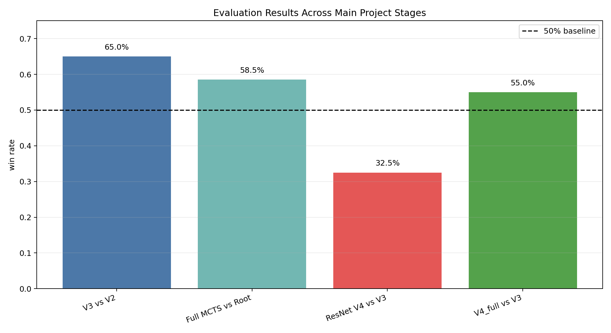

图 6-1 展示了 v3 对 v2、Full Neural MCTS 对 Root Neural MCTS、v4_full 对 v3 等关键阶段的综合胜率。该图用于从实战对弈角度说明模型迭代、搜索器改进和最终数据增强是否真正带来棋力提升。

### 6.3.2 策略损失指标

策略损失用于评价策略价值网络对搜索策略分布的拟合能力。在自我对弈数据中，每个局面都对应一个策略标签，该标签通常由 MCTS 或 Neural MCTS 的访问次数归一化得到。网络策略头输出 18 维动作 logits，经过 softmax 后可解释为各动作的预测概率。训练目标是使网络预测分布尽可能接近搜索器给出的目标分布。

策略损失可写为：

```text
policy_loss = -Σ π(a|s) log p(a|s)
```

其中，`π(a|s)` 表示搜索器在状态 `s` 下给出的目标动作分布，`p(a|s)` 表示策略价值网络预测的动作概率。该指标越低，说明网络越能复现搜索器在当前局面中的动作偏好。

需要注意的是，策略损失主要衡量“对搜索标签的拟合程度”，而不是直接衡量棋力。某个模型即使在验证集上具有较低的策略损失，也可能因为价值判断不稳定或搜索结合方式不佳而在实战中表现一般。因此，本项目将策略损失作为训练过程指标，将对战胜率作为最终效果指标。

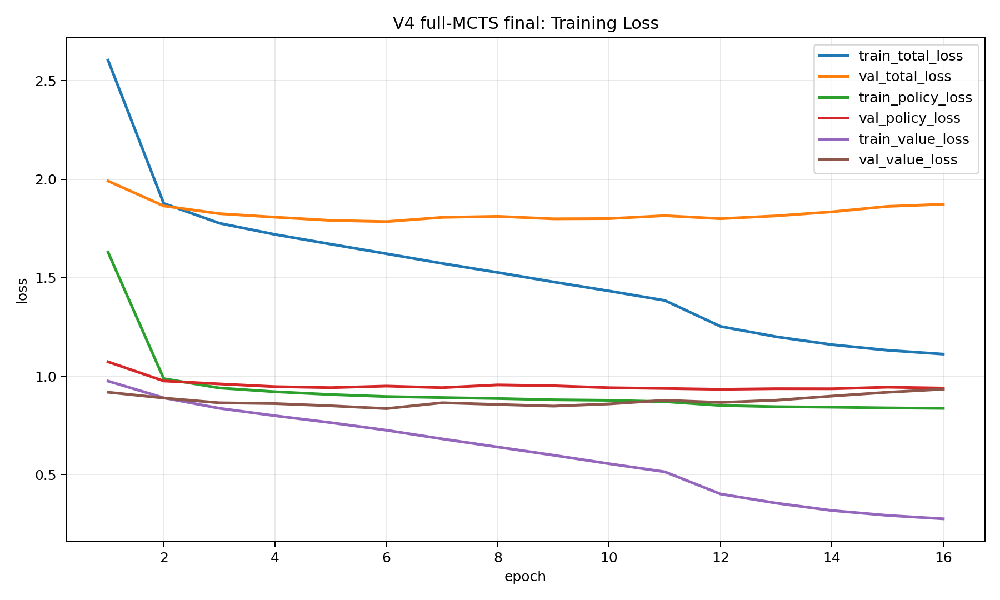

图 6-2 给出了最终模型 v4_full 的训练集和验证集损失变化。该图可以观察模型在训练过程中的收敛趋势，并辅助判断 early stopping 选择 best validation loss checkpoint 的合理性。

### 6.3.3 价值损失指标

价值损失用于评价网络对局面胜负趋势的估计能力。在本项目中，每个训练样本的价值标签来自对局最终结果。从当前行动方视角看，若最终获胜，则价值标签为 `+1`；若最终失败，则价值标签为 `-1`；若对局未分胜负或超过最大回合限制，则记为 `0`。

价值损失采用均方误差：

```text
value_loss = MSE(v, z)
```

其中，`v` 表示网络价值头输出的预测值，`z` 表示由最终胜负得到的目标价值。该指标越低，说明模型越能判断当前局面对行动方是否有利。

价值估计对 Full Neural MCTS 尤其重要。基础 MCTS 可以通过 rollout 估计后续结果，而 Neural MCTS 在叶节点会调用价值网络直接评估非终局局面，并将该估计值回传到搜索树中。如果价值头预测偏差较大，搜索器的 PUCT 选择和节点回传都会受到影响。因此，价值损失不仅关系到单独的策略价值网络，也会影响神经网络增强搜索器的整体质量。

### 6.3.4 总损失指标

策略价值网络采用联合训练目标，同时优化策略头和价值头。总损失由策略损失与价值损失加权组成：

```text
total_loss = policy_loss + value_loss_weight × value_loss
```

其中，`value_loss_weight` 用于调节价值学习在总目标中的权重。最终 v4_full 模型训练时使用的 `value_loss_weight` 为 1.0，即策略拟合与价值估计在训练目标中具有相同权重。

总损失主要用于观察模型是否稳定收敛，以及验证集损失是否出现过拟合趋势。训练脚本 `scripts/train_policy_value.py` 会记录每个 epoch 的训练损失、验证损失、policy top1、value MAE 和学习率，并支持保存 latest checkpoint、best validation loss checkpoint 与 best validation top1 checkpoint。最终 v4_full 模型的 best validation loss 出现在第 6 个 epoch，验证总损失为 1.7847。

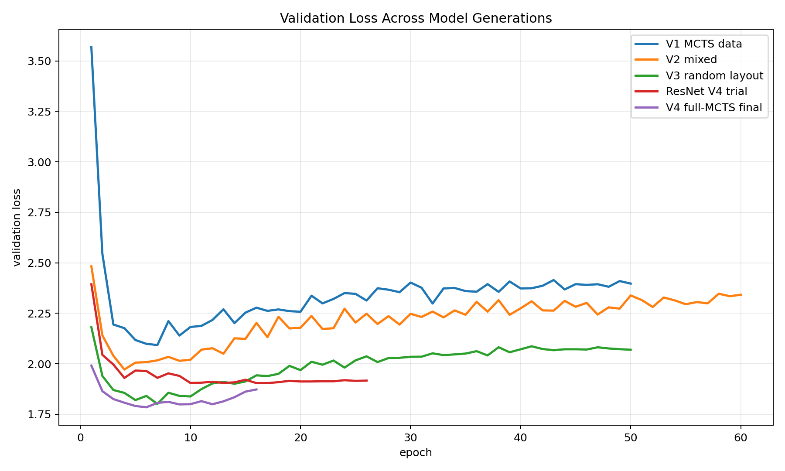

图 6-3 对比了 v1、v2、v3、ResNet v4 和 v4_full 等阶段模型的验证集 loss。该图说明不同训练数据和网络结构设置下，模型对验证集分布的拟合效果存在差异，最终模型选择不能只看训练集表现。

### 6.3.5 Policy Top-1 准确率

Policy Top-1 准确率用于衡量网络预测的最高概率动作是否与训练样本中的目标动作一致。它比策略损失更加直观，关注的是“网络最倾向选择的动作是否等于目标动作”。

其定义为：

```text
PolicyTop1 = 预测最高概率动作与目标动作一致的样本数 / 总样本数
```

在训练日志中，目标动作由训练数据中的策略分布最大值确定，预测动作由网络输出 logits 的最大值确定。最终 v4_full 模型的最高验证集 policy top1 出现在第 12 个 epoch，`val_policy_top1 = 0.6876`。这一结果表明，模型在验证集上能够较好地复现搜索器给出的主要动作选择。

Policy Top-1 也存在一定局限。爱恩斯坦棋中某些局面可能存在多个质量接近的合法动作，而 MCTS 访问次数分布也不一定完全集中在单一动作上。因此，一个动作没有成为 top1 标签，并不必然说明它是明显错误的走法。基于这一原因，本项目仅将 policy top1 作为策略头训练质量的观察指标，而不会用它替代实际对战胜率。

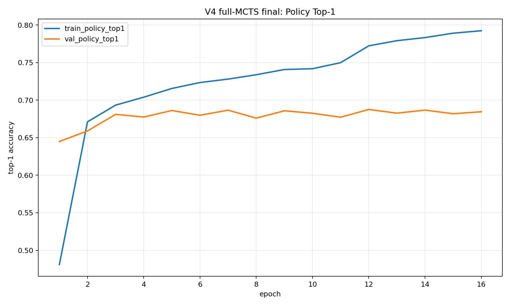

图 6-4 展示了 v4_full 策略头在训练集和验证集上的 Top-1 准确率变化。该指标反映网络输出的最高概率动作与搜索标签主动作的一致程度。

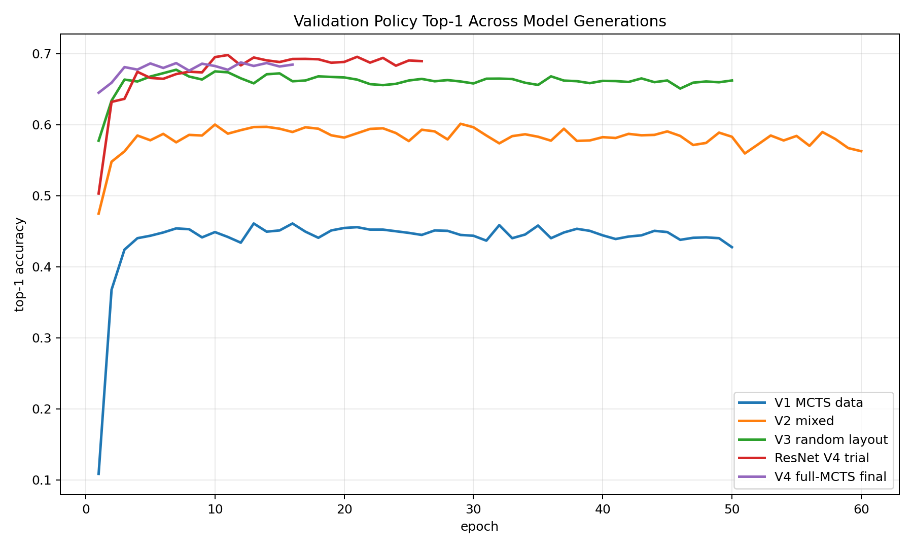

图 6-5 比较了不同阶段模型的验证集策略 Top-1 准确率，用于观察从基础 MCTS 数据、混合数据、随机开局数据到 Full Neural MCTS 数据的训练迭代是否提高了策略头对搜索动作分布的拟合能力。

### 6.3.6 Value MAE 指标

除价值损失外，项目还记录 value MAE，即价值预测平均绝对误差。其定义如下：

```text
ValueMAE = mean(|v - z|)
```

其中，`v` 是模型预测价值，`z` 是最终胜负标签。相比 MSE，MAE 不会对较大的单点误差进行平方放大，更适合直观表示价值头的平均偏差。如果 value MAE 随训练过程下降并趋于稳定，说明模型对局面胜负趋势的估计逐步改善。

项目报告图表中包含最终模型的 `v4_full_value_mae.png`，也包含 v1、v2、v3 和 ResNet v4 等阶段模型的 value MAE 曲线，便于比较不同训练阶段价值头的误差变化。

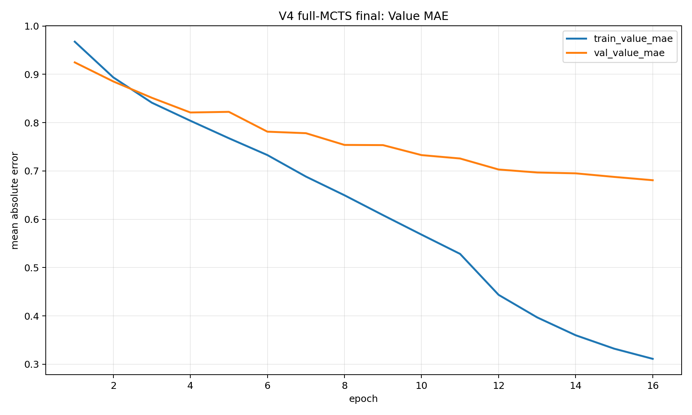

图 6-6 展示了最终模型价值头的 MAE 变化。价值头误差越低，说明模型对当前局面对行动方有利或不利的判断越接近最终胜负标签。

### 6.3.7 Reward 曲线与阶段性收益指标

本项目的训练流程是“自我对弈生成数据、策略价值网络监督训练、阶段性对战评估”，并不是每个 epoch 都在线更新智能体并即时获得环境 reward。因此，本项目中的 reward 曲线不能简单等同于传统在线强化学习中的逐步回报曲线。

更合理的做法是用两类数据刻画阶段性收益：一是自我对弈样本中的平均胜负价值，即从当前行动方视角统计 `values` 的平均值；二是不同阶段模型之间的对战胜率，例如 v3 相对 v2 的综合胜率、Full Neural MCTS 相对 Root Neural MCTS 的综合胜率，以及 v4_full 相对 v3 的综合胜率。

**表 6-5 收益相关指标**

| 指标 | 含义 | 数据来源 |
|---|---|---|
| 自我对弈平均收益 | 统计样本 `values` 字段的平均值 | `artifacts/data/*.npz` |
| 红蓝胜者比例 | 统计最终胜者在红蓝双方之间的分布 | `winners` 字段或数据集汇总表 |
| 阶段性评估胜率 | 统计不同阶段智能体之间的胜负结果 | `artifacts/logs/*.csv` 与评估汇总表 |

这种处理方式更符合本项目的离线训练机制。它既保留了强化学习任务中“胜负收益”的含义，又避免了将监督训练过程误写成逐步在线交互式强化学习。

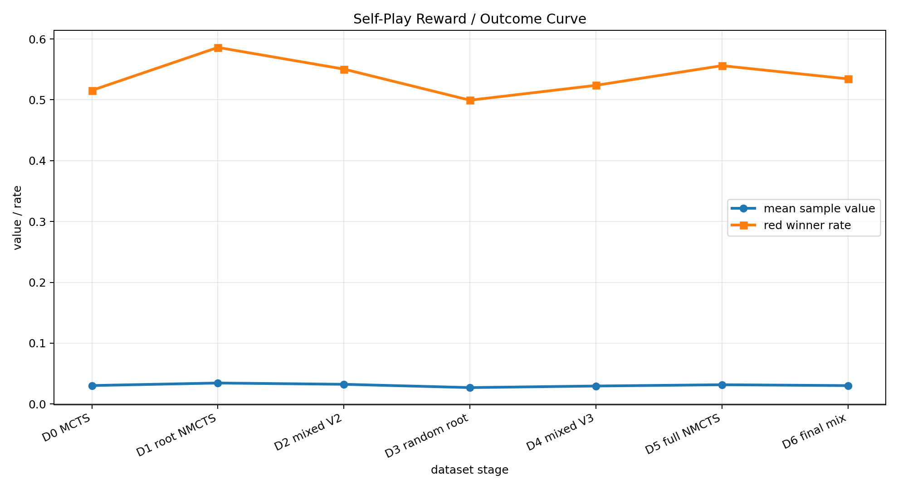

图 6-7 展示了不同自我对弈数据阶段的平均价值和胜者分布变化。需要强调的是，该图不是每个 epoch 在线强化学习即时 reward 曲线，而是基于各阶段自我对弈数据统计得到的阶段性收益曲线。

### 6.3.8 数据覆盖指标

除了模型指标和对战指标，训练数据本身的覆盖情况也需要评价。爱恩斯坦棋受到骰子点数、候选棋子和合法方向的共同限制，如果训练数据中的骰子点数、动作编号或胜负分布严重不均衡，模型可能会对某些局面学习不足。项目提供 `scripts/inspect_dataset.py` 用于检查 NPZ 数据集是否合法，并输出样本数、策略分布归一性、价值分布、骰子分布和动作分布等信息。

**表 6-6 数据覆盖相关指标**

| 指标 | 说明 |
|---|---|
| 对局数 | 衡量自我对弈数据来源规模 |
| 样本数 | 衡量可用于训练的局面数量 |
| 动作分布 | 统计 18 个动作编号在训练集中的覆盖情况 |
| 骰子分布 | 统计 1 至 6 点骰子在训练集中的出现频率 |
| 胜负分布 | 检查红蓝双方胜率是否存在明显偏置 |
| 策略分布归一性 | 检查每个样本的策略标签是否为有效概率分布 |
| 策略熵 | 衡量策略标签集中或分散的程度 |

最终训练集 `self_play_mixed_v4_full.npz` 包含 3000 局自我对弈和 53583 个训练样本，平均策略熵为 0.7356。相比早期 v1 使用的 `self_play_500g_100s.npz`，最终训练集在对局数、样本数和开局多样性上都有明显扩展，为最终模型提供了更充分的训练基础。

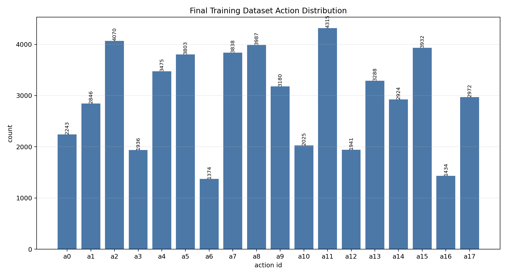

图 6-8 展示了最终训练集 `self_play_mixed_v4_full.npz` 中 18 个动作编号的出现频次，用于检查训练数据是否覆盖完整动作空间。

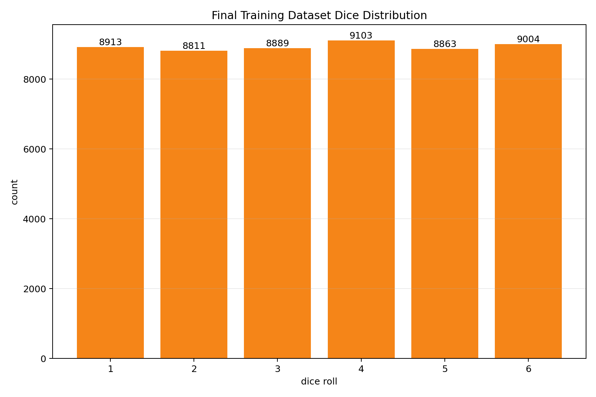

图 6-9 展示了最终训练集中 1 至 6 点骰子的出现频次。骰子分布较均衡，说明自我对弈样本没有明显集中在某个骰子点数上。

### 6.3.9 本节小结

综上，本项目的评价指标体系由训练过程指标、实际对战指标和数据质量指标共同构成。训练过程指标用于观察策略价值网络是否稳定学习搜索器给出的策略与胜负价值；实际对战指标用于判断模型和搜索器是否真正提升棋力；数据质量指标用于检查自我对弈数据是否具有足够规模和覆盖性。后续实验分析将围绕这些指标展开，并重点以综合胜率验证各阶段改进是否带来了真实的对弈收益。

## 6.4 训练过程与模型选择

本节结合训练日志说明各阶段策略价值网络的训练结果。与前 5 章中“自博弈模型”和“深度强化学习增强 MCTS”的算法描述相对应，本章实验中的神经网络训练采用离线监督方式完成：首先由 MCTS 或 Neural MCTS 自我对弈生成 `(state, policy, value)` 样本，然后使用 `scripts/train_policy_value.py` 训练策略价值网络。训练过程记录训练集 loss、验证集 loss、策略头 Top-1 准确率、价值头 MAE 和学习率等指标。

各阶段模型的训练结果由 `artifacts/logs/*.csv` 统计得到，汇总文件为 `artifacts/figures/report/training_summary.csv`。表 6-7 给出了主要模型的最佳验证指标。

**表 6-7 各阶段策略价值网络训练结果汇总**

| 模型阶段 | 训练日志 | 记录 epoch 数 | 最佳验证 loss | 最佳验证 loss 所在 epoch | 最佳验证 Top-1 | 最佳验证 Top-1 所在 epoch | 说明 |
|---|---|---:|---:|---:|---:|---:|---|
| V1 MCTS data | `train_500g_100s_gpu.csv` | 50 | 2.0928 | 7 | 0.4609 | 13 | 使用基础 MCTS 自我对弈数据训练的第一版策略价值网络 |
| V2 mixed | `train_v2_mixed.csv` | 60 | 1.9716 | 4 | 0.6013 | 29 | 合并基础 MCTS 与 Root Neural MCTS 数据后的模型 |
| V3 random layout | `train_v3_random.csv` | 50 | 1.8010 | 7 | 0.6773 | 7 | 加入随机开局数据后的模型 |
| ResNet V4 trial | `train_resnet_v4.csv` | 26 | 1.9043 | 16 | 0.6980 | 11 | 残差网络结构实验，对战表现弱于 V3，未采用 |
| V4 full-MCTS final | `train_v4_full.csv` | 16 | 1.7847 | 6 | 0.6876 | 12 | 使用 Full Neural MCTS 数据训练的最终模型 |

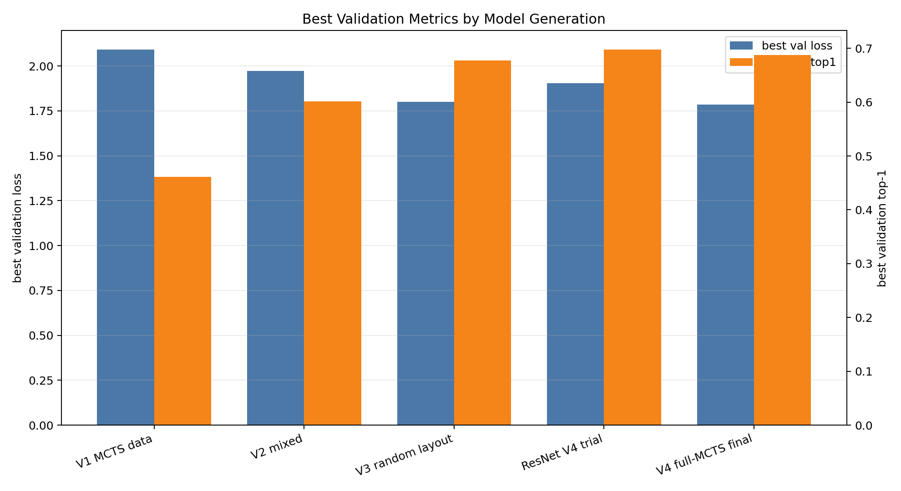

图 6-10 对比了各阶段模型的最佳验证 loss 和最佳验证 Top-1。可以看到，V3 和 V4 full-MCTS final 是训练指标较优的两个阶段；其中 V4 full-MCTS final 取得最低的最佳验证 loss，说明加入 Full Neural MCTS 生成的数据后，模型对验证集分布的拟合进一步改善。ResNet V4 trial 的验证 Top-1 较高，但后续对战实验表明其实际棋力弱于 V3，因此最终没有采用该结构。

最终模型选择并不只依据训练 loss，而是结合训练指标和实际对战胜率共同判断。V4 full-MCTS final 在验证 loss 上优于 V3，并且在 Full Neural MCTS 对战条件下相对 V3 取得 55.0% 的综合胜率，因此本文最终选用 `policy_value_v4_full_best_loss.pt` 作为策略价值网络 checkpoint，并使用 `full-neural-mcts` 作为最终智能体。

## 6.5 与基线模型的对比分析

本节只讨论与基线方法之间的对比实验。这里的基线指随机下棋智能体，即在当前合法动作集合中直接选择一步作为行动。该基线虽然不具备搜索和学习能力，但能够作为最低参照，用来判断基础 MCTS 和策略价值网络是否已经学到有效决策能力。与 v2、v3、v4_full 之间的代际对比不同，本节不讨论“新模型是否优于上一代模型”，而是讨论“各类方法是否优于随机基线”。

本节使用的实验日志主要来自两个目录：`artifacts/logs/6_5_2_basic_mcts/` 和 `artifacts/logs/6_5_3_policy_vs_baseline_online_default/`。前者记录基础 MCTS 与随机基线的对战结果，后者记录 v1、v2、v3 和 v4_full 纯策略价值网络与随机基线的对战结果。为便于报告复现，项目新增脚本 `scripts/generate_6_5_baseline_figures.py`，该脚本会从上述日志中生成汇总表和图表，输出到 `artifacts/figures/report/`。

### 6.5.1 实验数据来源与统计方式

基线对比实验采用红蓝互换设置。对于每一种目标智能体，实验分别进行“目标智能体执红、随机基线执蓝”和“随机基线执红、目标智能体执蓝”两组对战，每组 100 局，共 200 局。最终综合胜率按目标智能体在两组实验中的总胜局数计算：

```text
BaselineWinRate = 目标智能体获胜局数 / 200
```

该设置可以减少红蓝双方移动方向、目标角和先手因素带来的偏差。所有本节图表均由 `scripts/generate_6_5_baseline_figures.py` 从 CSV 日志自动统计得到，生成的汇总文件包括 `6_5_baseline_summary.csv` 和 `6_5_baseline_side_breakdown.csv`。

**表 6-8 基线对比实验日志来源**

| 实验内容 | 日志目录 | 输出汇总 |
|---|---|---|
| 基础 MCTS vs 随机基线 | `artifacts/logs/6_5_2_basic_mcts/` | `artifacts/figures/report/6_5_baseline_summary.csv` |
| 策略价值网络 vs 随机基线 | `artifacts/logs/6_5_3_policy_vs_baseline_online_default/` | `artifacts/figures/report/6_5_baseline_summary.csv` |
| 红蓝互换拆分统计 | 两个日志目录共同生成 | `artifacts/figures/report/6_5_baseline_side_breakdown.csv` |

### 6.5.2 基础 MCTS 与随机基线对比

基础 MCTS 是本项目中最早具备前瞻能力的智能体。与随机基线相比，MCTS 不直接随机选择合法动作，而是对候选动作进行若干次模拟，并依据搜索访问次数和平均收益选择动作。该方法不依赖神经网络，因此可以作为“纯搜索”基线。

在 `6_5_2_basic_mcts` 实验中，目标智能体为 `MCTS50`，即每步使用 50 次 MCTS 模拟。实验采用默认开局并进行红蓝互换。结果显示，MCTS50 执红时获得 51/100，执蓝时获得 57/100，合计 108/200，综合胜率为 54.0%，平均步数为 16.36。

**表 6-9 MCTS50 与随机基线对战结果**

| 对局设置 | MCTS50 胜局 | 随机基线胜局 | 总局数 | MCTS50 胜率 |
|---|---:|---:|---:|---:|
| MCTS50 执红 vs 随机基线执蓝 | 51 | 49 | 100 | 51.0% |
| 随机基线执红 vs MCTS50 执蓝 | 57 | 43 | 100 | 57.0% |
| 合计 | 108 | 92 | 200 | 54.0% |

从结果看，基础 MCTS 相比随机下棋具有一定优势，但提升幅度并不大。这一方面说明 MCTS 的前瞻搜索能够改善随机决策，另一方面也说明在 50 次模拟的预算下，基础 MCTS 仍受到 rollout 噪声、骰子随机性和搜索深度限制。该结论也解释了后续为什么需要引入策略价值网络和神经网络增强搜索：单纯依靠低预算 MCTS 很难形成稳定强棋力。

### 6.5.3 策略价值网络与随机基线对比

策略价值网络是项目中由自我对弈数据训练得到的神经网络智能体。它输入当前棋局状态，输出动作策略分布和局面价值估计。需要说明的是，项目中没有独立的“自博弈模型”文件；本文中相关表述均指由自我对弈数据监督训练得到的策略价值网络。

在 `6_5_3_policy_vs_baseline_online_default` 实验中，项目分别测试了 v1、v2、v3 和 v4_full 四个阶段的纯策略价值网络。这里不使用 MCTS 搜索，而是让策略网络直接根据输出策略选择动作，从而观察“网络本身”相对于随机基线的决策能力。实验结果如表 6-10 所示。

**表 6-10 策略价值网络与随机基线对战结果**

| 模型版本 | 策略网络执红胜局 | 策略网络执蓝胜局 | 合计胜局 | 总局数 | 综合胜率 | 平均步数 |
|---|---:|---:|---:|---:|---:|---:|
| Policy v1 | 65 / 100 | 40 / 100 | 105 | 200 | 52.5% | 16.05 |
| Policy v2 | 54 / 100 | 58 / 100 | 112 | 200 | 56.0% | 15.69 |
| Policy v3 | 61 / 100 | 51 / 100 | 112 | 200 | 56.0% | 16.08 |
| Policy v4_full | 76 / 100 | 67 / 100 | 143 | 200 | 71.5% | 15.95 |

从表 6-10 可以看出，四个阶段的策略价值网络均超过了随机基线。其中 v1 胜率为 52.5%，说明基础 MCTS 自我对弈数据已经使网络学到了略优于随机的动作偏好；v2 和 v3 胜率均为 56.0%，表明混合数据和随机开局数据使纯策略网络保持了稳定优势；v4_full 胜率达到 71.5%，显著高于其他版本，说明由 Full Neural MCTS 生成的高质量数据对策略网络的直接决策能力也有明显帮助。

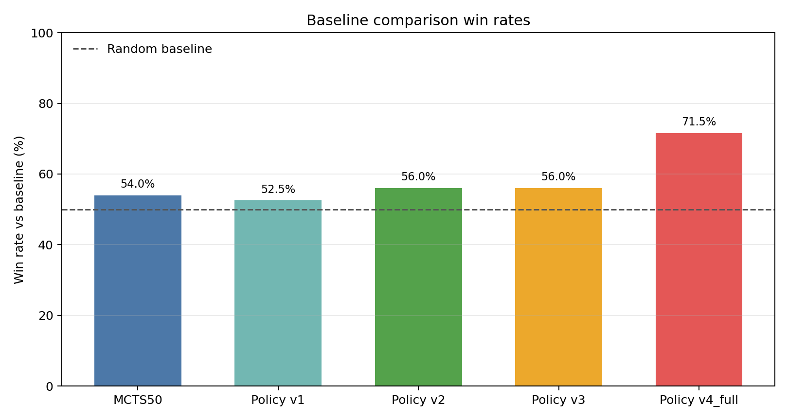

图 6-11 展示了 MCTS50 和各阶段策略价值网络相对随机基线的综合胜率。虚线表示 50% 随机基线水平。可以看到，MCTS50、Policy v1、Policy v2 和 Policy v3 均只是小幅超过基线，而 Policy v4_full 的提升最明显。这说明最终模型的优势不仅体现在与搜索器结合后的表现，也体现在策略网络自身的动作选择能力上。

### 6.5.4 红蓝互换结果分析

爱恩斯坦棋中红蓝双方的出发区域、移动方向和目标角不同，因此单看某一颜色上的胜率可能存在偏差。为了进一步观察模型是否对颜色位置敏感，图 6-12 给出了每个目标智能体在执红和执蓝时的胜率。

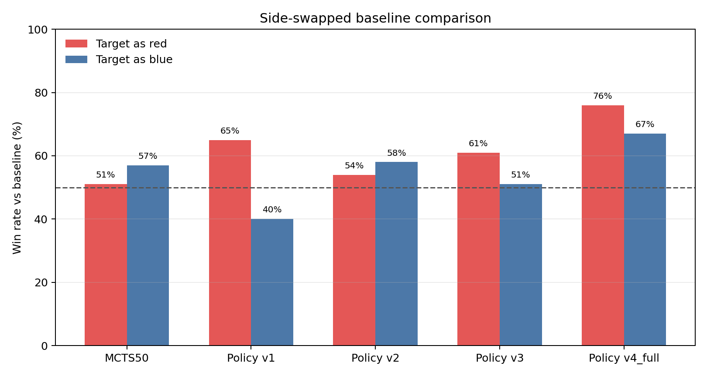

从红蓝拆分结果看，MCTS50 执红胜率为 51.0%，执蓝胜率为 57.0%，整体较为接近。Policy v1 出现明显不平衡，执红胜率达到 65.0%，但执蓝只有 40.0%，说明早期模型对颜色方向或默认布局可能存在适应不足。Policy v2 和 Policy v3 的红蓝胜率更加接近，说明后续数据扩展在一定程度上改善了颜色侧偏差。Policy v4_full 执红胜率为 76.0%，执蓝胜率为 67.0%，两侧均明显高于随机基线，表现最稳定。

**表 6-11 红蓝互换拆分结果**

| 智能体 | 执红胜率 | 执蓝胜率 | 综合胜率 |
|---|---:|---:|---:|
| MCTS50 | 51.0% | 57.0% | 54.0% |
| Policy v1 | 65.0% | 40.0% | 52.5% |
| Policy v2 | 54.0% | 58.0% | 56.0% |
| Policy v3 | 61.0% | 51.0% | 56.0% |
| Policy v4_full | 76.0% | 67.0% | 71.5% |

该拆分结果表明，仅看综合胜率还不够，红蓝互换能够揭示模型在不同颜色方向上的稳定性。尤其是 v1 的红蓝差异较大，说明早期训练数据虽然能够让模型超过随机基线，但泛化稳定性仍不足。v4_full 在两侧均显著超过 50%，说明最终阶段数据和训练过程更充分。

### 6.5.5 本节小结

本节基线对比实验表明，基础 MCTS、早期策略价值网络和最终策略价值网络均能够不同程度地超过随机下棋基线。MCTS50 的综合胜率为 54.0%，说明有限预算搜索能够带来一定前瞻收益；Policy v1 至 Policy v3 的综合胜率在 52.5% 到 56.0% 之间，说明策略价值网络已经具备基本决策能力，但优势仍较有限；Policy v4_full 的综合胜率达到 71.5%，且执红和执蓝均明显超过随机基线，说明最终阶段数据对纯网络策略的提升最明显。

因此，6.5 的结论是：相对于随机基线，项目中的搜索方法和策略价值网络都取得了有效提升；但基础 MCTS 和早期网络的优势较弱，最终 v4_full 才表现出稳定且显著的基线优势。v2 与 v3、v3 与 v4_full 的代际对比，以及固定开局与随机开局的数据增强对比，不在本节展开，将放在后续泛化实验和阶段演化实验中分析。

## 6.6 泛化实验：固定开局与随机开局对比

本节分析随机开局数据增强对模型泛化能力的影响。爱恩斯坦棋允许双方在各自起始区域内自由摆放 1 至 6 号棋子，因此固定开局只能覆盖一小部分初始局面。如果模型主要在默认布局上训练和评估，就可能学习到对特定棋形有效、但对其他开局不够稳定的策略。为验证这一问题，项目比较了固定开局与随机开局条件下 v3 相对 v2 的表现差异。

在本节中，v2 代表使用基础 MCTS 数据与 Root Neural MCTS 数据混合训练得到的模型；v3 则在 v2 的基础上进一步加入随机开局自我对弈数据。两者对比能够直接反映随机开局数据增强是否提升了模型在复杂初始布局下的适应能力。相关汇总由 `scripts/generate_6_6_6_7_figures.py` 根据评估日志生成，结果保存在 `artifacts/figures/report/6_6_fixed_vs_random_generalization.csv`。

### 6.6.1 数据增强设置

v2 阶段的训练集为 `self_play_mixed_v2_1000g.npz`，由基础 MCTS 数据和 Root Neural MCTS 数据合并得到，共包含 1000 局对弈和 17230 个样本。v3 阶段新增 `self_play_neural_mcts_v2_random_1000g_80s.npz`，该数据由 v2 网络指导的 Root Neural MCTS 在随机开局下生成，共包含 1000 局和 18795 个样本。随后项目将该随机开局数据与 v2 数据合并，得到 `self_play_mixed_v3_random.npz`，共 2000 局和 36025 个样本。

**表 6-12 随机开局数据增强相关数据集**

| 阶段 | 数据集 | 对局数 | 样本数 | 平均策略熵 | 说明 |
|---|---|---:|---:|---:|---|
| D2 / v2 | `self_play_mixed_v2_1000g.npz` | 1000 | 17230 | 0.8273 | 基础 MCTS 与 Root Neural MCTS 混合数据 |
| D3 | `self_play_neural_mcts_v2_random_1000g_80s.npz` | 1000 | 18795 | 0.7177 | 随机开局 Root Neural MCTS 新数据 |
| D4 / v3 | `self_play_mixed_v3_random.npz` | 2000 | 36025 | 0.7701 | v2 数据与随机开局数据合并 |

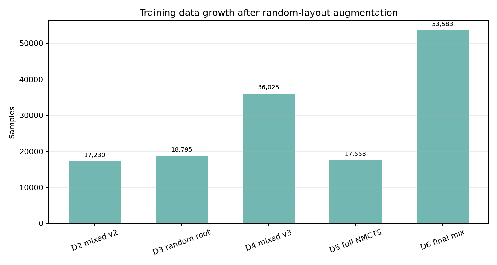

从图 6-13 可以看出，加入随机开局数据后，v3 训练集样本数从 v2 的 17230 增加到 36025，数据规模约扩大为原来的 2.09 倍。更重要的是，新增样本并不是简单重复已有默认布局，而是来自随机开局下的搜索对弈，因此能够覆盖更多开局排列和中盘变化。

### 6.6.2 固定开局与随机开局评估

为观察随机开局数据增强的实际作用，项目比较了 v3 与 v2 在两种评估环境下的对战结果。第一种是默认开局，即双方使用固定起始布局；第二种是随机开局，即每局开始时双方棋子在各自起始区域内随机排列。两种环境均采用红蓝互换统计。

**表 6-13 固定开局与随机开局下 v3 对 v2 的对比**

| 评估开局 | v3 执红胜局 | v3 执蓝胜局 | v3 合计胜局 | 总局数 | v3 综合胜率 | 平均步数 |
|---|---:|---:|---:|---:|---:|---:|
| 默认开局 | 58 / 100 | 46 / 100 | 104 | 200 | 52.0% | 16.53 |
| 随机开局 | 70 / 100 | 60 / 100 | 130 | 200 | 65.0% | 18.09 |

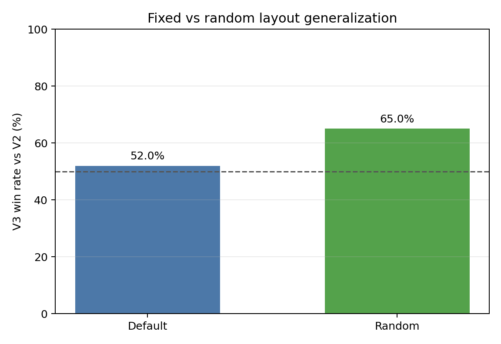

从表 6-13 和图 6-14 可以看出，v3 在默认开局下相对 v2 的综合胜率为 52.0%，只略高于均势；而在随机开局下，v3 的综合胜率提升到 65.0%。这说明 v3 的主要优势并不体现在固定布局下的微小改进，而是体现在面对随机布局时更强的适应能力。

### 6.6.3 实验结果分析

固定开局实验中，v3 相比 v2 只有 52.0% 的综合胜率，说明在默认布局附近，v2 已经能够学习到较充分的策略模式，v3 新增数据带来的边际提升有限。随机开局实验中，v3 胜率达到 65.0%，说明随机开局数据增强有效改善了模型对不同初始布局的泛化能力。

这一结果符合项目训练路线的预期。v2 的训练数据主要来自固定或较单一开局分布，模型容易在默认布局上形成较强拟合；v3 引入随机开局后，训练样本覆盖了更多棋子排列，使模型在遇到非默认布局时不容易失效。由于爱恩斯坦棋存在骰子随机性和自由布阵规则，开局分布差异会迅速影响后续候选棋子、合法动作和战术路线，因此随机开局数据对泛化能力具有直接作用。

本节结论是：随机开局数据增强并不是简单增加样本数量，而是改变了训练数据分布。它使模型从“适应默认布局”转向“适应多种初始布局”，因此在随机开局评估中带来了更明显收益。后续 6.7 节将在此基础上继续分析 v3 与 v4_full 的代际提升。

## 6.7 阶段演化实验：v2、v3 与 v4_full 对比

本节分析项目中关键模型阶段之间的对比结果。与 6.5 节的随机基线对比不同，本节关注的是模型迭代路线内部的代际提升，即 v3 是否优于 v2，以及最终 v4_full 是否优于 v3。为保证比较条件更贴近最终应用，本节主要采用随机开局和红蓝互换统计。

本节使用的汇总结果由 `scripts/generate_6_6_6_7_figures.py` 从已有评估日志生成，输出文件为 `artifacts/figures/report/6_7_generation_comparison.csv` 和 `artifacts/figures/report/6_7_generation_comparison_win_rates.png`。

### 6.7.1 v3 与 v2 对比

v2 模型由基础 MCTS 数据和 Root Neural MCTS 数据混合训练得到，代表项目进入神经网络辅助搜索后的第一轮稳定模型。v3 模型在 v2 的基础上加入随机开局自我对弈数据，训练目标是提升模型对不同初始布局的泛化能力。

在随机开局条件下，v3 执红对 v2 执蓝取得 70/100；v2 执红对 v3 执蓝时，v3 取得 60/100。两组实验合计后，v3 获得 130/200，综合胜率为 65.0%。

**表 6-14 v3 与 v2 随机开局对比结果**

| 对局设置 | v3 胜局 | 总局数 | v3 胜率 |
|---|---:|---:|---:|
| v3 执红 vs v2 执蓝 | 70 | 100 | 70.0% |
| v2 执红 vs v3 执蓝 | 60 | 100 | 60.0% |
| 合计 | 130 | 200 | 65.0% |

该结果说明，v3 相比 v2 的提升是比较明确的。结合 6.6 节结果可知，这一提升主要来自随机开局数据增强：在默认开局下，v3 对 v2 仅为 52.0%；在随机开局下，v3 胜率提升至 65.0%。因此，v3 阶段的核心贡献不是网络结构变化，而是训练数据分布扩展。

### 6.7.2 v4_full 与 v3 对比

v4_full 是项目最终采用的模型。它使用 `self_play_mixed_v4_full.npz` 训练，该数据集在 v3 训练集基础上加入了由 v3 网络配合 Full Neural MCTS 生成的新一轮随机开局自我对弈数据。最终训练集共包含 3000 局对弈和 53583 个样本。

在 v4_full 与 v3 的对比中，两者均使用 Full Neural MCTS 搜索器，评估参数固定为 `simulations=80`、`depth=12`、`chance_mode=sample`、`layout=random`。实验结果显示，v4_full 执红对 v3 执蓝时取得 57/100；v3 执红对 v4_full 执蓝时，v4_full 取得 53/100。两组实验合计后，v4_full 获得 110/200，综合胜率为 55.0%。

**表 6-15 v4_full 与 v3 随机开局对比结果**

| 对局设置 | v4_full 胜局 | 总局数 | v4_full 胜率 |
|---|---:|---:|---:|
| v4_full 执红 vs v3 执蓝 | 57 | 100 | 57.0% |
| v3 执红 vs v4_full 执蓝 | 53 | 100 | 53.0% |
| 合计 | 110 | 200 | 55.0% |

v4_full 相比 v3 的提升幅度低于 v3 相比 v2 的提升，但在红蓝互换后仍保持超过 50% 的综合胜率，说明最终数据迭代带来了稳定但较温和的增益。考虑到 v3 已经在随机开局数据增强后具有较强表现，v4_full 的 55.0% 胜率可以视为在较强上一代模型基础上的进一步优化。

### 6.7.3 阶段演化结果汇总

**表 6-16 阶段演化实验汇总**

| 对比实验 | 优势模型 | 胜局数 | 总局数 | 综合胜率 | 主要变化 |
|---|---|---:|---:|---:|---|
| v3 vs v2 | v3 | 130 | 200 | 65.0% | 加入随机开局自我对弈数据 |
| v4_full vs v3 | v4_full | 110 | 200 | 55.0% | 加入 Full Neural MCTS 生成的新数据 |

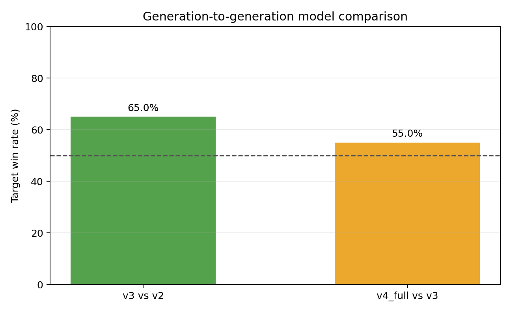

从表 6-16 和图 6-15 可以看出，v3 相对 v2 的提升更明显，说明随机开局数据对模型泛化能力的帮助较大；v4_full 相对 v3 的提升较小但仍为正，说明在已有较强模型基础上，继续使用更高质量搜索数据进行训练仍能带来收益。

本节结论是：项目的代际演化具有连续性。v3 通过随机开局数据解决了 v2 在开局分布上的不足，获得较大幅度提升；v4_full 通过 Full Neural MCTS 生成的新数据进一步优化策略价值网络，在上一代较强模型基础上实现稳定增益。因此，最终模型不是一次性得到的，而是由数据分布扩展和搜索质量提升共同推动形成的。

# 第 7 章 系统实现与可视化

## 7.1 系统实现概述

本项目围绕爱恩斯坦棋智能对弈任务，完成了从规则引擎、智能体决策、模型训练到结果可视化的完整系统实现。系统整体采用模块化设计，将棋类规则、比赛流程、智能体接口、训练模块和实验脚本分离，便于后续扩展不同 AI 方法。

核心代码主要分布在 `einstein_chess/` 和 `scripts/` 两个目录中。其中，`einstein_chess/engine.py` 实现棋盘状态、合法动作生成、移动执行、吃子和胜负判定；`einstein_chess/match.py` 实现完整比赛流程、15 分钟包干计时、非法操作处理和对局记录；`einstein_chess/agents/` 目录下实现随机智能体、基础 MCTS、策略价值网络智能体、Root Neural MCTS 和 Full Neural MCTS；`einstein_chess/training/` 目录下实现状态编码、动作编码、数据集读取、网络结构和自我对弈数据生成。

命令行脚本则主要用于训练和实验复现。`scripts/generate_self_play.py` 用于生成自我对弈数据，`scripts/train_policy_value.py` 用于训练策略价值网络，`scripts/evaluate_agents.py` 用于批量对战评估，`scripts/generate_report_figures.py` 用于生成报告图表，`scripts/competition_client.py` 用于接入小组内部自建的线上中间对战平台。

## 7.2 本地对弈界面

项目提供了基于 Tkinter 的本地图形界面，可以通过 `main.py` 启动。该界面支持人人对弈、人机对弈和机机对弈，能够直观展示棋盘、棋子编号、当前回合、骰子点数和胜负结果。用户可以在开局阶段手动选择棋子摆放方式，也可以使用默认或随机开局。

例如，使用最终模型进行人机对弈可以运行：

```bash
python main.py --red human --blue full-neural-mcts --checkpoint artifacts/checkpoints/policy_value_v4_full_best_loss.pt --device cpu --full-neural-mcts-simulations 40 --full-neural-mcts-depth 8 --chance-mode sample
```

在可视化界面中，人类玩家可以直接观察 AI 的落子行为，从而检查规则执行是否正确，也可以直观感受不同智能体之间的棋力差异。该界面主要用于演示、调试和人工体验，不承担大规模训练任务。

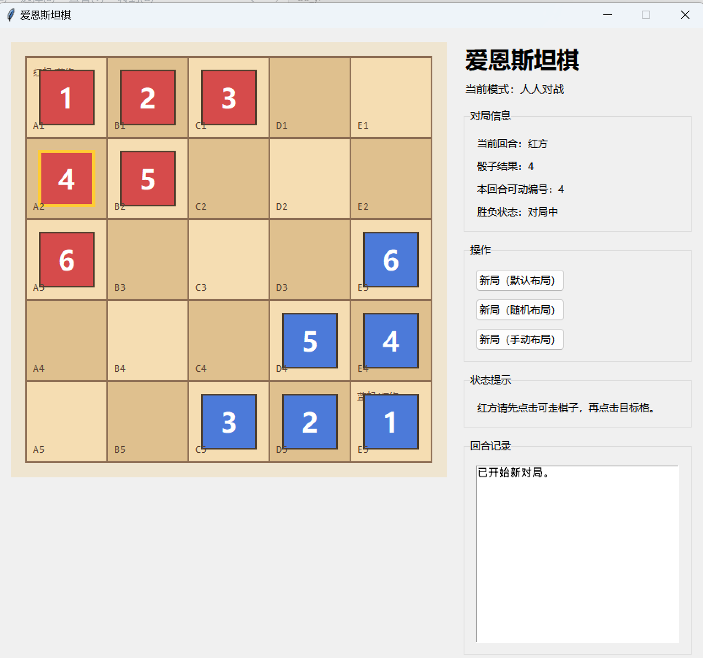

图 7-1 展示了项目的本地对弈可视化界面。界面中棋盘以 5×5 方格形式展示，红蓝双方棋子以编号区分，用户可以根据界面提示完成开局布阵、掷骰后走子以及观察 AI 的自动决策结果。该可视化界面使规则验证和人机对弈过程更加直观。

## 7.3 训练与评估可视化

除棋盘界面外，项目还实现了训练过程和实验结果的可视化。训练日志以 CSV 文件保存，包含每个 epoch 的训练损失、验证损失、策略 Top-1 准确率、价值误差和学习率等指标。通过 `scripts/plot_training_log.py` 和 `scripts/generate_report_figures.py`，可以自动生成 loss 曲线、策略准确率曲线、价值误差曲线、数据集规模图、收益曲线和对战胜率图。

报告图表统一保存在：

```text
artifacts/figures/report/
```

其中，`v4_full_loss.png` 展示最终模型训练与验证损失变化，`comparison_validation_loss.png` 和 `comparison_validation_top1.png` 用于比较不同阶段模型训练效果，`evaluation_progression_win_rates.png` 用于展示模型阶段演化和搜索器改进带来的胜率变化，`final_dataset_action_distribution.png` 与 `final_dataset_dice_distribution.png` 用于检查最终训练数据的动作和骰子覆盖情况。

这些可视化结果使实验分析不只依赖单个胜率数字，而是能够从训练收敛、数据质量和实战表现多个角度共同说明模型效果。

## 7.4 小组内部线上对战平台接入

为了在小组内部与其他同学开发的 AI 进行统一测试，本项目接入了小组自建的线上中间对战平台。该平台由小组内部搭建服务器，负责维护棋局状态、分发当前局面、接收双方智能体返回的布局和走法，并按照统一规则推进比赛流程。这样可以避免不同 AI 各自实现比赛流程导致的规则差异，也便于在相同环境下比较不同智能体的表现。

项目实现了线上对战客户端 `scripts/competition_client.py`。该客户端根据 `AI_CLIENT_PROTOCOL.md` 中定义的通信协议，与小组内部服务器建立连接，完成开局布阵、接收局面、根据当前骰子和棋盘状态选择动作，并将走法发送回服务器。最终模型接入小组内部线上平台的典型命令如下：

```bash
python scripts/competition_client.py --host 服务器IP --port 端口号 --checkpoint artifacts/checkpoints/policy_value_v4_full_best_loss.pt --device cpu --agent full-neural-mcts --full-neural-mcts-simulations 40 --full-neural-mcts-depth 8 --chance-mode sample
```

内部联调和测试时，推荐在 CPU 环境下使用较低搜索预算，例如 `simulations=40, depth=8`，以保证单步决策速度和连接稳定性。如果运行环境性能更强，也可以提高到 `simulations=80, depth=12`。通过该平台，本项目的最终 AI 可以与小组内部其他 AI 在相同服务器、相同协议和相同规则下进行完整对局测试。

## 7.5 系统实现小结

综上，项目已经形成了较完整的工程系统：规则引擎保证对弈合法性，比赛运行器保证完整流程和计时要求，图形界面支持本地演示，训练和评估脚本支持模型迭代，线上客户端支持小组内部平台联调和对战测试。系统既能用于实验研究，也能用于组内统一环境下的 AI 对抗测试。

# 第 8 章 总结与展望

## 8.1 工作总结

本文围绕爱恩斯坦棋智能对弈任务，完成了一个具备完整对弈能力的智能程序。项目首先实现了符合规则的 5×5 棋盘引擎，包括骰子选子、合法动作、吃子、自吃、胜负判定和自由开局布阵；随后实现了比赛运行器和 15 分钟包干计时，使程序能够稳定完成完整对局。

在智能体设计方面，项目从随机智能体和基础 MCTS 出发，逐步实现策略价值网络、Root Neural MCTS 和 Full Neural MCTS。训练过程中，系统通过自我对弈生成 `.npz` 数据集，并使用 PyTorch 训练策略价值网络。最终模型 `policy_value_v4_full_best_loss.pt` 结合 `full-neural-mcts` 作为最终智能体，在多组实验中相对早期模型和基线方法取得了更好的对战表现。

实验结果表明，随机开局数据增强能够明显提升模型泛化能力，Full Neural MCTS 相比 Root Neural MCTS 能带来更稳定的搜索收益，而最终 v4_full 模型在结合多层搜索后具备较强的实际对弈能力。项目还生成了训练曲线、收益曲线、胜率对比图和数据分布图，为设计说明文档提供了较完整的实验支撑。

## 8.2 项目成果

本项目的主要成果包括以下几个方面：

1. 实现了完整的爱恩斯坦棋规则引擎和对局流程。
2. 实现了人机对弈、AI 对战和小组内部线上平台接入。
3. 设计了状态编码、动作编码和合法动作约束机制。
4. 构建了基础 MCTS、策略价值网络和 Neural MCTS 智能体。
5. 生成了多阶段自我对弈数据集，并完成多代模型训练。
6. 完成了随机基线、基础 MCTS、纯策略网络、Root Neural MCTS 和 Full Neural MCTS 的对比实验。
7. 生成了训练曲线、收益曲线、数据分布图和评估胜率图。

最终系统不仅能够本地运行，也能够通过比赛客户端接入小组内部自建的中间对战平台，与组内其他 AI 完成完整比赛流程。

## 8.3 不足之处

虽然项目已经实现了完整功能，但仍存在一些不足。首先，训练数据规模仍然有限，当前模型主要基于数千局自我对弈数据训练，与大规模强化学习系统相比数据量仍有提升空间。其次，Full Neural MCTS 虽然加入了多层搜索和骰子随机节点，但为了保证运行速度，实际比赛中通常采用有限搜索次数，搜索质量仍受时间预算限制。

此外，当前模型主要采用离线训练方式，比赛阶段不进行在线学习。该设计有利于稳定运行，但也意味着模型无法在比赛过程中根据对手风格即时调整。最后，虽然项目尝试了 ResNet 结构，但由于数据规模和训练条件限制，复杂网络结构没有取得预期提升。

## 8.4 后续展望

后续可以从以下几个方向继续改进。第一，继续扩大自我对弈数据规模，尤其是使用更强的 Full Neural MCTS 生成更高质量的随机开局数据。第二，可以进一步优化搜索器，例如改进 chance node 的处理方式、加入更合理的时间分配策略，或根据局面复杂度动态调整搜索次数。

第三，可以继续探索更适合小棋盘随机博弈的网络结构，例如轻量残差网络、注意力机制或带有棋子关系建模的网络。第四，可以增加更丰富的评估对象，包括不同搜索预算的 MCTS、不同版本神经网络和小组内部其他智能体，从而获得更全面的棋力评价。第五，可以完善线上比赛客户端的异常处理和日志记录，使其在组内联调和正式测试环境中更加稳定。

总体来看，本项目已经完成了从规则实现到智能体训练、从本地可视化到线上对战接入的完整闭环。后续若进一步扩大训练规模并优化搜索效率，模型仍有继续提升的空间。


